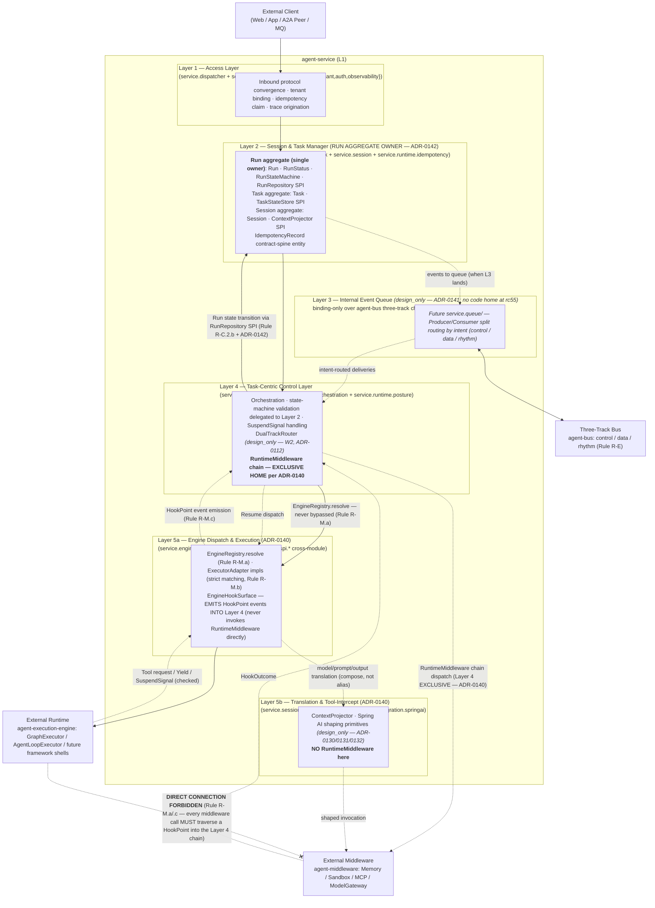
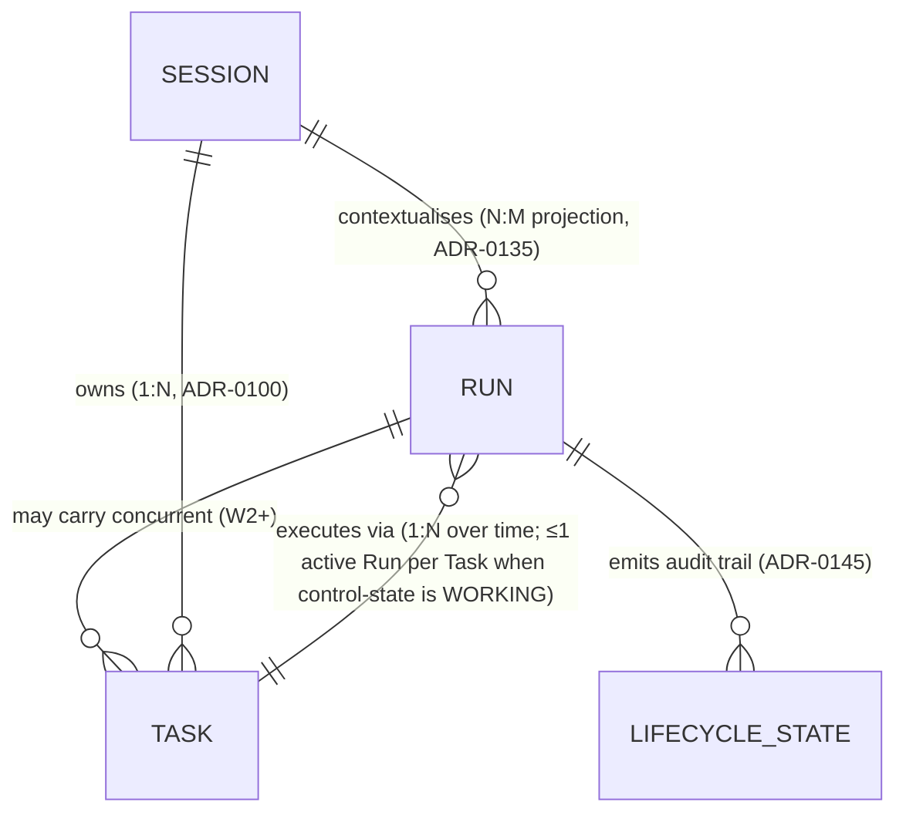
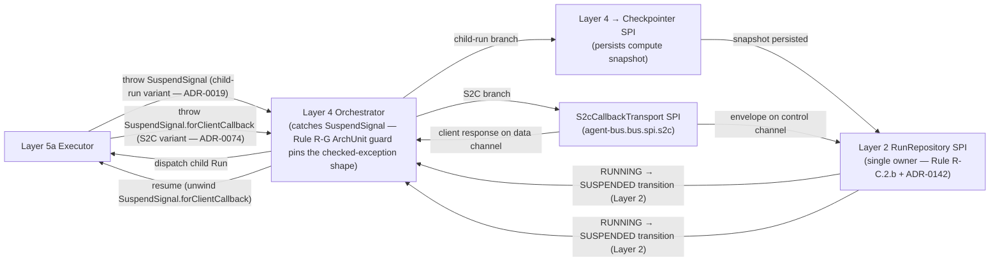

# agent-service — Logical View

> **Altitude discipline (L1).** This view names the **module's logical
> layers**, each layer's **responsibility and boundary**, the
> **aggregate entities** and their relationships, the **public SPI
> surface** (with generated-fact refs), and the **orthogonality red
> lines** the decomposition refuses to collapse. It does NOT carry
> code-level detail: entity column inventories, persistence schema,
> SQL CAS clauses, HTTP status codes, method descriptors, per-variant
> event field lists, and channel-routed variant sets are **L2 /
> contract** material. The Run / Task / Session entity field shapes are
> owned by the generated code-symbol facts + the future persistence L2
> design; the RunEvent hierarchy field shapes are owned by
> [`run-event.v1.yaml`](../../../../docs/contracts/run-event.v1.yaml).

## 1. Five-Layer Component Diagram



**Layer responsibilities** (canonical per ADR-0138 + ADR-0140/0142
narrowings):

1. **Access Layer (Layer 1)** — Inbound protocol convergence (HTTP/gRPC,
   A2A, MQ — protocol bindings declared in their respective contracts,
   most `(design_only)`). Performs tenant binding (per ADR-0040),
   idempotency claim (per ADR-0057), trace origination (per ADR-0061).
   Layer 1 NEVER drives Runtime directly (Rule R-M.a) and NEVER calls
   Middleware directly (Rule R-M.c). The filter-chain composition and
   HTTP wire behaviour are Layer 1 implementation / contract detail
   (`openapi-v1.yaml`), not restated here.

2. **Session & Task Manager (Layer 2 — Run aggregate single owner per
   ADR-0142)** — Owns the Run / Task / Session record lifecycles AND
   the Run aggregate's invariants. The `RunRepository` SPI is the SINGLE
   sanctioned Run-state-transition path (Rule R-C.2.b + ADR-0118 +
   ADR-0142); state-machine validation is invoked atomically inside that
   transition (callers do not invoke the validator directly). Session ↔
   Task is 1:N per ADR-0100. Persistence is RLS-bound (Rule R-J.a); the
   concrete CAS primitive + RLS realisation is the
   [`development.md`](development.md) §5.3 L2 Boundary Contract.

3. **Internal Event Queue (Layer 3 — design_only per ADR-0141)** —
   Binding-only layer over the canonical three-track channels declared
   in `bus-channels.yaml` per Rule R-E. Producer/Consumer split routes
   events by intent (`control` / `data` / `rhythm`); per-channel
   durability tier is an orthogonal axis. **No code home at rc55**
   (`service.queue/` does NOT exist on disk); the layer appears here as
   a `(design_only)` sub-block to make the binding contract visible, NOT
   as a peer to layers with code homes.

4. **Task-Centric Control Layer (Layer 4 — RuntimeMiddleware exclusive
   home per ADR-0140)** — Orchestrator + state-machine validation
   delegation + DualTrackRouter `(design_only)` + RuntimeMiddleware
   chain. Where Runtime would otherwise call Middleware directly, the
   call is converted to a `HookPoint` event (Rule R-M.c +
   `engine-hooks.v1.yaml`) and dispatched through the middleware chain.
   SuspendSignal handling (child-run + S2C-callback variants) lives here.
   Run state writes ALWAYS go through Layer 2's `RunRepository` SPI
   (ADR-0142).

5. **Engine Dispatch & Execution Layer (Layer 5a — per ADR-0140
   split)** — `EngineRegistry.resolve` per Rule R-M.a; `ExecutorAdapter`
   implementations for Graph and AgentLoop, with future heterogeneous
   adapters (LangChain / LlamaIndex) declared `design_only`. Layer 5a
   EMITS HookPoint events INTO Layer 4's RuntimeMiddleware chain; it
   NEVER directly invokes RuntimeMiddleware (the cohesion fix from
   ADR-0140).

6. **Translation & Tool-Intercept Layer (Layer 5b — per ADR-0140
   split)** — `ContextProjector` (Session → injected context) composed
   with Spring AI primitives (`PromptTemplate`,
   `StructuredOutputConverter<T>`, `ChatAdvisor` + `AdvisorChain` per
   ADR-0130/0131/0132, `design_only`). No RuntimeMiddleware here. Spring
   AI evolution cadence is independent of Layer 5a's Rule R-M cadence
   (the rationale for the split).

## 2. Aggregate Model — Run / Task / Session (tenant-scoped)

> **Red line (Rule R-C.2.a + R-J.a + Principle P-J):** every aggregate
> below is tenant-scoped — tenant identity is a first-class, mandatory
> attribute, and every persistence write is RLS-bound. The **field-level
> shape** of each entity (columns, types, nullability) is owned by the
> generated code-symbol facts (cited below) and the future persistence
> L2 design — not enumerated here.



| Aggregate | Owns | Generated-fact anchor | Distinct identity (Rule, ADR) |
|---|---|---|---|
| **Run** | Execution state (the transient compute snapshot) | [`code-symbol/com-huawei-ascend-service-runtime-runs-run`](../../../../architecture/facts/generated/code-symbols.json) | "the transient compute snapshot" — distinct from Task (ADR-0136) |
| **Task** | Control state (done-or-not, why-stopped); A2A protocol state | [`code-symbol/com-huawei-ascend-service-task-task`](../../../../architecture/facts/generated/code-symbols.json) | "what's done-or-not / why-stopped" — distinct from Run (ADR-0136) |
| **Session** | Context state (conversation history, shared variables) | [`code-symbol/com-huawei-ascend-service-session-session`](../../../../architecture/facts/generated/code-symbols.json) | Context source of truth; Run/Task may drift across Sessions (ADR-0100) |
| **Lifecycle-state audit** | Append-only transition trail | emission shape per `RunStateTransitionEvent` in [`run-event.v1.yaml`](../../../../docs/contracts/run-event.v1.yaml) | derived FK; tenant identity inherited |

**Aggregate-ownership invariants** (cross-cutting):
- Every aggregate is tenant-scoped with RLS enabled in the same
  migration that creates its table (Rule R-J.a). The migration sequence
  + RLS policy bodies are the [`development.md`](development.md) §5.3 L2
  Boundary Contract.
- Run aggregate ownership is pinned to Layer 2 (ADR-0142): Layer 2 is
  the SINGLE writer; Layer 4 holds a typed `RunRepository` reference and
  delegates transitions to it. A future ArchUnit guard
  (`Layer4MustNotImportRunDirectlyTest`, W2+) is the candidate mechanism.

## 3. Run lifecycle state machine (cancel-race-aware)

```mermaid
stateDiagram-v2
    [*] --> PENDING: created (Layer 1 intake; create-only path)
    PENDING --> RUNNING: dispatch (Layer 4 → Layer 2 transition)
    RUNNING --> SUSPENDED: SuspendSignal thrown by Layer 5a (child-run OR S2C callback)
    SUSPENDED --> RUNNING: resume (Layer 4)
    RUNNING --> SUCCEEDED: terminal success
    RUNNING --> FAILED: terminal failure
    SUSPENDED --> FAILED: resume gives up
    RUNNING --> CANCELLED: cancel (tenant-guarded — Rule R-J.b)
    SUSPENDED --> CANCELLED: cancel (same guard)
    PENDING --> CANCELLED: cancel (same guard)
    RUNNING --> EXPIRED: deadline pass
    SUSPENDED --> EXPIRED: deadline pass
    FAILED --> RUNNING: retry (W2-scoped policy per ADR-0118)

    CANCELLED --> [*]
    SUCCEEDED --> [*]
    EXPIRED --> [*]

    note left of RUNNING
        EVERY transition is delegated to Layer 2's RunRepository SPI
        (single-owner per ADR-0142). Layer 4 NEVER writes Run state directly.
        Structurally closes F-nonatomic-run-status-write
        (5 prior recurrences). The atomic primitive that backs the
        transition is the development.md §5.3 L2 Boundary Contract.
    end note
```

**Cancel-vs-complete race — structural resolution.** When two writers
contend on the same Run (e.g. a cancel and a terminal completion), Layer
2's transition primitive admits exactly one; the loser re-reads the
authoritative post-transition state and the Layer 1 route contract
decides its response. The race is modelled **structurally** (not by
retry-and-pray) — this is the orthogonality red line in §9. The
response-code posture and the SQL/atomic-primitive realisation are NOT
in this view: they are owned by [`openapi-v1.yaml`](../../../../docs/contracts)
(response posture) and [`development.md`](development.md) §5.3 (CAS
realisation). The explicit loser-side flow is
[`process.md`](process.md) §P6.

## 4. Task control-state machine (A2A protocol)

```mermaid
stateDiagram-v2
    [*] --> SUBMITTED: Task created by Layer 2
    SUBMITTED --> WORKING: dispatch to Orchestrator (Layer 4)
    WORKING --> INPUT_REQUIRED: await client callback (S2C) OR user-input wait
    INPUT_REQUIRED --> WORKING: resume with input
    WORKING --> COMPLETED: terminal success
    WORKING --> FAILED: terminal failure

    note right of WORKING
        Task control-state is DECOUPLED from Run execution-state (§3).
        A single Task in WORKING may have many transient Runs cycling
        through the execution DFA. Per ADR-0136 Task and Run are TWO
        DISTINCT entities: Task is control state; Run is the compute snapshot.
    end note

    COMPLETED --> [*]
    FAILED --> [*]
```



The A2A state vocabulary (the protocol enum values) is owned by the A2A
envelope contract (`a2a-envelope.v1.yaml`, `design_only`); the Java
control-state shape is the `Task` aggregate fact cited in §2.

## 5. SuspendSignal flow (child-run + S2C-callback variants)



Both `SuspendSignal` variants share **the same checked-exception type**
— a deliberate design per ADR-0100 (Yield/SuspendSignal coexistence)
reaffirmed by ADR-0137: one Java compiler guard, one Rule R-G ArchUnit
guard, one Rule R-H "no `Thread.sleep`" enforcement scope. PR #71's
proposed `InterruptSignal` rename was rejected by ADR-0137 because the
checked-exception shape is a Tier-A competitive differentiator (the Java
compiler enforces caller-side handling). The S2C envelope + response
field shapes are owned by
[`s2c-callback.v1.yaml`](../../../../docs/contracts/s2c-callback.v1.yaml).

## 6. Vocabulary glossary — distinct mechanisms, not aliases

The rc55 audit (R4 finding) called out that an earlier glossary read
`ChatAdvisor + RuntimeMiddleware → "Shadow Tool Interceptor"` as if the
two were aliases. They are NOT. The corrected mapping below is the
canonical L1 vocabulary:

| Concept | Mechanism A | Mechanism B | Why distinct |
|---|---|---|---|
| Tool intercept | `RuntimeMiddleware` on `HookPoint.before_tool` / `after_tool` (Rule R-M.c; Layer 4 EXCLUSIVE per ADR-0140) | `ChatAdvisor.aroundCall(...)` (Spring AI per ADR-0132; Layer 5b) | Different cardinality (per-HookPoint-per-Run vs per-model-call-per-ChatClient) and different scope (hook-point boundary vs model-call boundary). They COMPOSE; they are not aliases. |
| Cross-cutting policy | `RuntimeMiddleware` chain (Layer 4) | Layer 1 platform filter chain (`MeterFilter` / Spring Security filter) | RuntimeMiddleware is Runtime-domain (orchestration-aware, HookPoint-driven); the Layer 1 filter chain is HTTP-edge-domain (request-aware). |
| Context injection | `ContextProjector.project(...)` (Layer 5b) | `PromptTemplate.render(...)` (Layer 5b) | ContextProjector projects Session state into the injected-context shape; PromptTemplate renders a template against that context. They compose serially. |

Other vocabulary mappings (full table in ADR-0136 §3):

| PR #71 / academic name | Shipped platform name (canonical) |
|---|---|
| Task (as "scheduling core") | `Task` control-state record — distinct from Run |
| TaskManager | TaskCenter sub-package + `TaskStateStore` SPI (per ADR-0100) |
| TaskEvent | `RunEvent` sealed-hierarchy variants (per ADR-0145; §7) — NO standalone `TaskEvent` Java type |
| InterruptSignal | `SuspendSignal` (`bus.spi.engine.SuspendSignal`, checked exception) — glossary synonym only per ADR-0137 |
| InterruptType (INPUT_REQUIRED / TOOL_EXECUTION / COLLABORATION / SAFETY_CHECK) | Maps onto 3 platform mechanisms: A2A state for input-required, HookPoint for tool, SuspendReason for collaboration / safety |
| Internal Event Queue | Three-track bus: `control` / `data` / `rhythm` (Rule R-E); Layer 3's binding role per ADR-0141 (`design_only`) |
| DualTrackRouter | New SPI `(design_only — W2, ADR-0112)`; maps to `SlowTrackJudge`; narrowed by ADR-0139 |
| FastPath / SlowPath | In-process reactive-synchronous + metadata persistence (Fast) vs persistent-reactive + SuspendSignal + ResumeDispatcher (Slow); neither bypasses tenant scoping / RLS / reactive / SuspendSignal (ADR-0139 narrowed semantics) |

**v1.2 (per ADR-0155 §3)**: Layer 5b Translation & Tool-Intercept does
NOT construct prompts. The Agent (native code, third-party framework
Formatter, or remote service) owns prompt assembly. Layer 5b is a
messages-in-flight boundary aspect — policy, redaction, token-budget
audit, fallback trim. `GovernedMessages` is its downstream type (the
earlier `BuiltPrompt` is deleted).

## 7. RunEvent sealed hierarchy (per ADR-0145)

The audit lifecycle of a Run is modelled as a **single sealed `RunEvent`
hierarchy** — a closed set of variants covering the S1-S5 emission
points (creation, state transition, suspend / resume, S2C callback,
child-run spawn / completion, cancel, terminal). The sealed shape is the
L1 architectural fact: a closed discriminated union, with the
`EvolutionExport` discriminator
([`code-symbol/...service-runtime-evolution`](../../../../architecture/facts/generated/code-symbols.json),
enum already shipped) binding each variant's export scope (Rule R-M.e).

The **variant set, the per-variant field shapes, the per-variant
`emitted_by` / `emission_trigger`, the evolution-export defaults, and
the channel routing** are the single source of truth in
[`run-event.v1.yaml`](../../../../docs/contracts/run-event.v1.yaml)
(`status: design_only`; the Java sealed interface + its records land in a
follow-up impl-mode wave, at which point Rule R-M.e becomes gateable).
This view does NOT duplicate the contract's variant/field tables; the
scenario-to-variant coverage cross-walk lives in
[`scenarios.md`](scenarios.md) per-scenario "RunEvent emissions" rows.

## 8. Configuration ownership matrix (per-module sovereign vs read-only)

> Absorbed from PR #79 per the post-merge audit Wave 3 plan. Configuration
> MUST NOT be scattered across request bodies, adapter-private fields, or
> prompt templates — L1 names the sovereign layer and the read-only
> consumers. The concrete field schemas of each category are L2 / contract
> detail.

| Configuration category | Sovereign layer | Read-only / consumer layers |
| --- | --- | --- |
| Client identity and access capability | Access Layer | Session & Task Manager, Task-Centric Control |
| Agent identity and service capability | Access Layer + Engine Dispatch & Execution | Task-Centric Control, Translation & Tool-Intercept |
| Run-creation configuration snapshot | Session & Task Manager | All execution-related layers |
| Model information | Translation & Tool-Intercept | Engine Dispatch & Execution, Task-Centric Control |
| Third-party Agent adapter information | Engine Dispatch & Execution | Access Layer, Task-Centric Control, Session & Task Manager |
| Client-hosted skill information | Access Layer + Task-Centric Control | Translation & Tool-Intercept, Engine Dispatch & Execution |
| Tool / sandbox / skill capacity | Task-Centric Control | Translation & Tool-Intercept, Engine Dispatch & Execution |
| Channel and delivery policy | Internal Event Queue | Session & Task Manager, Task-Centric Control |

The "required information" and "exception closure" columns for each
category (the field-level detail) are delegated to the owning module's
L2 design and the relevant contract (model / adapter / skill-capacity /
channel manifests).

## 9. Orthogonality red-lines (correct vs incorrect splits)

> Absorbed from PR #79 per the post-merge audit Wave 3 plan. These are the
> 8 layer/module boundaries this L1 design REFUSES to collapse; violating
> any is a recurrence trigger for `F-layer-decomposition-low-cohesion`
> (rc55 / ADR-0144).

| Boundary | Correct split | Incorrect split |
| --- | --- | --- |
| Stream / poll vs Run lifecycle | Access Layer owns connection + projection; Run lifecycle is owned by Session & Task Manager + Task-Centric Control. | A transport disconnect cancels the Run, or polling reads engine internals. |
| Direct access vs bypass | Client may directly reach the Access Layer; it must not reach engines, repositories, middleware, or bus channels. | Clients calling an ExecutorAdapter or a bus topic for low latency. |
| Run vs Task vs Session | Run owns execution state; Task owns protocol/control state; Session owns context state. | One store swallowing Run, Task, and Session. |
| Checkpoint vs Session / Memory | Checkpoint is a compute snapshot; Session / Memory are context + knowledge sources of truth. | Using a checkpoint as a replacement for Session projection or Memory mutation. |
| Retry vs new-Agent scheduling | Retry / resume first reuses the same Run, attempt, remote handle, or child-Run relationship. | Silently creating a new remote Agent after interruption (duplicate side effects, broken audit). |
| Client-hosted skill vs server tool | Client skill uses S2C callback + policy control; server tool uses RuntimeMiddleware + sandbox control. | An engine adapter directly accessing client-local capability, or treating a client skill as a server-side tool. |
| RuntimeMiddleware vs ChatAdvisor | RuntimeMiddleware handles Run-aware HookPoints (Layer 4); ChatAdvisor handles model-call boundaries (Layer 5b). | Placing both tool interceptors in the same module. |
| Configuration source vs runtime consumption | Configuration is owned by explicit layers, resolved to a snapshot at Run creation; execution layers only consume it. | Each adapter / prompt / request body interpreting configuration independently. |

## 10. Cross-references

- Scenarios: [`scenarios.md`](scenarios.md) — S1-S5 + cross-scenario
  red lines.
- Process View: [`process.md`](process.md) — layer-interaction flows
  P1-P6 (P3 + P6 cover the cancel-race winner + loser).
- Physical View: [`physical.md`](physical.md) — 5-plane deployment,
  persistence-plane tenancy posture, three-track bus binding, sandbox
  boundary.
- Development View: [`development.md`](development.md) — package tree,
  Layer↔Package matrix per ADR-0144, 5 L2 Boundary Contracts (the home
  for persistence / CAS / RLS / channel-routing realisation detail).
- SPI Appendix: [`spi-appendix.md`](spi-appendix.md) — active SPI
  interfaces with 4-way parity (Rule G-1.1.b).
- Module-root grounding: [`ARCHITECTURE.md`](ARCHITECTURE.md) §1-§9.
- Contract anchors: [`run-event.v1.yaml`](../../../../docs/contracts/run-event.v1.yaml),
  [`engine-envelope.v1.yaml`](../../../../docs/contracts/engine-envelope.v1.yaml),
  [`engine-hooks.v1.yaml`](../../../../docs/contracts/engine-hooks.v1.yaml),
  [`s2c-callback.v1.yaml`](../../../../docs/contracts/s2c-callback.v1.yaml),
  [`bus-channels.yaml`](../../../../docs/governance/bus-channels.yaml).
- Authoritative ADRs: ADR-0136 (vocabulary) · ADR-0137 (SuspendSignal
  canonical) · ADR-0138 (5-layer L1) · ADR-0139 (Fast/Slow Path
  narrowed) · ADR-0140 (5a/5b split) · ADR-0141 (Layer 3 design_only) ·
  ADR-0142 (Run aggregate single owner) · ADR-0144 (Layer↔Package
  matrix) · ADR-0145 (RunEvent sealed hierarchy).
