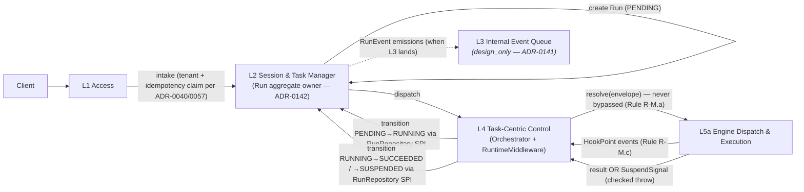
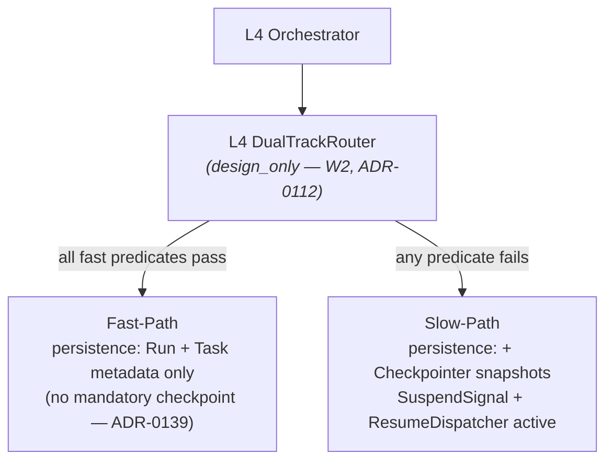
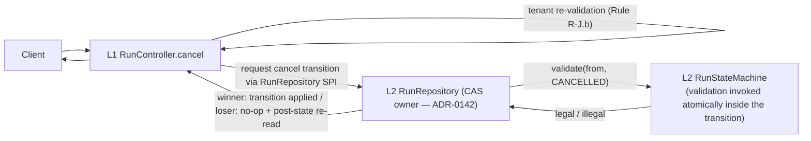
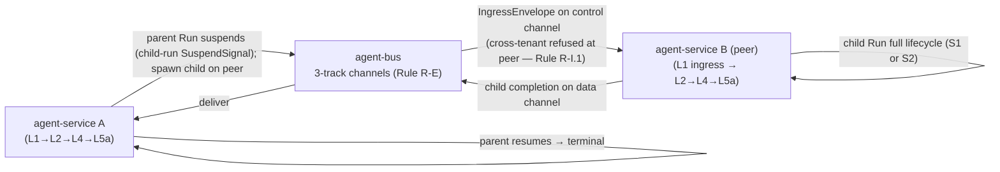
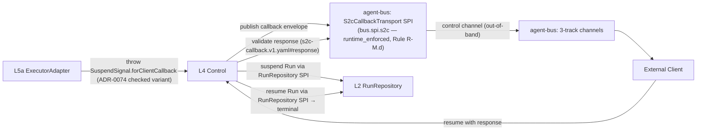
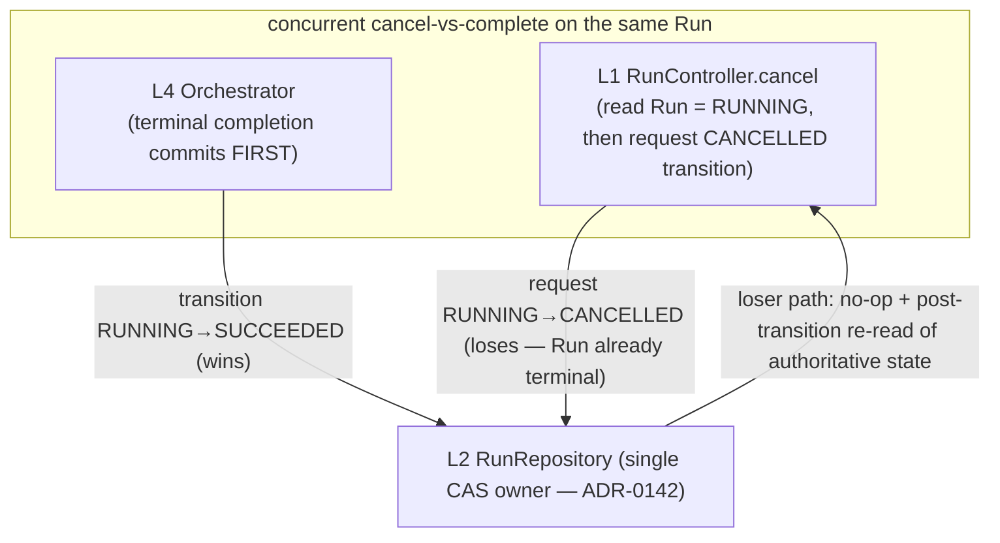

# agent-service — Process View

> **Altitude discipline (L1).** This view shows **layer-to-layer
> interaction order** for each canonical scenario — which layer drives
> which next, and where a suspension or a race is resolved structurally.
> It does NOT carry wire-level sequence steps: HTTP status codes, route
> verbs, filter ordering, method descriptors, SQL CAS clauses, and the
> per-step RunEvent variant emission set are **L2 / contract** material.
> Each flow points at the contract or process-sequence L2 zone that owns
> those steps. The end-to-end wire sequences are owned by the route
> contracts (`openapi-v1.yaml`), the engine / S2C / RunEvent contracts,
> and the L2 Boundary Contracts in [`development.md`](development.md) §5.

## 0. Layer-interaction legend

The flows below use the canonical layer names from
[`logical.md`](logical.md) §1:

- **L1 Access** — inbound protocol convergence + tenant binding +
  idempotency claim + trace origination.
- **L2 Session & Task Manager** — Run / Task / Session aggregates;
  **single writer of Run state** (ADR-0142) via the `RunRepository` SPI
  ([`code-symbol/com-huawei-ascend-service-runtime-runs-spi-runrepository`](../../../../architecture/facts/generated/code-symbols.json)).
- **L3 Internal Event Queue** — `(design_only — ADR-0141)` binding over
  the three-track bus.
- **L4 Task-Centric Control** — orchestration + state-machine
  validation delegation + **RuntimeMiddleware chain (exclusive home,
  ADR-0140)** + SuspendSignal handling.
- **L5a Engine Dispatch & Execution** — `EngineRegistry.resolve`
  (Rule R-M.a) + `ExecutorAdapter` impls; emits HookPoint events INTO
  L4.
- **L5b Translation & Tool-Intercept** — Spring AI shaping primitives
  (`(design_only)`).

**Invariant carried by every flow** (ADR-0142): L4 NEVER writes Run
state directly; every Run transition is delegated to L2 through the
`RunRepository` SPI. The atomic-CAS obligation that backs that delegation
is specified in [`development.md`](development.md) §5.3 (Postgres RLS
Boundary Contract), not in these diagrams.

## 1. P1 — Synchronous intake → dispatch → (optional) suspend → resume (covers S1 + S2)

**Fast-Path vs Slow-Path** is decided by the `DualTrackRouter`
`(design_only — W2, ADR-0112)` (see P2). The two paths differ in
**persistence shape** (Fast-Path: metadata only; Slow-Path: plus
Checkpointer snapshots) — narrowed per ADR-0139. The precise async
return shape (cursor / polling / streaming) and the idempotency-hit
response posture are Layer 1 contract concerns owned by
[`openapi-v1.yaml`](../../../../docs/contracts) and ADR-0057; the
mid-execution Fast→Slow upgrade is the boundary contract recorded in
[`scenarios.md`](scenarios.md) §1.

**RunEvent emissions** per step are specified in
[`run-event.v1.yaml`](../../../../docs/contracts/run-event.v1.yaml)
(per-variant `emitted_by` / `emission_trigger`) and cross-walked in
[`logical.md`](logical.md) §7; they are not annotated step-by-step here.

## 2. P2 — Fast-Path / Slow-Path decision (covers S1 / S2 divergence)

The router reads Run metadata (estimated wall-clock, external-input /
S2C-callback / A2A-collaboration flags, deployment-locus expectation)
and consults per-tenant thresholds. The threshold source, the exact
predicate set, and the per-decision audit event are delegated to the
**DualTrackRouter L2 Boundary Contract**
([`development.md`](development.md) §5.4 per ADR-0112). **Red line
(ADR-0139):** neither path bypasses tenant scoping, RLS, reactive I/O
(Rule R-G), or SuspendSignal (Rule R-H) — restated in
[`scenarios.md`](scenarios.md) §6.

## 3. P3 — Cancel + cancel-race WINNER (covers S5 winner side)

The cancel transition is delegated to L2's `RunRepository` SPI; L2
admits exactly one writer through its atomic primitive. The **response
posture** the caller sees (idempotent success on same-terminal,
rejection on different-terminal, cross-tenant collapse) is a Layer 1
contract concern owned by [`openapi-v1.yaml`](../../../../docs/contracts);
the **structural** resolution of the cancel-vs-complete race is the
orthogonality red line documented in [`logical.md`](logical.md) §3 +
§9 and modelled by the state machine there. The loser side is P6 below.

#### P3 v1.2 amendment — CANCEL_RACE_RESOLVED arbitration (ADR-0155 §6)

When a cancel arrives concurrent with a work-item completion, Layer 4
arbitration is **deterministic** — the CAS engine inspects the in-flight
envelope and applies a fixed rule (it never guesses arrival order). The
decision table (child-runs-unsettled vs final-artifact-present vs
partial-artifact) and the resulting `RunEvent` reason codes are
contract material in
[`run-event.v1.yaml`](../../../../docs/contracts/run-event.v1.yaml)
(`CancelRequestedEvent` + terminal reason vocabulary); the L1 invariant
is only that the arbitration is deterministic and Layer-2-owned.

## 4. P4 — A2A peer collaboration (covers S3)

The parent suspends via the child-run `SuspendSignal` variant; both
sides own their Run aggregate through their own L2 `RunRepository` SPI
(ADR-0142 single-owner holds on each instance independently).
Correlation is by `parentRunId` + `traceId` (Run aggregate fields —
see the Run fact
[`code-symbol/com-huawei-ascend-service-runtime-runs-run`](../../../../architecture/facts/generated/code-symbols.json)).
The A2A / Ingress envelope field shapes are `(design_only)` contract
material (`a2a-envelope.v1.yaml`, `ingress-envelope.v1.yaml`); the
cross-instance child-spawn / completion wire steps are owned by those
contracts plus the engine-envelope contract, not enumerated here.

## 5. P5 — S2C client callback (covers S4)

Suspension uses the checked `SuspendSignal.forClientCallback(...)`
variant (ADR-0074); the suspend / resume Run transitions are delegated
to L2's `RunRepository` SPI (ADR-0142). The **envelope + response field
shapes**, the **validation rule**, the **inline payload cap**, and the
**timeout / schema-invalid outcome vocabulary** are the single source of
truth in
[`s2c-callback.v1.yaml`](../../../../docs/contracts/s2c-callback.v1.yaml)
(runtime_enforced per Rule R-M.d) and the `S2cCallback*` variants of
[`run-event.v1.yaml`](../../../../docs/contracts/run-event.v1.yaml) —
not restated step-by-step here. Channel selection (control for the
request, data for the response) is per
[`bus-channels.yaml`](../../../../docs/governance/bus-channels.yaml).

## 6. P6 — Cancel-race LOSER (O3 — structural resolution)

The cancel-race **winner** is P3; this flow names the **loser's**
structural path so the race is closed on both sides.

**Why the race is closed structurally, not by retry:** L2's atomic
primitive admits exactly one writer. The loser does not retry-and-pray;
it re-reads the authoritative post-transition Run state and the **Layer
1 route contract** decides the response (idempotent success when the
winning state matches the requested transition; rejection when it does
not). The loser-side response-code matrix and the rejection-audit
`CancelRequestedEvent` emission are contract material owned by
[`openapi-v1.yaml`](../../../../docs/contracts) and
[`run-event.v1.yaml`](../../../../docs/contracts/run-event.v1.yaml); the
L1 invariant is only that the loser path is deterministic and emits a
rejection-audit signal. This closes the
`F-nonatomic-run-status-write` recurrence family (5 prior occurrences)
at the aggregate-ownership level — see [`logical.md`](logical.md) §3.

## 7. Cross-references

- Scenarios: each Pk flow maps to a sibling Sk scenario in
  [`scenarios.md`](scenarios.md); P3 + P6 together cover S5
  (winner + loser).
- Logical: layer numbering, component names, the Run state machine, and
  the orthogonality red lines come from [`logical.md`](logical.md)
  §1 + §3 + §9.
- Physical: cross-channel binding (`control` / `data` / `rhythm`) per
  [`physical.md`](physical.md) §3.
- Development: package homes for each participant + the §5 L2 Boundary
  Contracts that own the wire-level sequence detail this view delegates.
- Contracts (wire-sequence + emission home):
  [`openapi-v1.yaml`](../../../../docs/contracts),
  [`run-event.v1.yaml`](../../../../docs/contracts/run-event.v1.yaml),
  [`s2c-callback.v1.yaml`](../../../../docs/contracts/s2c-callback.v1.yaml),
  [`engine-envelope.v1.yaml`](../../../../docs/contracts/engine-envelope.v1.yaml).
