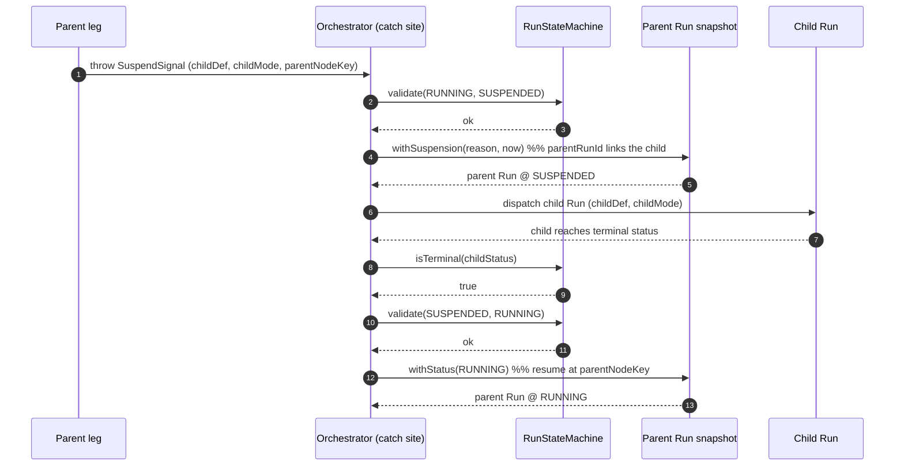

# L2 FunctionPoint Spec — `FP-CHILD-RUN-SPAWN`

This is the **L2 detail home** for the `FP-CHILD-RUN-SPAWN` FunctionPoint: the
runtime sequence by which a parent Run suspends awaiting a freshly dispatched
child Run and resumes when the child reaches a terminal status. It carries the
method call chain and the parent-suspend / child-execute / parent-resume sequence
that the layer-purity verdict ruled does **NOT** belong in L0 / L1 prose
(Rule 145 / E194-E195); L0 keeps the RunStatus DFA *invariant*, this spec owns the
verbs and the method hops.

> **Readable interpretation layer (Rule 146 / E196).** This spec invents no
> FunctionPoint ID, no frame ID, no method name, and no status value. Every
> identity is copied from the authoring DSL; every code anchor is cited from the
> generated facts. Where this prose and the DSL disagree, the DSL wins; where the
> DSL and the generated facts disagree, the generated facts win (ADR-0154 cascade:
> `generated facts > DSL > Card/prose`).

## Authority chain (read top-down)

1. **FunctionPoint identity (authoring DSL)** — element `fpChildRunSpawn` in
   [`../../../features/function-points.dsl`](../../../features/function-points.dsl),
   `saa.id` = `FP-CHILD-RUN-SPAWN`. `saa.status` `shipped`, `saa.channel`
   `internal`, `saa.actor` `platform-runtime`, `saa.trigger`
   `internal-orchestration-event`, `saa.requirement` `REQ-004`, `saa.sourceAdr`
   `ADR-0145`. The element declares **no** `saa.code_entrypoint_refs`, **no**
   `saa.test_refs`, and **no** `saa.contract_op_refs`; this spec adds none.
2. **Owning EngineeringFrame (structural parent)** — `EF-TASK-CONTROL`
   (`efTaskControl`, owner `agent-service`), which holds the `anchors` edge to
   this FunctionPoint in
   [`../../../features/engineering-frames.dsl`](../../../features/engineering-frames.dsl).
   Its Frame Card is
   [`../../L1/frames/EF-TASK-CONTROL.md`](../../L1/frames/EF-TASK-CONTROL.md).
3. **Generated facts (binding factual authority)** — the `code-symbol/*` facts in
   [`../../../facts/generated/code-symbols.json`](../../../facts/generated/code-symbols.json).
   Every anchor cited in §4 resolves there; facts are never hand-edited.
4. **Contract surface** — none. `FP-CHILD-RUN-SPAWN` is an `internal`-channel
   orchestration collaboration with no OpenAPI / AsyncAPI operation; its boundary
   is the owning frame's SPI types, cited in §4 / §6.
5. **L0 constraint authority** — the RunStatus DFA invariant at
   [`../../L0/ARCHITECTURE.md`](../../L0/ARCHITECTURE.md) §4 #20. L0 keeps the
   legal-transition / terminal invariant; this spec carries the child-spawn verbs
   and the method sequence. The transitions are grounded in the `RunStateMachine`
   code fact (§4).

---

## 1. Behavior

A parent Run, mid-execution, delegates a sub-task by spawning a **child** Run: the
parent parks at `SUSPENDED` (linked to the child by id), the child Run executes
independently, and the parent is resumed toward `RUNNING` once the child reaches a
terminal status (`SUCCEEDED` / `FAILED` / `CANCELLED` / `EXPIRED`). Both parent
transitions pass the `RunStateMachine` legal-transition guard. The structural axis
is `agent-service -> EF-TASK-CONTROL -> FP-CHILD-RUN-SPAWN`; the value axis is
`PC-003 -> REQ-004 -> FEAT-SUSPEND-RESUME-CONTROL -> FP-CHILD-RUN-SPAWN` (the
`featSuspendResumeControl requires fpChildRunSpawn` edge in `features.dsl`).

| Field | Value (copied from the DSL element) |
|---|---|
| FunctionPoint ID | `FP-CHILD-RUN-SPAWN` |
| Status | `shipped` (`saa.status`) |
| Owning EngineeringFrame | `EF-TASK-CONTROL` (the `anchors` parent) |
| Owner module | `agent-service` (`saa.owner`) |
| Requirement | `REQ-004` (`saa.requirement`) |
| Channel | `internal` (`saa.channel`) |
| Actor | `platform-runtime` (`saa.actor`) |
| Trigger | `internal-orchestration-event` (`saa.trigger`) |
| Source ADR | `ADR-0145` (`saa.sourceAdr`) |

## 2. I/O

`internal` channel — no wire request / response. The input and output are typed
in-process collaborations:

- **Input** — a child-flavour `SuspendSignal`
  (`code-symbol/com-huawei-ascend-bus-spi-engine-suspendsignal`) raised by the
  parent's executing leg, carrying the child's executor definition and run mode
  (`childDef` / `childMode`) and the node key the parent will resume at
  (`parentNodeKey`). The parent `Run` snapshot
  (`code-symbol/com-huawei-ascend-service-runtime-runs-run`) carries the current
  status and the `parentRunId` linkage.
- **Output** — a copied parent `Run` snapshot at `SUSPENDED` while the child runs,
  then back toward `RUNNING` once the child is terminal; the child `Run` is a
  separate aggregate whose `parentRunId()` points at the suspending parent.
- **Side effects** — the guarded parent status changes are committed through the
  Run aggregate's persistence port `RunRepository` (anchored by
  `EF-SESSION-TASK-STATE`, `FP-RUN-STATE-TRANSITION`); dispatch and durable
  checkpoint of the child are orchestration-SPI concerns (`EF-ORCHESTRATION-SPI`),
  used here but owned there.

## 3. Runtime Sequence

The legal transitions this FunctionPoint drives are the parent's suspend
(`RUNNING -> SUSPENDED`) and resume (`SUSPENDED -> RUNNING`) edges of the RunStatus
DFA; resume is gated on the child reaching a terminal status, tested through
`RunStateMachine.isTerminal(childStatus)`. Each parent edge is admitted only after
`RunStateMachine.validate(from, to)` passes.

The catch-site / dispatch participant (`Orchestrator`) lives in the neutral
execution model (`EF-ORCHESTRATION-SPI`, package `com.huawei.ascend.bus.spi.engine`)
and is named here only as the boundary that reacts to a child-flavour
`SuspendSignal`; this FunctionPoint's own frame (`EF-TASK-CONTROL`) anchors the
*control* behaviour — the guarded parent `Run` transitions and the
terminal-gated resume. The child dispatch + checkpoint plumbing is the
orchestration SPI's process detail, referenced not duplicated.

## 4. Class / Method Anchors (from facts)

Every code anchor cited from the generated facts; no class or method name is
minted. Method descriptors are verbatim entries in each class fact's
`public_methods[]`.

| Role | Symbol | Fact id (+ method descriptor) |
|---|---|---|
| In-frame parent linkage | `Run.parentRunId` | `code-symbol/com-huawei-ascend-service-runtime-runs-run#parentRunId()Ljava/util/UUID;` |
| In-frame parent suspend snapshot | `Run.withSuspension` | `code-symbol/com-huawei-ascend-service-runtime-runs-run#withSuspension(Ljava/lang/String;Ljava/time/Instant;)Lcom/huawei/ascend/service/runtime/runs/Run;` |
| In-frame parent resume snapshot | `Run.withStatus` | `code-symbol/com-huawei-ascend-service-runtime-runs-run#withStatus(Lcom/huawei/ascend/service/runtime/runs/RunStatus;)Lcom/huawei/ascend/service/runtime/runs/Run;` |
| In-frame terminal predicate (resume gate) | `RunStateMachine.isTerminal` | `code-symbol/com-huawei-ascend-service-runtime-runs-runstatemachine#isTerminal(Lcom/huawei/ascend/service/runtime/runs/RunStatus;)Z` |
| In-frame transition guard | `RunStateMachine.validate` | `code-symbol/com-huawei-ascend-service-runtime-runs-runstatemachine#validate(Lcom/huawei/ascend/service/runtime/runs/RunStatus;Lcom/huawei/ascend/service/runtime/runs/RunStatus;)V` |
| Collaborating signal carrier (child flavour) | `SuspendSignal.childDef` | `code-symbol/com-huawei-ascend-bus-spi-engine-suspendsignal#childDef()Lcom/huawei/ascend/bus/spi/engine/ExecutorDefinition;` |
| Collaborating signal carrier (child mode) | `SuspendSignal.childMode` | `code-symbol/com-huawei-ascend-bus-spi-engine-suspendsignal#childMode()Lcom/huawei/ascend/bus/spi/engine/RunMode;` |
| Collaborating reason taxonomy | `SuspendReason` (sealed) | `code-symbol/com-huawei-ascend-service-runtime-resilience-spi-suspendreason` |

All fact ids in this section resolve in
[`../../../facts/generated/code-symbols.json`](../../../facts/generated/code-symbols.json).
The `SuspendReason` interface declares no public methods (sealed type with record
variants, including the child-await placeholder), so it is cited as a type only.

## 5. Error Paths

| Cause (observable) | Outcome | Status / signal | Exception |
|---|---|---|---|
| Parent suspend attempted from a status with no `-> SUSPENDED` edge (only `RUNNING` has one) | rejected at the model boundary | no transition; the spawn is refused | `IllegalStateException` from `RunStateMachine.validate` |
| Parent resume attempted from a status with no `-> RUNNING` edge | rejected at the model boundary | no transition; the resume is refused | `IllegalStateException` from `RunStateMachine.validate` |
| Child Run reaches a non-terminal status when resume is evaluated | resume not taken | parent stays `SUSPENDED` | none — `RunStateMachine.isTerminal` returns `false`, gating the resume |

This FunctionPoint introduces no `error.code` of its own (no contract surface —
§6). How a child's terminal *outcome* (failed vs succeeded) shapes the parent's
post-resume path is the parent leg's own logic, not this transition guard's.

## 6. Contracts

No external contract surface — internal boundary; the contract is the owning
frame's SPI types (cited in §4): the `Run` / `RunStatus` / `RunStateMachine`
public surface of `com.huawei.ascend.service.runtime.runs`, and the collaborating
child-flavour `SuspendSignal` carrier. The DSL element `fpChildRunSpawn` declares
no `saa.contract_op_refs`, so none is cited.

## 7. Tests

The authoring DSL declares **no** FunctionPoint-level test for
`FP-CHILD-RUN-SPAWN`: the element carries no `saa.test_refs`, and
[`../../../features/verification.dsl`](../../../features/verification.dsl) holds no
`verifies` edge into `fpChildRunSpawn`. Per the readable-interpretation discipline
(Rule 146 clause 2), no `test/*` fact is attributed to this FunctionPoint here —
inventing one would assert a `verifies` relationship the DSL does not record.

The DFA *invariant* this FunctionPoint relies on (the legal parent `RUNNING <->
SUSPENDED` edges and the terminal-status set the resume gate reads) is exercised at
the frame altitude by the `RunStateMachine` DFA suite recorded in the
`EF-TASK-CONTROL` Frame Card `fact_refs:`
(`test/com-huawei-ascend-service-runtime-runs-runstatemachinetest`); a
FunctionPoint-scoped `verifies` edge is the authoring step that would let this
section cite a test directly, and lands with the same PR that adds it.

## 8. Gates

| Concern | Gate rule / enforcer | What it blocks |
|---|---|---|
| FunctionPoint element well-formedness | Rule G-14 / E160 | a profile-tagged FP element missing a required `saa.*` property. |
| Frame anchors >= 1 FP (shipped) | Rule G-23 | promoting `EF-TASK-CONTROL` to `shipped` without anchoring >= 1 FunctionPoint (this FP is one of its anchors). |
| Card / spec is a readable interpretation | Rule 146 / E196 | a `code-symbol/*` citation or method descriptor here that does not resolve in the generated facts, or an FP/frame relationship not present in the DSL. |
| No L2 detail left upstream | Rule 145 / E194-E195 | the child-spawn method-chain and sequence this spec carries being left in L0 / L1 prose instead. |
| FunctionPoint readiness | Rule 147 / E197 (kernel Rule G-30) | a FunctionPoint marked ready whose axis obligations are absent — `gate/lib/check_feature_readiness.py`, ADVISORY at the ADR-0159 §13.3 landing rung. |

---

## What stays upstream (NOT carried here)

Per the layer-purity keep-list (Rule 145), the following remain at L0 / L1 and are
only *referenced* here, never duplicated:

- the L0 §4 #20 RunStatus DFA *invariant* (which transitions are legal / terminal)
  — L0 owns the invariant; this spec owns the child-spawn verbs and method hops;
- naming `EF-TASK-CONTROL` / the `com.huawei.ascend.service.runtime.runs` package
  as a **boundary identity** (Frame Card material);
- the Run aggregate's atomic compare-and-set persistence realization
  (`FP-RUN-STATE-TRANSITION` / `EF-SESSION-TASK-STATE`) and the child dispatch +
  checkpoint plumbing (`EF-ORCHESTRATION-SPI`), used here but detailed there;
- citing the ArchUnit / gate enforcer that pins the boundary (named in §8, not
  re-specified).

## Authority

- ADR-0068 — Layered 4+1 + Architecture Graph as twin sources of truth
  ([`../../../../docs/adr/0068-layered-4plus1-and-architecture-graph.yaml`](../../../../docs/adr/0068-layered-4plus1-and-architecture-graph.yaml)).
- ADR-0161 — EngineeringFrame package-cluster anchor + Card over DSL
  ([`../../../../docs/adr/0161-engineering-frame-package-cluster-anchor-and-card-over-dsl.yaml`](../../../../docs/adr/0161-engineering-frame-package-cluster-anchor-and-card-over-dsl.yaml)).
- ADR-0145 — Sealed RunEvent hierarchy (the child-run / event scope this FP's source ADR pins)
  ([`../../../../docs/adr/0145-run-event-sealed-hierarchy.yaml`](../../../../docs/adr/0145-run-event-sealed-hierarchy.yaml)).
- Frame Card: [`../../L1/frames/EF-TASK-CONTROL.md`](../../L1/frames/EF-TASK-CONTROL.md).
- L2 corpus index: [`../README.md`](../README.md).
