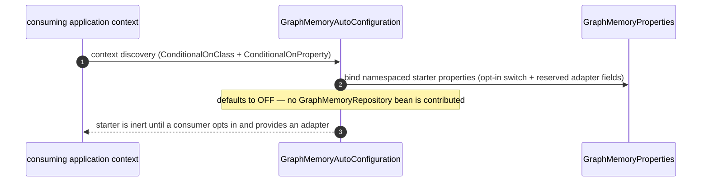

# L2 FunctionPoint Spec — `FP-GRAPH-MEMORY-STORE`

This L2 detailed-design document is the **detail home** for the tenant-scoped
graph-memory store FunctionPoint — the SPI surface a consuming application uses
to add, query, and search semantic graph facts, plus the Spring Boot
auto-configuration decision that wires (or, by default, withholds) a backing
adapter. It carries the SPI method inventory and the wiring scenario that the
layer-purity verdict ruled do NOT belong in L0 / L1 prose (Rule 145 /
E194-E195).

> **READABLE INTERPRETATION layer (Rule 146 / E196).** This document invents no
> FunctionPoint ID, frame ID, or method name. Every identity is **copied** from
> the authoring DSL; every code / test anchor is **cited** from the generated
> facts. Where this prose and the DSL disagree, the DSL wins; where the DSL and
> generated facts disagree, the **generated facts win** (ADR-0154 cascade:
> `generated facts > DSL > Card/prose`).

> **Realization note (cited, not minted).** The DSL element carries
> `saa.status "shipped"`, but its owning frame `EF-GRAPHMEMORY-AUTOCONFIG` is
> `design_only`: the auto-configuration contributes **no** `GraphMemoryRepository`
> adapter bean today, and its test asserts the bean is absent. The SPI **type**
> and its methods exist and are cited below; the production storage adapter behind
> them does not yet ship. This spec therefore documents the SPI contract surface
> and the wiring decision that ship, and marks the adapter runtime as
> not-yet-realized rather than inventing a call chain through an absent bean.

## Authority chain (read top-down)

1. **FunctionPoint identity (authoring DSL)** — element `fpGraphMemoryStore` in
   [`../../../features/function-points.dsl`](../../../features/function-points.dsl),
   `saa.id` = `FP-GRAPH-MEMORY-STORE`. Its `saa.status` is `shipped`,
   `saa.channel` `internal`, `saa.actor` `platform-runtime`, `saa.trigger`
   `internal-orchestration-event`, `saa.requirement` `REQ-008`, `saa.owner`
   `spring-ai-ascend-graphmemory-starter`, `saa.sourceAdr` `ADR-0081`. This spec
   adds no property the element does not declare.
2. **Owning EngineeringFrame (structural parent)** — `EF-GRAPHMEMORY-AUTOCONFIG`
   (`efGraphmemoryAutoconfig`), which holds the `anchors` edge to this
   FunctionPoint in
   [`../../../features/engineering-frames.dsl`](../../../features/engineering-frames.dsl)
   (`efGraphmemoryAutoconfig -> fpGraphMemoryStore`, `saa.rel "anchors"`). Its
   Frame Card is
   [`../../L1/frames/EF-GRAPHMEMORY-AUTOCONFIG.md`](../../L1/frames/EF-GRAPHMEMORY-AUTOCONFIG.md).
3. **Generated facts (binding factual authority)** — the `code-symbol/*` and
   `test/*` facts in
   [`../../../facts/generated/code-symbols.json`](../../../facts/generated/code-symbols.json)
   and
   [`../../../facts/generated/tests.json`](../../../facts/generated/tests.json).
   Every anchor cited below resolves there. Facts are never hand-edited.
4. **Contract surface** — no `contract-op/*`. The graph-memory family has a
   document-level contract taxonomy fact `contract-yaml/memory-store` in
   [`../../../facts/generated/contract-surfaces.json`](../../../facts/generated/contract-surfaces.json);
   the binding boundary for this `internal`-channel FunctionPoint is the SPI type
   itself (§4, §6).
5. **L0 constraint authority** — the
   [`../../L0/ARCHITECTURE.md`](../../L0/ARCHITECTURE.md) §4 constraint plus the
   ownership topology fixed in ADR-0082 (the SPI is owned by `agent-service`; the
   starter is a downstream consumer). L0 / ADR own the ownership invariant; this
   spec owns the SPI verbs and the wiring decision.

---

## 1. Behavior

This FunctionPoint realizes one behaviour: **expose a tenant-scoped graph-memory
store SPI — add a fact, query by subject, semantic-search — and let a consuming
application opt a backing adapter in or out via the starter's
auto-configuration**. On the value axis it serves `REQ-008` via the graph-memory
feature; on the structural axis it is anchored by `EF-GRAPHMEMORY-AUTOCONFIG`
inside the `spring-ai-ascend-graphmemory-starter`, while the SPI type it exposes
is owned upstream by `agent-service` (ADR-0082).

| Field | Value (copied from the DSL element) |
|---|---|
| FunctionPoint ID | `FP-GRAPH-MEMORY-STORE` |
| Status | `shipped` (`saa.status`) — see the realization note above (frame is `design_only`; adapter unrealized) |
| Owning EngineeringFrame | `EF-GRAPHMEMORY-AUTOCONFIG` (the `anchors` parent) |
| Owner module | `spring-ai-ascend-graphmemory-starter` (`saa.owner`) |
| Requirement | `REQ-008` (`saa.requirement`) |
| Channel | `internal` (`saa.channel`) |
| Actor | `platform-runtime` (`saa.actor`) |
| Trigger | `internal-orchestration-event` (`saa.trigger`) |
| Source ADR | `ADR-0081` (`saa.sourceAdr`) |

## 2. I/O

The I/O is the SPI method surface
(`code-symbol/com-huawei-ascend-service-runtime-memory-spi-graphmemoryrepository`).
Every method is tenant-scoped (a tenant identifier is the leading parameter):

- **`addFact`** — Input: tenant id, subject, predicate, object, plus a
  `GraphMetadata` carrier
  (`code-symbol/com-huawei-ascend-service-runtime-memory-spi-graphmemoryrepository-graphmetadata`);
  Output: none (void) — the side effect is persisting one semantic fact for the
  tenant. Descriptor:
  `addFact(Ljava/lang/String;Ljava/lang/String;Ljava/lang/String;Ljava/lang/String;Lcom/huawei/ascend/service/runtime/memory/spi/GraphMemoryRepository$GraphMetadata;)V`.
- **`query`** — Input: tenant id, a subject/key string, a result limit (`int`);
  Output: a `java.util.List` of matching graph facts for the tenant. Descriptor:
  `query(Ljava/lang/String;Ljava/lang/String;I)Ljava/util/List;`.
- **`search`** — Input: tenant id, a semantic query string, a result limit
  (`int`); Output: a `java.util.List` of semantically-ranked graph facts for the
  tenant. Descriptor:
  `search(Ljava/lang/String;Ljava/lang/String;I)Ljava/util/List;`.
- **Side effects** — `addFact` writes one tenant-scoped fact into the backing
  graph store *when an adapter is wired*; `query` / `search` are reads. The
  carrier types crossing the boundary are `GraphEdge`
  (`code-symbol/com-huawei-ascend-service-runtime-memory-spi-graphmemoryrepository-graphedge`)
  and `GraphMetadata` (above). The concrete persistence mechanics are an adapter
  concern, delegated to an implementation this frame does not yet provide.

## 3. Runtime Sequence

The only runtime path that ships today is the **auto-configuration decision**,
not an end-to-end store call (no adapter bean is contributed — see the
realization note). The shipped sequence is a single conditional registration:

The store-call sequence (`addFact` / `query` / `search` over a wired adapter) is
the **future** realization: once a `GraphMemoryRepository` adapter bean is
contributed, a tenant-scoped call enters through that bean's implementation of
the SPI methods in §4. That sequence is documented here as the contract the SPI
defines, but it is not drawn as a live diagram because no adapter participant
resolves to a `code-symbol/*` fact yet.

## 4. Class / Method Anchors (from facts)

| Role | Symbol | Fact id (+ method descriptor) |
|---|---|---|
| SPI surface (type) | `GraphMemoryRepository` | `code-symbol/com-huawei-ascend-service-runtime-memory-spi-graphmemoryrepository` |
| SPI — add a fact | `GraphMemoryRepository.addFact` | `code-symbol/com-huawei-ascend-service-runtime-memory-spi-graphmemoryrepository#addFact(Ljava/lang/String;Ljava/lang/String;Ljava/lang/String;Ljava/lang/String;Lcom/huawei/ascend/service/runtime/memory/spi/GraphMemoryRepository$GraphMetadata;)V` |
| SPI — query by key | `GraphMemoryRepository.query` | `code-symbol/com-huawei-ascend-service-runtime-memory-spi-graphmemoryrepository#query(Ljava/lang/String;Ljava/lang/String;I)Ljava/util/List;` |
| SPI — semantic search | `GraphMemoryRepository.search` | `code-symbol/com-huawei-ascend-service-runtime-memory-spi-graphmemoryrepository#search(Ljava/lang/String;Ljava/lang/String;I)Ljava/util/List;` |
| Carrier — edge (type) | `GraphMemoryRepository.GraphEdge` | `code-symbol/com-huawei-ascend-service-runtime-memory-spi-graphmemoryrepository-graphedge` |
| Carrier — metadata (type) | `GraphMemoryRepository.GraphMetadata` | `code-symbol/com-huawei-ascend-service-runtime-memory-spi-graphmemoryrepository-graphmetadata` |
| Auto-config entry (type) | `GraphMemoryAutoConfiguration` | `code-symbol/com-huawei-ascend-service-runtime-graphmemory-graphmemoryautoconfiguration` |
| Bound properties (type) | `GraphMemoryProperties` | `code-symbol/com-huawei-ascend-service-runtime-graphmemory-graphmemoryproperties` |

All fact ids in this section resolve in
[`../../../facts/generated/code-symbols.json`](../../../facts/generated/code-symbols.json);
each method descriptor is a verbatim entry in the SPI class fact's
`public_methods[]`.

## 5. Error Paths

| Cause (observable) | Outcome | Status / signal | Exception / behaviour |
|---|---|---|---|
| starter on the classpath, opt-in property absent (default) | no adapter contributed | the starter is inert; no `GraphMemoryRepository` bean exists | — (by design; the `ConditionalOnProperty` simply does not match) |
| opt-in requested but no adapter implementation provided | the consumer's own wiring resolves no bean | a Spring `NoSuchBeanDefinitionException` surfaces in the consuming context if a collaborator requires the SPI | — (consumer-side wiring error, not raised by this frame) |
| tenant-scoped store call once an adapter exists | adapter-defined | adapter-defined | deferred to the adapter implementation (not yet realized) |

There is no HTTP status (internal channel). The shipped, test-backed outcome is
the *absence* of a bean under the default posture (§7); the store-call error
semantics belong to the future adapter and are not minted here.

## 6. Contracts

No external contract surface — internal boundary. The contract is the
`GraphMemoryRepository` SPI type
(`code-symbol/com-huawei-ascend-service-runtime-memory-spi-graphmemoryrepository`),
owned by `agent-service` per ADR-0082; the starter exposes only the Spring Boot
auto-configuration contract
(`code-symbol/com-huawei-ascend-service-runtime-graphmemory-graphmemoryautoconfiguration`
+ `code-symbol/com-huawei-ascend-service-runtime-graphmemory-graphmemoryproperties`).
The generated
[`../../../facts/generated/contract-surfaces.json`](../../../facts/generated/contract-surfaces.json)
carries no `contract-op/*` for graph memory; the document-level taxonomy fact
`contract-yaml/memory-store` is the prose family description, not a wire
operation. The on-the-wire mechanics of any future adapter are L2 adapter detail,
delegated to the SPI implementation.

## 7. Tests

| Layer | Test class | Fact id | Covers |
|---|---|---|---|
| Integration / wiring | `com.huawei.ascend.service.runtime.graphmemory.GraphMemoryAutoConfigurationTest` | `test/com-huawei-ascend-service-runtime-graphmemory-graphmemoryautoconfigurationtest` | the auto-configuration loads without failing **and** contributes **no** `GraphMemoryRepository` bean under the default posture — the running evidence that the frame is wiring-only. |

- The `test/*` id resolves in
  [`../../../facts/generated/tests.json`](../../../facts/generated/tests.json)
  (its `test_methods[]` carries `contextLoads_noGraphMemoryRepositoryBean`).
- Unit and store-behaviour test layers (Rule D-4) are **deferred** until a real
  `GraphMemoryRepository` adapter is contributed: no adapter `test/*` fact exists
  yet, consistent with the frame's `design_only` realization status. The SPI
  contract is type-checked at compile time; its behavioural tests land with the
  adapter.

## 8. Gates

| Concern | Gate rule / enforcer | What it blocks |
|---|---|---|
| FunctionPoint element well-formedness | architecture-sync profile required-properties gate (`architecture/profile/required-properties.yaml`) | a profile-tagged FP element missing one of the mandatory `saa.*` properties (`saa.id`/`kind`/`level`/`view`/`status`/`owner`/`sourceAdr`). |
| Frame anchors >= 1 FP (shipped) | Rule G-23 / Rule 140 (E-frame anchor integrity) | promoting `EF-GRAPHMEMORY-AUTOCONFIG` to `shipped` without anchoring >= 1 FunctionPoint (this FP is its anchor). |
| Card / spec is a readable interpretation | Rule 146 / E196 | a citation here (`code-symbol/*`, `test/*`, method descriptor) that does not resolve in the generated facts, or an FP / frame relationship absent from the DSL. |
| No L2 detail left upstream | Rule 145 / E194-E195 | the SPI method inventory / wiring sequence this spec carries being left in L0 / L1 prose instead. |
| Ownership topology truth | ADR-0082 (module-metadata + module-build fact layer) | the starter claiming ownership of the `GraphMemoryRepository` SPI it merely consumes. |
| FunctionPoint readiness | Rule 147 / E197 (kernel Rule G-30) | a FunctionPoint marked ready whose axis obligations are absent — `gate/lib/check_feature_readiness.py`, ADVISORY at the ADR-0159 §13.3 landing rung. |

---

## What stays upstream (NOT carried here)

- the L0 / ADR-0082 *ownership invariant* (the SPI is owned by `agent-service`;
  the starter is a downstream consumer) — L0 / ADR own the topology; this spec
  owns the SPI verbs and the wiring decision;
- naming `GraphMemoryRepository` / `GraphMemoryAutoConfiguration` as **boundary
  identities** and the starter's package decomposition (that is the
  [`EF-GRAPHMEMORY-AUTOCONFIG` Frame Card](../../L1/frames/EF-GRAPHMEMORY-AUTOCONFIG.md));
- citing the gate / module-metadata enforcer that pins the boundary (named in §8,
  not re-specified).

## Authority

- ADR-0068 — Layered 4+1 + Architecture Graph as twin sources of truth
  ([`../../../../docs/adr/0068-layered-4plus1-and-architecture-graph.yaml`](../../../../docs/adr/0068-layered-4plus1-and-architecture-graph.yaml)).
- ADR-0161 — EngineeringFrame package-cluster anchor + Card over DSL
  ([`../../../../docs/adr/0161-engineering-frame-package-cluster-anchor-and-card-over-dsl.yaml`](../../../../docs/adr/0161-engineering-frame-package-cluster-anchor-and-card-over-dsl.yaml)).
- ADR-0082 — GraphMemory ownership canonical + topology truth
  ([`../../../../docs/adr/0082-graphmemory-ownership-canonical-and-topology-truth.yaml`](../../../../docs/adr/0082-graphmemory-ownership-canonical-and-topology-truth.yaml)).
- Rule 33 — Layered 4+1 Discipline; Rule 145 — L2 detail sink; Rule 146 — Frame
  Card / FunctionPoint-spec is a readable interpretation (`CLAUDE.md`).
- L2 corpus index: [`../README.md`](../README.md).
