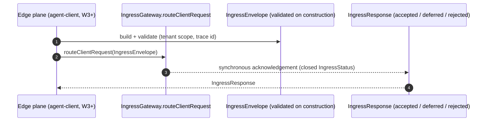

# L2 FunctionPoint Spec — `FP-INGRESS-ENVELOPE` (Ingress Envelope Routing)

This is the **L2 technical-detail home** for the single FunctionPoint
`FP-INGRESS-ENVELOPE`: routing a normalized client-originated request from the
edge plane to the compute_control plane through the `IngressGateway` SPI. It
carries the method-level routing contract, the participating value carriers, and
the runtime scenario that the layer-purity verdict ruled does **not** belong in
L0 / L1 prose (Rule 145 / E194-E195).

> **This document is a READABLE INTERPRETATION layer (Rule 146 / E196).** It
> invents no FunctionPoint ID, frame ID, type name, method descriptor, or status
> value. Every identity is copied from the authoring DSL; every code/test/contract
> fact is cited from the generated facts. Where this prose and the DSL disagree,
> the DSL wins; where the DSL and the generated facts disagree, the generated
> facts win (cascade: `generated facts > DSL > Card/prose`).

## Authority chain (read top-down)

1. **FunctionPoint identity (authoring DSL)** — element `fpIngressEnvelope`
   (`saa.id` = `FP-INGRESS-ENVELOPE`) in
   [`../../../features/function-points.dsl`](../../../features/function-points.dsl).
   Its `saa.status`, `saa.channel`, `saa.actor`, `saa.trigger`, `saa.requirement`,
   and `saa.sourceAdr` are copied verbatim into §1.
2. **Owning EngineeringFrame (structural parent)** — `EF-INGRESS-GATEWAY`
   (`efIngressGateway`, owner `agent-bus`) holds the `anchors` edge
   `efIngressGateway -> fpIngressEnvelope` in
   [`../../../features/engineering-frames.dsl`](../../../features/engineering-frames.dsl).
   Frame Card: [`../../L1/frames/EF-INGRESS-GATEWAY.md`](../../L1/frames/EF-INGRESS-GATEWAY.md).
3. **Generated facts (binding factual authority)** — the `code-symbol/*` and
   `test/*` facts cited in §4 / §7 resolve in
   [`../../../facts/generated/code-symbols.json`](../../../facts/generated/code-symbols.json)
   and [`../../../facts/generated/tests.json`](../../../facts/generated/tests.json).
4. **Contract surface (binding wire / SPI authority)** — the schema contract
   [`../../../../docs/contracts/ingress-envelope.v1.yaml`](../../../../docs/contracts/ingress-envelope.v1.yaml)
   (`contract-yaml/ingress-envelope`), Authority ADR-0089.
5. **L0 constraint authority** — the L0 §4 edge-plane / negative-dependency
   constraint (Rule R-I.1) that names the boundary without carrying its routing
   detail. This spec carries the detail; L0 keeps the invariant.

---

## 1. Behavior

`FP-INGRESS-ENVELOPE` realizes the **single cross-plane control hop**: a
client-originated request, normalized into one validated `IngressEnvelope`, is
routed from the edge plane to the compute_control plane and answered with one
synchronous `IngressResponse` acknowledgement. The boundary exists so the bus has
exactly one validated envelope to route, regardless of how the edge client
expressed the request (ADR-0089, Rule R-I.1).

On the value axis this FunctionPoint serves
`PC-002 -> REQ-002 -> FEAT-EDGE-COMPUTE-INGRESS -> FP-INGRESS-ENVELOPE`; on the
structural axis it is `agent-bus -> EF-INGRESS-GATEWAY -> FP-INGRESS-ENVELOPE`.

| Field | Value (copied from the DSL element) |
|---|---|
| FunctionPoint ID | `FP-INGRESS-ENVELOPE` |
| Status | `shipped` (`saa.status`) — **SPI surface only**; see the maturity note below |
| Owning EngineeringFrame | `EF-INGRESS-GATEWAY` (the `anchors` parent) |
| Owner module | `agent-bus` (`saa.owner`) |
| Requirement | `REQ-002` (`saa.requirement`) |
| Channel | `internal` (`saa.channel`) |
| Actor | `platform-runtime` (`saa.actor`) |
| Trigger | `internal-orchestration-event` (`saa.trigger`) |
| Source ADR | `ADR-0089` (`saa.sourceAdr`) |
| Value-axis Feature | `FEAT-EDGE-COMPUTE-INGRESS` (`requires` edge, owner `agent-bus`) |

> **Maturity note (not a contradiction).** The FunctionPoint is `shipped` in the
> sense that its **boundary identity** — the `IngressGateway` SPI and its two
> immutable value carriers — ships and compiles. The `ingress-envelope.v1.yaml`
> contract is `status: design_only` / `runtime_enforced: false`, and no
> production implementation sits behind the SPI yet; the agent-service `/v1/runs`
> HTTP routes continue to serve edge traffic directly until the W3+ agent-client
> SDK lands (ADR-0089 / ADR-0049). The two enforcers in §8 hold the boundary's
> negative invariants today; a behavioural test for the route hop lands with the
> runtime binding.

## 2. I/O

- **Input** — `IngressEnvelope`
  (`code-symbol/com-huawei-ascend-bus-spi-ingress-ingressenvelope`), an immutable
  record carrying the request id, tenant scope, idempotency key, a closed
  `IngressRequestType`, the opaque payload, the trace id, an optional deadline,
  and request attributes. Construction validates the contract-spine invariants
  (non-null tenant scope, well-formed trace identifier) so a malformed C2S request
  is refused at the boundary, not deep in the runtime.
- **Output (success)** — `IngressResponse`
  (`code-symbol/com-huawei-ascend-bus-spi-ingress-ingressresponse`), a synchronous
  acknowledgement whose closed outcome set is `IngressResponse$IngressStatus`
  (`code-symbol/com-huawei-ascend-bus-spi-ingress-ingressresponse-ingressstatus`).
  The record exposes one factory per outcome — `accepted(...)`, `deferred(...)`,
  `rejected(...)` (cited in §4) — so the routing entrypoint returns a typed,
  closed acknowledgement.
- **Side effects** — none owned by this frame. `EF-INGRESS-GATEWAY` is a pure
  boundary declaration; the request is *forwarded* across the plane boundary to a
  compute_control-plane implementation (owned by the agent-service request-admission
  frame), which owns any state write. This spec never inlines that downstream
  persistence.

## 3. Runtime Sequence

The routing hop is a single SPI call from the edge-plane caller to the gateway
boundary, returning one acknowledgement. The compute_control-plane realization
that satisfies `IngressGateway` is out of this frame (boundary-only at this
status), so the sequence terminates at the SPI surface.

The `routeClientRequest` method is the only boundary hop; the downstream
plane-crossing forward and any admission work are owned by the compute_control
realization and are not this frame's detail.

## 4. Class / Method Anchors (from facts)

| Role | Symbol | Fact id (+ method descriptor) |
|---|---|---|
| Entry SPI (routing entrypoint) | `IngressGateway.routeClientRequest` | `code-symbol/com-huawei-ascend-bus-spi-ingress-ingressgateway#routeClientRequest(Lcom/huawei/ascend/bus/spi/ingress/IngressEnvelope;)Lcom/huawei/ascend/bus/spi/ingress/IngressResponse;` |
| Request carrier (type) | `IngressEnvelope` | `code-symbol/com-huawei-ascend-bus-spi-ingress-ingressenvelope` |
| Request taxonomy (type) | `IngressEnvelope$IngressRequestType` | `code-symbol/com-huawei-ascend-bus-spi-ingress-ingressenvelope-ingressrequesttype` |
| Acknowledgement carrier (type) | `IngressResponse` | `code-symbol/com-huawei-ascend-bus-spi-ingress-ingressresponse` |
| Acknowledgement: accept factory | `IngressResponse.accepted` | `code-symbol/com-huawei-ascend-bus-spi-ingress-ingressresponse#accepted(Ljava/util/UUID;Ljava/lang/String;)Lcom/huawei/ascend/bus/spi/ingress/IngressResponse;` |
| Acknowledgement: defer factory | `IngressResponse.deferred` | `code-symbol/com-huawei-ascend-bus-spi-ingress-ingressresponse#deferred(Ljava/util/UUID;)Lcom/huawei/ascend/bus/spi/ingress/IngressResponse;` |
| Acknowledgement: reject factory | `IngressResponse.rejected` | `code-symbol/com-huawei-ascend-bus-spi-ingress-ingressresponse#rejected(Ljava/util/UUID;Ljava/lang/String;)Lcom/huawei/ascend/bus/spi/ingress/IngressResponse;` |
| Outcome alphabet (type) | `IngressResponse$IngressStatus` | `code-symbol/com-huawei-ascend-bus-spi-ingress-ingressresponse-ingressstatus` |

The DSL element declares no `saa.code_entrypoint_refs`; the entry above is the
SPI routing method the owning frame anchors (`efIngressGateway -> fpIngressEnvelope`),
copied from the Frame Card §6 and resolving in
[`../../../facts/generated/code-symbols.json`](../../../facts/generated/code-symbols.json).

## 5. Error Paths

The boundary refuses malformed input at the envelope construction edge and
expresses non-accept routing outcomes through the closed `IngressStatus` set —
there is no separate error channel.

| Cause (observable) | Outcome | Status / signal | `error.code` / exception |
|---|---|---|---|
| Null tenant scope or malformed trace id on the request | rejected at boundary | construction failure | `IllegalArgumentException` (envelope construction invariant) |
| Request cannot be admitted now (back-pressure / deferral) | deferred | `IngressResponse` via `deferred(...)` | closed `IngressStatus` deferral outcome |
| Request refused by routing policy | rejected | `IngressResponse` via `rejected(...)` with `rejectionReason` | closed `IngressStatus` reject outcome |

This is an `internal`-channel FunctionPoint with no HTTP wire, so no
`response_status_codes` apply; the outcomes above are the closed
`IngressResponse$IngressStatus` alphabet, cited as a type in §4, not minted here.

## 6. Contracts

`FP-INGRESS-ENVELOPE` speaks an **internal** boundary, not an HTTP/AsyncAPI
operation, so it has no `contract-op/*`. Its envelope/response shape is pinned by
a schema contract.

| Operation | Fact id | Surface | Status |
|---|---|---|---|
| Ingress envelope schema (C2S) | `contract-yaml/ingress-envelope` | `docs/contracts/ingress-envelope.v1.yaml` | `design_only` (not runtime-enforced) |

- The binding wire authority is the schema contract document itself
  ([`../../../../docs/contracts/ingress-envelope.v1.yaml`](../../../../docs/contracts/ingress-envelope.v1.yaml),
  Authority ADR-0089); this table is a readable interpretation of it. The Java
  records under `com.huawei.ascend.bus.spi.ingress` mirror that schema and validate
  required fields on construction.
- No external HTTP contract surface exists for the routing hop — the contract for
  this internal boundary **is** the owning frame's SPI type `IngressGateway`
  (cited in §4).

## 7. Tests

The DSL element declares no `saa.test_refs`. No behavioural test exercises the
routing hop yet, because the frame ships the SPI declaration only (no
implementation behind the boundary, `design_only` contract). The two fact-cited
tests below hold the boundary's **negative** invariants — the structural
guarantees that make the SPI the single C2S path.

| Layer | Test class | Fact id | Covers |
|---|---|---|---|
| Architecture / enforcer | `SpiPurityGeneralizedArchTest` | `test/com-huawei-ascend-service-runtime-architecture-spipuritygeneralizedarchtest` | the ingress SPI package stays framework-free (depends only on `java.*` + same-package siblings). |
| Architecture / enforcer | `EdgeToComputeDirectLinkArchTest` | `test/com-huawei-ascend-client-architecture-edgetocomputedirectlinkarchtest` | the edge plane takes no direct compute_control dependency, forcing every C2S call through this ingress SPI. Armed-but-vacuous while `agent-client` is a skeleton; it begins gating once the edge SDK lands. |

A behavioural (round-trip) test for `routeClientRequest` is **deferred** until the
runtime binding and the edge SDK arrive; both test facts above resolve in
[`../../../facts/generated/tests.json`](../../../facts/generated/tests.json).

## 8. Gates

| Concern | Gate rule / enforcer | What it blocks |
|---|---|---|
| SPI purity (framework-free boundary) | `SpiPurityGeneralizedArchTest` (enforcer `E48`) | the ingress SPI package importing Spring / platform / reference impls. |
| Edge-plane negative dependency | `EdgeToComputeDirectLinkArchTest` (enforcer `E143`) + Rule `105` `edge_no_direct_compute_link` (enforcer `E144`) | an edge-plane class importing `com.huawei.ascend.{service,engine,middleware}.*`, bypassing the ingress SPI. |
| Frame anchors >= 1 FP (shipped) | Rule G-23 (enforcer `E188`) | promoting `EF-INGRESS-GATEWAY` to `shipped` without the `anchors` edge to `FP-INGRESS-ENVELOPE`. |
| Card / spec is a readable interpretation | Rule 146 / E196 | a citation here (`code-symbol/*`, `test/*`, method descriptor) that does not resolve, or an FP/frame relationship absent from the DSL. |
| No L2 detail left upstream | Rule 145 / E194-E195 | the routing method / sequence / envelope detail this spec carries being left in L0 / L1 prose. |

---

## What stays upstream (NOT carried here)

Per the layer-purity keep-list, the following remain at L0 / L1 and are only
*referenced* here, never duplicated (Rule 145):

- the L0 §4 edge-plane negative-dependency *invariant* (Rule R-I.1: the edge
  plane never imports compute_control production code) — L0 owns the invariant;
  this spec owns the routing method and the envelope/acknowledgement carriers;
- naming `IngressGateway` / `com.huawei.ascend.bus.spi.ingress` as the boundary
  identity and the development-view package decomposition of `agent-bus` (Frame
  Card / L1 material);
- citing the ArchUnit / gate enforcer that pins the boundary (named in §8, not
  re-specified).

## Authority

- ADR-0068 — Layered 4+1 + Architecture Graph as twin sources of truth.
- ADR-0089 — Edge-Plane Ingress Gateway Mandate (the routing boundary + schema contract).
- ADR-0157 — EngineeringFrame Ontology (`EF-INGRESS-GATEWAY` structural anchor).
- ADR-0161 — EngineeringFrame package-cluster anchor + Card over DSL.
- Rule 33 — Layered 4+1 Discipline; Rule 145 — L2 detail sink; Rule 146 — Frame
  Card / FunctionPoint-spec is a readable interpretation (`CLAUDE.md`).
- L2 corpus index: [`../README.md`](../README.md).
