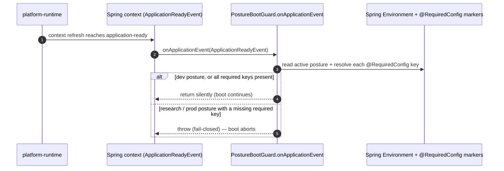

# L2 FunctionPoint Spec — `FP-POSTURE-BOOT-GUARD`

This L2 detailed-design document is the **detail home** for the posture boot
guard — the single startup-time scenario that validates every `@RequiredConfig`
marker and fails the application boot closed when, under a non-development
posture, a required configuration key is absent. It carries the method call
chain, the boot-event sequence, and the fail-closed error paths that the
layer-purity verdict ruled do NOT belong in L0 / L1 prose (Rule 145 /
E194-E195): L0 §4 keeps the *invariant* (research / prod boot fail-closed on
missing config), this spec carries the verbs, the listener method, and the
throw behaviour.

> **READABLE INTERPRETATION layer (Rule 146 / E196).** This document invents no
> FunctionPoint ID, frame ID, method name, or exception type. Every identity is
> **copied** from the authoring DSL; every code / test anchor is **cited** from
> the generated facts. Where this prose and the DSL disagree, the DSL wins; where
> the DSL and generated facts disagree, the **generated facts win** (ADR-0154
> cascade: `generated facts > DSL > Card/prose`).

## Authority chain (read top-down)

1. **FunctionPoint identity (authoring DSL)** — element `fpPostureBootGuard` in
   [`../../../features/function-points.dsl`](../../../features/function-points.dsl),
   `saa.id` = `FP-POSTURE-BOOT-GUARD`. Its `saa.status` is `shipped`,
   `saa.channel` `internal`, `saa.actor` `platform-runtime`, `saa.trigger`
   `internal-orchestration-event`, `saa.requirement` `REQ-007`, `saa.sourceAdr`
   `ADR-0058`. This spec adds no property the element does not declare.
2. **Owning EngineeringFrame (structural parent)** — `EF-ACCESS-ADMISSION`
   (`efAccessAdmission`), which holds the `anchors` edge to this FunctionPoint in
   [`../../../features/engineering-frames.dsl`](../../../features/engineering-frames.dsl)
   (`efAccessAdmission -> fpPostureBootGuard`, `saa.rel "anchors"`). Its Frame
   Card is
   [`../../L1/frames/EF-ACCESS-ADMISSION.md`](../../L1/frames/EF-ACCESS-ADMISSION.md).
3. **Generated facts (binding factual authority)** — the `code-symbol/*` and
   `test/*` facts in
   [`../../../facts/generated/code-symbols.json`](../../../facts/generated/code-symbols.json)
   and
   [`../../../facts/generated/tests.json`](../../../facts/generated/tests.json).
   Every anchor cited below resolves there. Facts are never hand-edited.
4. **Contract surface** — none. This is an `internal`-channel FunctionPoint; the
   contract is the owning frame's startup behaviour, not a wire operation (see
   §6).
5. **L0 constraint authority** — the
   [`../../L0/ARCHITECTURE.md`](../../L0/ARCHITECTURE.md) §4 constraint that names
   the posture fail-closed boundary without carrying its boot-listener detail.
   This spec carries the detail; L0 keeps the invariant.

---

## 1. Behavior

This FunctionPoint realizes one behaviour: **at application-ready, validate that
every `@RequiredConfig`-marked configuration key is present and, under a
non-development posture, abort boot when one is missing** — so a research- or
prod-posture deployment can never start half-configured. On the value axis it
serves `REQ-007` via the posture-bootstrap feature; on the structural axis it is
anchored by `EF-ACCESS-ADMISSION` inside `agent-service`.

| Field | Value (copied from the DSL element) |
|---|---|
| FunctionPoint ID | `FP-POSTURE-BOOT-GUARD` |
| Status | `shipped` (`saa.status`) |
| Owning EngineeringFrame | `EF-ACCESS-ADMISSION` (the `anchors` parent) |
| Owner module | `agent-service` (`saa.owner`) |
| Requirement | `REQ-007` (`saa.requirement`) |
| Channel | `internal` (`saa.channel`) |
| Actor | `platform-runtime` (`saa.actor`) |
| Trigger | `internal-orchestration-event` (`saa.trigger`) — concretely, the Spring `ApplicationReadyEvent` |
| Source ADR | `ADR-0058` (`saa.sourceAdr`) |

## 2. I/O

- **Input** — the resolved Spring `Environment` plus the set of `@RequiredConfig`
  markers discovered on beans at startup. The marker type is cited as
  `code-symbol/com-huawei-ascend-service-platform-posture-requiredconfig`
  (annotation; its sole element `in()[Ljava/lang/String;` enumerates the posture
  set in which the key is required). The boot trigger is the
  `ApplicationReadyEvent` parameter on the listener method (§4).
- **Output (success)** — no value. On a development posture, or when all required
  keys for the active posture are present, the listener returns silently and boot
  continues. There is no success payload — the observable success is "the context
  finishes starting".
- **Side effects** — none on the happy path (read-only over `Environment`). On
  the failure path, the side effect is **fail-closed boot abort**: the guard
  throws, propagating out of context refresh so the application process does not
  reach a serving state. No state is written and no event is emitted.

## 3. Runtime Sequence

The guard is a single Spring `ApplicationListener`; the only multi-hop is the
read of the `Environment` against the discovered markers, then the
posture-conditional branch. The application-posture *gate* used by other runtime
components at construction time
(`code-symbol/com-huawei-ascend-service-runtime-posture-appposturegate`) is the
sibling enforcement point — it shares the posture decision but is invoked per
in-memory component (§5), not at the boot event, and is therefore a collaborator
of this scenario rather than a hop inside it.

## 4. Class / Method Anchors (from facts)

| Role | Symbol | Fact id (+ method descriptor) |
|---|---|---|
| Entry (boot listener) | `PostureBootGuard.onApplicationEvent` | `code-symbol/com-huawei-ascend-service-platform-posture-posturebootguard#onApplicationEvent(Lorg/springframework/boot/context/event/ApplicationReadyEvent;)V` |
| Required-config marker (type) | `RequiredConfig` | `code-symbol/com-huawei-ascend-service-platform-posture-requiredconfig` |
| Posture marker element | `RequiredConfig.in` | `code-symbol/com-huawei-ascend-service-platform-posture-requiredconfig#in()[Ljava/lang/String;` |
| Collaborating posture gate (type) | `AppPostureGate` | `code-symbol/com-huawei-ascend-service-runtime-posture-appposturegate` |
| Posture-gate guard method | `AppPostureGate.requireDevForInMemoryComponent` | `code-symbol/com-huawei-ascend-service-runtime-posture-appposturegate#requireDevForInMemoryComponent(Ljava/lang/String;)V` |

All fact ids in this section resolve in
[`../../../facts/generated/code-symbols.json`](../../../facts/generated/code-symbols.json);
each method descriptor is a verbatim entry in the cited class fact's
`public_methods[]`.

## 5. Error Paths

| Cause (observable) | Outcome | Status / signal | Exception |
|---|---|---|---|
| research / prod posture, a `@RequiredConfig` key for the active posture is absent | boot aborted (fail-closed) | application context fails to start; process does not serve | `IllegalStateException` (raised by the posture enforcement path) |
| in-memory-only component constructed under research / prod posture | construction rejected | thrown out of bean construction | `IllegalStateException` (`AppPostureGate.requireDevForInMemoryComponent`) |
| development posture, key absent | tolerated | boot continues silently | — (no throw; dev is permissive) |

The fail-closed family has no HTTP status (internal channel); the observable
signal is "the application process refuses to reach a serving state". The
`IllegalStateException` outcome of the posture gate is the running evidence
exercised by the cited tests in §7 (`prod_posture_throws_illegal_state`,
`research_posture_throws_illegal_state`, and the boot-guard startup-failure
methods).

## 6. Contracts

No external contract surface — internal boundary. The "contract" of this
FunctionPoint is the owning frame's startup behaviour: the
`@RequiredConfig` marker SPI
(`code-symbol/com-huawei-ascend-service-platform-posture-requiredconfig`) and the
posture-conditional fail-closed semantics enforced by the boot guard and the
application-posture gate (cited in §4). The generated
[`../../../facts/generated/contract-surfaces.json`](../../../facts/generated/contract-surfaces.json)
carries no `contract-op/*` for posture, consistent with the `internal` channel
declared on the DSL element.

## 7. Tests

| Layer | Test class | Fact id | Covers |
|---|---|---|---|
| Integration / boot | `com.huawei.ascend.service.platform.posture.PostureBootGuardIT` | `test/com-huawei-ascend-service-platform-posture-posturebootguardit` | dev posture silent; research / prod boot fail-closed on missing datasource / JWKS / in-memory-idempotency config; fully-configured research boot passes. |
| Unit / domain | `com.huawei.ascend.service.runtime.posture.AppPostureGateTest` | `test/com-huawei-ascend-service-runtime-posture-appposturegatetest` | the posture decision in isolation: dev / null / empty posture pass; research and prod throw `IllegalStateException`. |
| Integration / posture binding | `com.huawei.ascend.service.platform.posture.PostureBindingIT` | `test/com-huawei-ascend-service-platform-posture-posturebindingit` | `APP_POSTURE` resolves through the YAML placeholder; the research security chain rejects an unallowlisted path. |

- All `test/*` ids resolve in
  [`../../../facts/generated/tests.json`](../../../facts/generated/tests.json)
  (each carries its `test_methods[]`).
- The authoring-DSL record of which test verifies this FunctionPoint is the
  `verifies` edge `testPostureBootGuardTest -> fpPostureBootGuard` in
  [`../../../features/verification.dsl`](../../../features/verification.dsl); the
  `testPostureBootGuardTest` element's `saa.sourceFile` is `PostureBootGuardIT.java`,
  which the integration row above cites. This table is a readable view of that
  edge joined to the generated `test/*` facts.

## 8. Gates

| Concern | Gate rule / enforcer | What it blocks |
|---|---|---|
| FunctionPoint element well-formedness | architecture-sync profile required-properties gate (`architecture/profile/required-properties.yaml`) | a profile-tagged FP element missing one of the mandatory `saa.*` properties (`saa.id`/`kind`/`level`/`view`/`status`/`owner`/`sourceAdr`). |
| Frame anchors >= 1 FP (shipped) | Rule G-23 / Rule 140 (E-frame anchor integrity) | promoting `EF-ACCESS-ADMISSION` to `shipped` without anchoring >= 1 FunctionPoint (this FP is one anchor). |
| Card / spec is a readable interpretation | Rule 146 / E196 | a citation here (`code-symbol/*`, `test/*`, method descriptor) that does not resolve in the generated facts, or an FP / frame relationship absent from the DSL. |
| No L2 detail left upstream | Rule 145 / E194-E195 | the boot-listener method chain / fail-closed sequence this spec carries being left in L0 / L1 prose instead. |
| FunctionPoint readiness | Rule 147 / E197 (kernel Rule G-30) | a FunctionPoint marked ready whose axis obligations are absent — `gate/lib/check_feature_readiness.py`, ADVISORY at the ADR-0159 §13.3 landing rung. |

---

## What stays upstream (NOT carried here)

- the L0 §4 *invariant* that research / prod posture boots fail-closed on missing
  configuration (L0 owns the invariant; this spec owns the listener method, the
  boot event, and the throw);
- naming `PostureBootGuard` and `AppPostureGate` as **boundary identities** and
  the Access-and-Admission frame's package decomposition (that is the
  [`EF-ACCESS-ADMISSION` Frame Card](../../L1/frames/EF-ACCESS-ADMISSION.md));
- citing the gate / ArchUnit enforcer that pins the boundary (named in §8, not
  re-specified).

## Authority

- ADR-0068 — Layered 4+1 + Architecture Graph as twin sources of truth
  ([`../../../../docs/adr/0068-layered-4plus1-and-architecture-graph.yaml`](../../../../docs/adr/0068-layered-4plus1-and-architecture-graph.yaml)).
- ADR-0161 — EngineeringFrame package-cluster anchor + Card over DSL
  ([`../../../../docs/adr/0161-engineering-frame-package-cluster-anchor-and-card-over-dsl.yaml`](../../../../docs/adr/0161-engineering-frame-package-cluster-anchor-and-card-over-dsl.yaml)).
- Rule 33 — Layered 4+1 Discipline; Rule 145 — L2 detail sink; Rule 146 — Frame
  Card / FunctionPoint-spec is a readable interpretation (`CLAUDE.md`).
- L2 corpus index: [`../README.md`](../README.md).
