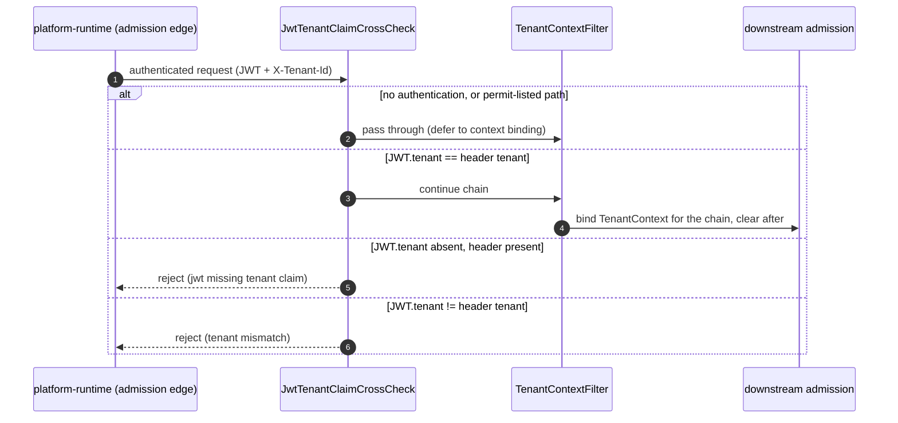

# L2 FunctionPoint Spec — `FP-TENANT-CROSS-CHECK`

This is the L2 detailed-design home for the **`JWT.tenant` claim cross-check**: the
cross-cutting admission guard that, at every tenant-scoped surface, requires the
tenant claim carried inside the verified JWT to agree with the tenant identity
asserted on the request (the `X-Tenant-Id` header / `IngressEnvelope.tenantId`), and
rejects a mismatch instead of letting either side silently win. It carries the method
call chain, runtime sequence, error paths, and test inventory that the layer-purity
verdict ruled does **NOT** belong in L0 / L1 prose (Rule 145 / E194-E195). It is the
migration target for that leaked detail, not a second source of truth.

> **This document is a READABLE INTERPRETATION layer (Rule 146 / E196 discipline).**
> It invents no FunctionPoint ID, frame ID, operation ID, status code, error code,
> or method name. Every identity is **copied** from the authoring DSL; every fact is
> **cited** from the generated facts. Where this prose and the DSL disagree, the DSL
> wins; where the DSL and generated facts disagree, the **generated facts win**
> (ADR-0154 cascade: `generated facts > DSL > Card/prose`).

## Authority chain (read top-down)

1. **FunctionPoint identity (authoring DSL)** — element `fpTenantCrossCheck` in
   [`../../../features/function-points.dsl`](../../../features/function-points.dsl),
   `saa.id` = `FP-TENANT-CROSS-CHECK`. Its `saa.status`, `saa.channel`, `saa.actor`,
   `saa.trigger`, `saa.requirement`, and `saa.sourceAdr` are copied verbatim into
   the sections below; this spec adds no property the element does not declare.
2. **Owning EngineeringFrame (structural parent)** — `EF-ACCESS-ADMISSION`, which
   holds the `anchors` edge to this FunctionPoint in
   [`../../../features/engineering-frames.dsl`](../../../features/engineering-frames.dsl)
   (`efAccessAdmission -> fpTenantCrossCheck`, `saa.rel = anchors`). Its Frame Card
   is [`../../L1/frames/EF-ACCESS-ADMISSION.md`](../../L1/frames/EF-ACCESS-ADMISSION.md)
   (section 6, `FP-TENANT-CROSS-CHECK`).
3. **Generated facts (binding factual authority)** — the `code-symbol/*` and
   `test/*` facts in
   [`../../../facts/generated/code-symbols.json`](../../../facts/generated/code-symbols.json)
   and [`../../../facts/generated/tests.json`](../../../facts/generated/tests.json).
   Every anchor cited below resolves in these files; facts are never hand-edited.
4. **Contract surface** — this FunctionPoint declares no `saa.contract_op_refs`. It
   is an internal cross-cutting admission guard, not a wire operation; its boundary
   is the filter type cited in §4 (see §6).
5. **L0 constraint authority** — `architecture/docs/L0/ARCHITECTURE.md` §4 names the
   cross-check-not-replace tenant-identity invariant; this spec carries the
   guard's runtime detail. The behaviour is governed by ADR-0056.

---

## 1. Behavior

This FunctionPoint realizes **tenant-identity cross-checking**: at a tenant-scoped
surface, the tenant claim inside the authenticated JWT and the tenant asserted on the
request must agree, or the request is rejected; neither value silently overrides the
other. When the request carries no authentication, or hits a permit-listed path, the
guard passes through and lets the downstream tenant-context binding decide. On the
value axis it serves `REQ-006` (`ProductClaim -> Requirement -> Feature ->
FunctionPoint`); on the structural axis it is anchored by `EF-ACCESS-ADMISSION`
(`Module agent-service -> EngineeringFrame -> FunctionPoint`).

| Field | Value (copied from the DSL element) |
|---|---|
| FunctionPoint ID | `FP-TENANT-CROSS-CHECK` |
| Status | `shipped` (`saa.status`) |
| Owning EngineeringFrame | `EF-ACCESS-ADMISSION` (the `anchors` parent) |
| Owner module | `agent-service` (`saa.owner`) |
| Requirement | `REQ-006` (`saa.requirement`) |
| Channel | `internal` (`saa.channel`) |
| Actor | `platform-runtime` (`saa.actor`) |
| Trigger | `internal-orchestration-event` (`saa.trigger`) |
| Source ADR | `ADR-0056` (`saa.sourceAdr`) |

## 2. I/O

- **Input** — the authenticated principal's `tenant` JWT claim and the tenant
  asserted on the request (the `X-Tenant-Id` header value bound as the per-request
  `TenantContext`, `code-symbol/com-huawei-ascend-service-platform-tenant-tenantcontext`).
  The header name and the JWT decode are upstream auth concerns, cited not re-spelled.
- **Output (success)** — when claim and header agree, the guard continues the chain;
  the downstream `TenantContextFilter`
  (`code-symbol/com-huawei-ascend-service-platform-tenant-tenantcontextfilter`) then
  binds the validated tenant into the per-request context for the duration of the
  chain and clears it afterwards.
- **Side effects** — none on the success path beyond establishing/clearing the
  per-request tenant binding held in
  `code-symbol/com-huawei-ascend-service-platform-tenant-tenantcontextholder`; on a
  mismatch the guard short-circuits and the request is rejected with no state write.

## 3. Runtime Sequence

The cross-check runs ahead of the tenant-context binding; the over-the-wire status
mapping for a rejection (which HTTP status, which error body) is owned by the
contract surface, named in §5, not drawn here.

## 4. Class / Method Anchors (from facts)

| Role | Symbol | Fact id (+ method descriptor) |
|---|---|---|
| Mechanism (guard) | `JwtTenantClaimCrossCheck` | `code-symbol/com-huawei-ascend-service-platform-tenant-jwttenantclaimcrosscheck` |
| Context binding (filter) | `TenantContextFilter` | `code-symbol/com-huawei-ascend-service-platform-tenant-tenantcontextfilter` |
| Per-request context (type) | `TenantContext` | `code-symbol/com-huawei-ascend-service-platform-tenant-tenantcontext` |
| Context holder | `TenantContextHolder.get` | `code-symbol/com-huawei-ascend-service-platform-tenant-tenantcontextholder#get()Lcom/huawei/ascend/service/platform/tenant/TenantContext;` |
| Context holder | `TenantContextHolder.set` | `code-symbol/com-huawei-ascend-service-platform-tenant-tenantcontextholder#set(Lcom/huawei/ascend/service/platform/tenant/TenantContext;)V` |
| Context holder | `TenantContextHolder.clear` | `code-symbol/com-huawei-ascend-service-platform-tenant-tenantcontextholder#clear()V` |
| Constants (type) | `TenantConstants` | `code-symbol/com-huawei-ascend-service-platform-tenant-tenantconstants` |

Both `JwtTenantClaimCrossCheck` and `TenantContextFilter` extend
`OncePerRequestFilter`; their per-request override (`doFilterInternal`) is
`protected` and therefore not a member of either class fact's `public_methods[]`, so
it is named here as the override but is intentionally not cited as a `#descriptor`
method ref (only `public_methods[]` entries are gate-resolvable). All fact ids in this
section resolve in
[`../../../facts/generated/code-symbols.json`](../../../facts/generated/code-symbols.json).

## 5. Error Paths

| Cause (observable) | Outcome | Status / signal | Mechanism |
|---|---|---|---|
| `JWT.tenant` differs from request tenant | Rejected; downstream not invoked | `403` | cross-check mismatch branch |
| `JWT.tenant` absent while request tenant present | Rejected; downstream not invoked | `403` | cross-check missing-claim branch |
| No authentication present | Pass through | continue chain | guard defers to context binding |
| Permit-listed path | Skip the guard | continue chain | permit-list bypass |
| Missing request tenant (research/prod posture) | Rejected at context binding | `400` | downstream `TenantContextFilter` posture handling |

The `403` and `400` mappings are the contract surface's: every status code here
appears in the mutating admission operation `contract-op/createrun`
`response_status_codes` (`401, 403, 400, ...`). This table names the *cause →
mechanism* relation that this FunctionPoint realizes and defers the wire status
codes to that operation.

## 6. Contracts

No external contract surface — this is an internal-channel, cross-cutting admission
guard (the DSL element declares no `saa.contract_op_refs` and no HTTP entry). The
binding boundary is the owning frame's guard type
`code-symbol/com-huawei-ascend-service-platform-tenant-jwttenantclaimcrosscheck` and
the context-binding filter
`code-symbol/com-huawei-ascend-service-platform-tenant-tenantcontextfilter` (cited in
§4). The guard applies in front of the tenant-scoped admission operations (e.g.
`contract-op/createrun`,
[`../../../facts/generated/contract-surfaces.json`](../../../facts/generated/contract-surfaces.json));
the route, verb, header, and status detail of those operations are their own
contract-surface / L2 material, not restated here.

## 7. Tests

| Layer | Test class | Fact id | Covers |
|---|---|---|---|
| Unit | `JwtTenantClaimCrossCheckTest` | `test/com-huawei-ascend-service-platform-tenant-jwttenantclaimcrosschecktest` | claim-equals-header pass-through, claim-differs `403` mismatch, missing-claim `403`, no-auth / permit-list / missing-header pass-through |
| Unit | `TenantContextFilterTest` | `test/com-huawei-ascend-service-platform-tenant-tenantcontextfiltertest` | posture-conditioned missing-header handling, invalid-UUID rejection, context set during chain |
| Unit | `TenantContextFilterMdcTest` | `test/com-huawei-ascend-service-platform-tenant-tenantcontextfiltermdctest` | tenant MDC populated during the chain and cleared after; OpenAPI path not filtered |
| Integration / contract | `TenantContextFilterIT` | `test/com-huawei-ascend-service-platform-tenant-tenantcontextfilterit` | health endpoint exempt from the tenant filter (with and without header) |
| Integration / isolation | `TenantIsolationIT` | `test/com-huawei-ascend-service-platform-security-tenantisolationit` | tenant A data is not visible to tenant B (end-to-end isolation) |

The authoring-DSL `verifies` edge for this FunctionPoint
(`testTenantContextFilterIT -> fpTenantCrossCheck` in
[`../../../features/verification.dsl`](../../../features/verification.dsl)) resolves to
the generated fact `test/com-huawei-ascend-service-platform-tenant-tenantcontextfilterit`,
cited above. All `test/*` ids in this table resolve in
[`../../../facts/generated/tests.json`](../../../facts/generated/tests.json).

## 8. Gates

| Concern | Gate rule / enforcer | What it blocks |
|---|---|---|
| FunctionPoint element well-formedness | Rule G-14 | a profile-tagged FP element missing a required `saa.*` property. |
| Frame anchors >= 1 FP (shipped) | Rule G-23 | promoting `EF-ACCESS-ADMISSION` to `shipped` without anchoring >= 1 FunctionPoint. |
| Card / spec is a readable interpretation | Rule 146 / E196 | a citation here (`code-symbol/*`, `test/*`, method descriptor) that does not resolve in the generated facts, or an FP/frame relationship absent from the DSL. |
| No L2 detail left upstream | Rule 145 / E194-E195 | the guard call chain, cross-check sequence, status mapping, or test inventory being left in L0 / L1 prose instead of here. |
| FunctionPoint readiness | Rule 147 / E197 (kernel Rule G-30) | a FunctionPoint marked ready whose axis obligations (frame anchors + owning-module implements; a Feature requires; a resolving generated-fact ref + tests + a gate ref) are absent — `gate/lib/check_feature_readiness.py`, ADVISORY at the ADR-0159 §13.3 rung. |

---

## What stays upstream (NOT carried here)

Per the layer-purity keep-list, the following remain at L0 / L1 and are only
*referenced* from this spec, never duplicated (Rule 145):

- the L0 §4 cross-check-not-replace tenant-identity *invariant* (L0 owns the
  invariant; this spec owns the guard method hops, the pass-through vs reject
  sequence, and the error matrix);
- naming `JwtTenantClaimCrossCheck` / `TenantContextFilter` as a **boundary
  identity** and the development-view package decomposition of the admission cluster
  (that is the `EF-ACCESS-ADMISSION` Frame Card material);
- citing the ArchUnit / gate enforcer that pins the boundary (named in §8, not
  re-specified).

## Authority

- ADR-0068 — Layered 4+1 + Architecture Graph as twin sources of truth
  ([`../../../../docs/adr/0068-layered-4plus1-and-architecture-graph.yaml`](../../../../docs/adr/0068-layered-4plus1-and-architecture-graph.yaml)).
- ADR-0161 — EngineeringFrame package-cluster anchor + Card over DSL
  ([`../../../../docs/adr/0161-engineering-frame-package-cluster-anchor-and-card-over-dsl.yaml`](../../../../docs/adr/0161-engineering-frame-package-cluster-anchor-and-card-over-dsl.yaml)).
- ADR-0056 — JWT validation + tenant claim cross-check (the ADR governing this
  FunctionPoint)
  ([`../../../../docs/adr/0056-jwt-validation-and-tenant-claim-cross-check.md`](../../../../docs/adr/0056-jwt-validation-and-tenant-claim-cross-check.md)).
- Rule 33 — Layered 4+1 Discipline; Rule 145 — L2 detail sink; Rule 146 — Frame
  Card / FunctionPoint spec is a readable interpretation (`CLAUDE.md` / rule cards).
- Owning Frame Card: [`../../L1/frames/EF-ACCESS-ADMISSION.md`](../../L1/frames/EF-ACCESS-ADMISSION.md).
- L2 corpus index: [`../README.md`](../README.md).
