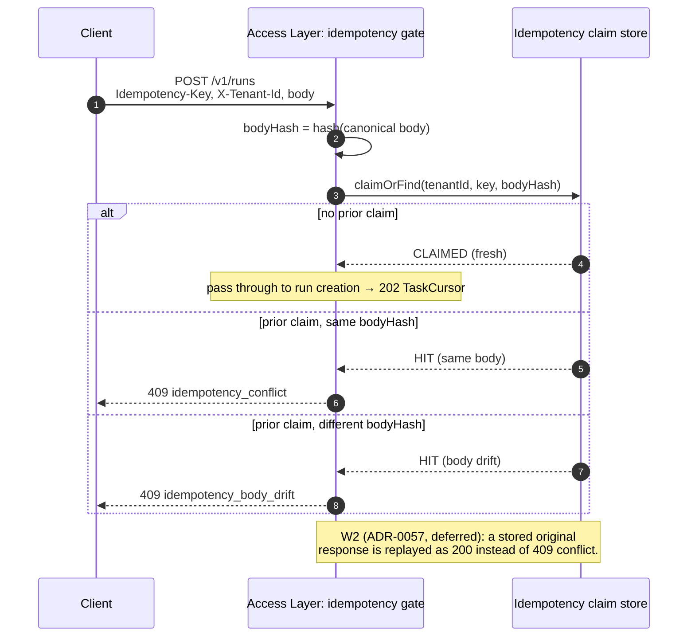
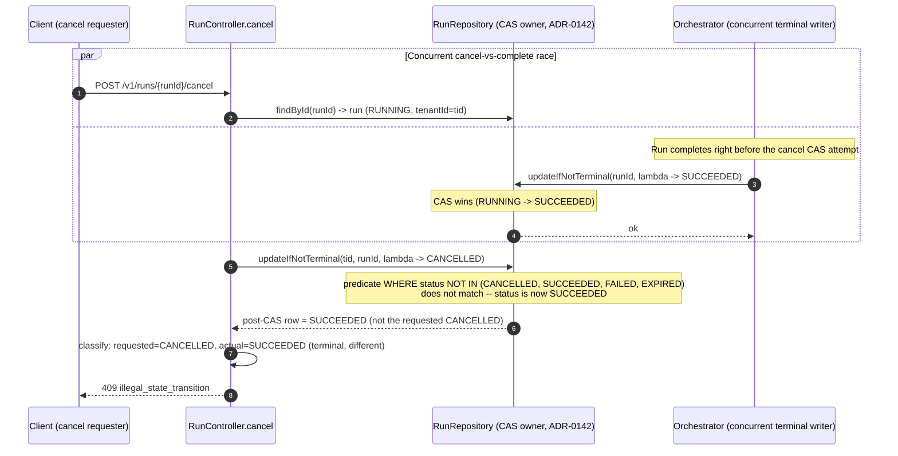

# `run-http-contract` — Process View (idempotency body-lifetime + cancel-CAS realization)

> **Migrated body-lifetime + cancel-CAS home (active).** This file is the L2 detail
> sink for two run-lifecycle HTTP verb realizations the layer-purity verdict ruled
> belong at L2:
>
> - the **idempotency body-lifetime** of `POST /v1/runs` (§1–§3) — the runtime
>   sequence that decides `idempotency_conflict` vs `idempotency_body_drift` vs
>   (W2) cached replay; and
> - the **cancel-CAS realization + cancel-race resolution** of
>   `POST /v1/runs/{runId}/cancel` (§4–§6) — the atomic
>   `RunRepository.updateIfNotTerminal(...)` compare-and-set, its
>   `RunStateMachine.validate(...)`-inside-CAS step, and the winner/loser race
>   ordering that decides the 200-vs-409 outcome.
>
> The binding authorities are ADR-0057 (idempotency), ADR-0118 + ADR-0142 (the
> atomic CAS + Run-aggregate single-owner pinning), and the `createRun` /
> `cancelRun` response semantics (facts `contract-op/createrun` /
> `contract-op/cancelrun`) in
> [`../../../../docs/contracts/openapi-v1.yaml`](../../../../docs/contracts/openapi-v1.yaml).
> The L1 process view ([`../../L1/agent-service/process.md`](../../L1/agent-service/process.md))
> shows the same gates at structural altitude (which layer calls which); this sink
> carries the method-level + wire-level expansion. Every method below resolves to
> an entry in its class fact's `public_methods[]`; nothing mints a new status code,
> error code, method name, or SQL predicate.

## 1. Body-lifetime states (W1 claim-only)

The `Idempotency-Key` header binds a `(tenantId, key, bodyHash)` triple. W1 is
**claim-only** per ADR-0057: the platform records the claim but does NOT yet
store the original response for replay (that is the W2 extension).

| Observed request | Prior claim state | Outcome | Status / `error.code` |
|---|---|---|---|
| First use of `key` | none | claim recorded; run created | `202` `TaskCursor` |
| Reuse of `key`, identical body | claimed, same `bodyHash` | duplicate of an in-flight / completed claim | `409` `idempotency_conflict` |
| Reuse of `key`, different body | claimed, different `bodyHash` | body drift on a reused key | `409` `idempotency_body_drift` |
| Reuse of `key`, identical body (W2) | claimed + response stored | original response replayed | `200` cached response *(W2 — ADR-0057, deferred)* |

## 2. Sequence — claim / conflict / drift

## 3. Body-hash discipline

- The hash is taken over the **canonical** request body (the `CreateRunRequest`
  JSON), so semantically identical bodies hash identically and a re-ordered or
  reformatted body is not treated as drift.
- The claim is scoped by `tenantId` first (tenant isolation), so the same
  `Idempotency-Key` value used by two tenants never collides.
- The claim is recorded **before** any run state write, so a retry of a request
  that already created a run cannot create a second run.

## 4. Cancel-CAS realization — the atomic state transition

`POST /v1/runs/{runId}/cancel` does not write `RunStatus` directly. The transition
is an atomic compare-and-set delegated to the Run aggregate's single owner
(ADR-0142): the controller invokes
`updateIfNotTerminal(tenantId, runId, λ)` on the `RunRepository` SPI, and the
state-machine validation runs *inside* that call so the validate + transition pair
is atomic (ADR-0118 + Rule R-C.2.b).

Method-level facts (each resolves to a `public_methods[]` entry of its class fact):

| Step | Symbol | Fact id | Method descriptor |
|---|---|---|---|
| HTTP entry | `RunController.cancel` | `code-symbol/com-huawei-ascend-service-platform-web-runs-runcontroller` | `cancel(Ljava/lang/String;)Lorg/springframework/http/ResponseEntity;` |
| Atomic CAS | `RunRepository.updateIfNotTerminal` | `code-symbol/com-huawei-ascend-service-runtime-runs-spi-runrepository` | `updateIfNotTerminal(Ljava/lang/String;Ljava/util/UUID;Ljava/util/function/UnaryOperator;)Ljava/util/Optional;` |
| Transition guard | `RunStateMachine.validate` | `code-symbol/com-huawei-ascend-service-runtime-runs-runstatemachine` | `validate(Lcom/huawei/ascend/service/runtime/runs/RunStatus;Lcom/huawei/ascend/service/runtime/runs/RunStatus;)V` |

**Atomic-primitive realization** (the implementation detail L1 no longer carries):

- **Durable backend** — a single SQL statement guarded by a
  `WHERE status NOT IN (CANCELLED, SUCCEEDED, FAILED, EXPIRED)` predicate (the
  "not-terminal" CAS). Exactly one concurrent writer commits.
- **In-memory reference backend** (`InMemoryRunRegistry`,
  `code-symbol/com-huawei-ascend-service-runtime-orchestration-inmemory-inmemoryrunregistry`)
  — `ConcurrentHashMap.computeIfPresent` provides the equivalent atomic primitive.

The tenant-isolation half of the persistence story (RLS policy on the
`tenant_id` column, `SET LOCAL app.tenant_id` GUC) is owned by the tenant-isolation
L2 detail home, not here — this section owns only the *CAS* realization of the
cancel verb.

## 5. Cancel-race resolution — winner / loser ordering

When a cancel races a concurrent terminal transition (e.g. the orchestrator's
`SUCCEEDED` write commits on the same `runId` at the same instant), the
`WHERE status NOT IN (...)` predicate admits exactly one writer and the loser
re-reads the committed row to choose its response code. This is the runtime
sequence the verdict ruled is L2 detail (it names method hops, the CAS predicate,
and the resulting wire codes); it is homed here, not at L1.

## 6. Cancel outcome matrix (loser-side response codes)

The response is a pure function of the post-CAS terminal status vs the requested
transition. Source: the `cancelRun` `responses` block (fact
`contract-op/cancelrun`) + ADR-0118 idempotency semantics.

| Post-CAS terminal status | Requested transition | Response | `error.code` |
|---|---|---|---|
| (was non-terminal) → CANCELLED | CANCELLED | `200` (cancel applied) | — |
| CANCELLED | CANCELLED | `200` (idempotent same-status terminal; CAS no-op) | — |
| SUCCEEDED | CANCELLED | `409` (different-terminal rejected) | `illegal_state_transition` |
| FAILED | CANCELLED | `409` (different-terminal rejected) | `illegal_state_transition` |
| EXPIRED | CANCELLED | `409` (different-terminal rejected) | `illegal_state_transition` |

The same-status terminal row is a CAS no-op (no transition occurs); it still
returns `200` for idempotency. Every cross-tenant cancel collapses to `404`
`not_found` upstream of the CAS (tenant-scope-as-not-found, per `cancelRun`'s
`404` response) — the authorization gate fails before the CAS is attempted, so it
is a wire-contract concern owned by [`logical.md`](logical.md) §4, not a CAS
outcome.

## 7. Cross-references

- Wire contract (status matrix, request / response shapes, error-code vocabulary):
  [`logical.md`](logical.md) §4–§5.
- Servlet filter-chain registration order (the edge composition that runs ahead of
  the controller): [`development.md`](development.md) §2.
- Structural parent sequences (L1 altitude — which layer calls which):
  [`../../L1/agent-service/process.md`](../../L1/agent-service/process.md)
  (the `Idempotency hit` / `fresh request` branch for §1–§3; the cancel branch for
  §4–§6) and the RunStatus DFA identity in
  [`../../L1/agent-service/logical.md`](../../L1/agent-service/logical.md) §3.
- Idempotency / cancel binding feature (L1):
  [`../../L1/agent-service/features/access-layer.md`](../../L1/agent-service/features/access-layer.md)
  (AS-L1-F05 binding; AS-L1-F07 cancel / resume ingress).
- Binding authority: ADR-0057 (idempotency) + ADR-0118 / ADR-0142 (atomic CAS +
  single-owner pinning) + the `createRun` / `cancelRun` semantics in
  [`../../../../docs/contracts/openapi-v1.yaml`](../../../../docs/contracts/openapi-v1.yaml).
- Method facts:
  [`../../../facts/generated/code-symbols.json`](../../../facts/generated/code-symbols.json).
- Sink index: [`README.md`](README.md).
