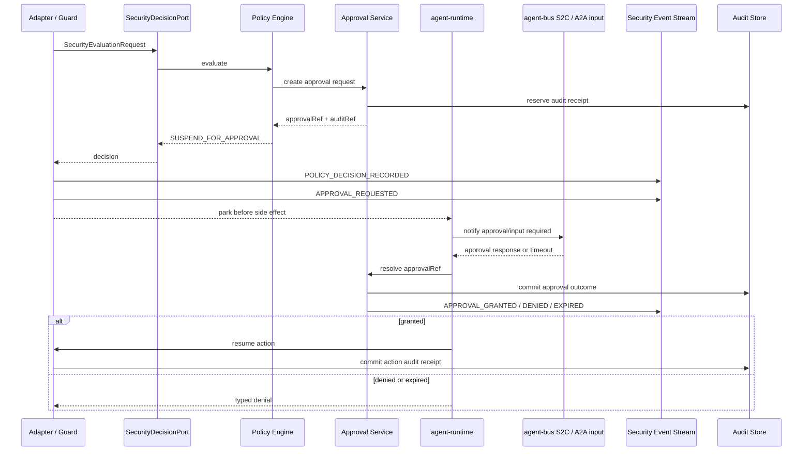

# Agent Approval And Audit Event L2 Proposal

> **Date:** 2026-06-13
> **Status:** Draft
> **Parent proposal:** `2026-06-13-agent-security-decision-chain-proposal.en.md`
> **Scope:** approval suspension, security-event stream, audit receipt, and runtime resume behavior.

## 1. Background

The security decision chain cannot rely only on `allow` and `deny`. High-risk capability invocation often needs a third state: park the action, wait for human or controlled approval, resume if granted, and return a typed denial if denied or expired.

This proposal defines how `SUSPEND_FOR_APPROVAL`, security decision events, and audit receipts work together so the repository can turn security awareness into an executable, traceable, and auditable runtime chain.

The design must preserve current repository constraints:

- `TrajectoryEvent` is runtime telemetry and its v2 event-kind set is currently closed;
- `agent-bus` already owns S2C callback primitives;
- `agent-runtime` owns A2A execution and agent framework adapters;
- `agent-service` can own serviceized approval state and durable audit implementation;
- the retired `agent-middleware` must not be reintroduced as a runtime dependency.

## 2. Scope Statement

Primary scope:

- `affects_level: L2`
- `affects_view: development`

This proposal defines:

- `security-approval.v1.yaml`;
- `security-decision-event.v1.yaml`;
- how approval requests are created, resumed, expired, cancelled, and audited;
- how security events relate to trajectory events without replacing them;
- how audit receipts act as pre-side-effect obligations for high-risk actions.

This proposal does not define:

- core `SecurityEvaluationRequest` / `SecurityDecision` fields, owned by the security decision contract L2;
- capability permission YAML, owned by the capability permission L2;
- approval UI pages or timeline product surfaces;
- concrete database tables, beyond required durability semantics.

## 3. Root Cause / Strongest Interpretation (Rule D-1)

1. **Observed failure / motivation:** the parent decision chain can return `SUSPEND_FOR_APPROVAL`, but without an approval/audit contract the runtime cannot park, resume, expire, cancel, or prove whether an action ran after authorization.
2. **Execution path:** policy decision returns `SUSPEND_FOR_APPROVAL`; runtime parks the action before side effect; approval service records state; operator approves or timeout occurs; runtime resumes or rejects; security event and audit receipt record the full path.
3. **Root cause:** `TrajectoryEvent` is telemetry, not an approval state machine; `audit-trail.v1.yaml` is still a design-level contract and does not yet define executable approval and receipt semantics.
4. **Evidence:** current `TrajectoryEvent.Kind` mostly covers run/model/tool/reasoning/error/progress; contract catalog marks `audit-trail.v1.yaml` as design-only; `agent-bus` already provides S2C callback transport.

## 4. Proposed Design

### 4.1 Do Not Overload `TrajectoryEvent`

This proposal does not recommend extending `TrajectoryEvent.Kind` to carry approval, security policy, and audit events. Instead, add a paired security-event stream:

```text
TrajectoryEvent
  -> operational timeline, spans, adapter progress, tool execution progress

SecurityDecisionEvent
  -> policy decision, approval, audit, redaction, fallback, sandbox/security outcome
```

The two streams correlate by:

- `tenantId`
- `sessionId`
- `taskId`
- `traceId`
- `spanId`
- `securityEvaluationRequestId`
- `decisionId`
- `auditRef`

This avoids breaking the current trajectory enum and OTel sink while enabling a full session security timeline.

### 4.2 New Contract: `security-decision-event.v1.yaml`

Security decision events record what happened in the security chain without carrying sensitive payloads inline.

Event kinds:

```text
POLICY_DECISION_RECORDED
APPROVAL_REQUESTED
APPROVAL_GRANTED
APPROVAL_DENIED
APPROVAL_EXPIRED
APPROVAL_CANCELLED
AUDIT_RECEIPT_RESERVED
AUDIT_RECEIPT_COMMITTED
REDACTION_APPLIED
SANDBOX_ROUTE_DECIDED
EGRESS_DECISION_RECORDED
MEMORY_ACCESS_DECISION_RECORDED
FALLBACK_DECISION_RECORDED
POLICY_ENGINE_DEGRADED
```

Minimum fields:

```yaml
schemaVersion: security-decision-event/v1
eventId: sec_evt_01
eventKind: POLICY_DECISION_RECORDED
tsEpochMillis: 1780000000000
tenantId: tenant-a
sessionId: session-a
taskId: task-a
agentId: agent-a
traceId: trace-a
spanId: span-a
decisionId: dec-a
securityEvaluationRequestId: sec_eval_req-a
policyId: policy-a
policyVersion: "2026-06-13.1"
decisionType: SUSPEND_FOR_APPROVAL
approvalRef: approval-a
auditRef: audit-a
payloadRef: payload_ref://security-event/sec_evt_01
redactionSummary:
  secretCount: 0
  piiCount: 1
```

Rules:

- raw prompts, raw capability arguments, tool args, file payloads, API bodies, credentials, and PII must not appear inline;
- large or sensitive payloads use `payloadRef`, and `payloadRef` points to redacted artifacts by default, not raw interactions;
- if controlled raw evidence must be retained, it must use a separate regulated evidence store with break-glass access, short TTL, access audit, and encryption; it is not the default for security events or audit receipts;
- where runtime can assign sequence numbers, event order is monotonic per task;
- the security-event stream is append-only from the consumer perspective.

### 4.3 New Contract: `security-approval.v1.yaml`

Approval object:

```yaml
schemaVersion: security-approval/v1
approvalRef: approval_01
decisionId: dec_01
securityEvaluationRequestId: sec_eval_req_01
tenantId: tenant-a
sessionId: session-a
taskId: task-a
agentId: agent-a
status: REQUESTED
requestedAction:
  actionType: BUSINESS_ACTION
  capabilityKind: BUSINESS_ACTION
  targetName: payment.transfer
  requestedScope:
    businessAction: payment.transfer
    maxAmount: "policy-defined"
riskTier: R5_BUSINESS_CRITICAL
policyId: payment-transfer-prod
policyProfile: regulated_prod
profileRule: r5.regulated_approval
reasonCode: REGULATED_APPROVAL_REQUIRED
requestedAt: "2026-06-13T10:00:00Z"
expiresAt: "2026-06-13T10:15:00Z"
approver:
  role: regulated-operator
result:
  status: null
  decidedAt: null
  reason: null
auditRef: audit_01
```

Approval status:

```text
REQUESTED
GRANTED
DENIED
EXPIRED
CANCELLED
SUPERSEDED
```

State semantics:

| Status | Meaning | Runtime behavior |
|---|---|---|
| `REQUESTED` | approval request is created and waiting | park action, no side effect |
| `GRANTED` | approval granted | re-check policy, then resume |
| `DENIED` | approval denied | return typed denial |
| `EXPIRED` | approval timed out | deny action and emit expiry event |
| `CANCELLED` | task or session cancelled | cancel approval and clean parked state |
| `SUPERSEDED` | replaced by new policy or request | deny old request; only new request may continue |

### 4.4 Runtime Approval Flow



Core rules:

- the target side effect must not run before approval is granted;
- required audit reserve must complete before the approval request is shown;
- after approval is granted, runtime performs a lightweight re-evaluation before resume to catch policy-version changes;
- approval result, resumed action result, and audit commit result all emit security events.

### 4.5 Mapping To Current Runtime Surfaces

| Current surface | Use in this proposal |
|---|---|
| `agent-runtime.engine.spi.AgentRuntimeHandler` | handler wrapper or adapter returns a parked/typed failure state before side effect |
| `agent-runtime.engine.a2a` | maps approval-required state to A2A input-required style behavior |
| `agent-bus.spi.s2c.S2cCallbackTransport` | optional callback transport for server-to-client approval prompts |
| `agent-service` | stores approval records and audit receipts in serviceized deployments |
| `TrajectoryEvent` | remains operational telemetry and carries correlation only |
| `SecurityDecisionEvent` | new paired security event stream for policy, approval, audit, and degradation results |

### 4.6 Pause / Resume Relationship With AgentScope / OpenJiuwen / A2A

Approval and audit state are repository-owned. AgentScope, OpenJiuwen, and A2A may expose interruption, input-required, callback, or similar mechanisms, but those mechanisms are only interaction carriers. They are not the source of approval truth.

| Framework / path | Native pause/resume shape | Repository-owned behavior |
|---|---|---|
| OpenJiuwen tool callback / interrupt | may expose tool callbacks or interrupt-like results | high-risk action must be parked before side effect; `approvalRef` / `auditRef` are created by this repository |
| OpenJiuwen remote tool path | remote tool may expose interrupt or remote invocation metadata | outbound A2A approval remains correlated by `taskId` / `toolCallId` / `decisionId` |
| AgentScope local/harness adapter | `AgentScopeEvent.interrupted(...)` and stream events can express interruption | adapter maps interruption to repository approval or typed denial only when security decision says so |
| AgentScope remote runtime client | external runtime may expose stream event only and not repository approval semantics | repository must pause before remote runtime call if approval is required |
| A2A remote invocation | remote task can return `INPUT_REQUIRED` and continue later | repository approval may map to A2A input-required state, but result remains in `security-approval.v1.yaml` |
| SDK Java/HTTP tool mapper | no native HITL, but invocation is under repository adapter control | strongest place to park before side effect and resume after approval |

Constraints:

- if security decision requires approval, the action must not be delegated to the framework first;
- if a framework can only interrupt after an action has started, that path cannot enforce R4/R5 pre-action approval unless a wrapper, proxy, or sandbox control point is added;
- framework cancellation and repository approval cancellation are correlated but distinct;
- framework input-required state is not an audit receipt.

#### Approval Boundary Under Least Agency

HITL confirms whether one high-risk action inside the agency boundary may continue. It must not become a way for users to temporarily expand what the agent is allowed to do. Otherwise the system degenerates into least privilege plus frequent prompts, causing confirmation fatigue and over-delegation.

Rules:

- approval requests must carry `delegationEnvelopeRef`, `requestedScope`, `policyProfile`, `riskTier`, and `profileRule`;
- requests outside the `DelegationEnvelope` are denied directly or routed to a policy-change workflow; they do not create ordinary HITL approvals;
- "always allow / remember my choice" creates only a scoped, expiring, actor-bound candidate grant and must pass policy validation again;
- AgentScope / OpenJiuwen / JiuwenSwarm interruption, input-required, or approval override is an interaction carrier or evidence only, not repository approval truth;
- before resuming after approval, runtime revalidates policy version and envelope to catch policy changes while waiting.

### 4.7 Approval Enforcement Rules

| Case | Required behavior |
|---|---|
| `strict_allowlist` capability missing from allowlist | deny directly; do not create HITL request |
| `review_unknown` capability missing from allowlist | create HITL approval request if posture allows |
| `scoped_allowlist` allowlist match but scope violation | deny directly; do not ask user to approve scope escape |
| `least_agency_scoped` allowlist match but out of `DelegationEnvelope` | deny directly or route to policy change; do not create ordinary HITL |
| `regulated_prod` R3/R4/R5 action | require approval and audit obligations according to profile rule |
| approval required but approval service is not configured | deny in research/prod; dev may use local console/test harness |
| approval expires | deny action, emit `APPROVAL_EXPIRED`, commit audit result |
| task cancelled while waiting | cancel approval, emit `APPROVAL_CANCELLED`, best-effort cancel downstream |
| approval granted after expiry | reject as stale; create a new approval if policy allows retry |
| same idempotency key retried | return existing unresolved approval or final result |
| policy version changes while waiting | re-evaluate before resume; deny if new policy is stricter |

### 4.8 Audit Receipt Rules

Audit receipts are not the same as security events:

```text
security event = observable security decision timeline
audit receipt  = compliance evidence that a high-risk decision/action was durably recorded
```

Rules:

- R4/R5 actions in research/prod require `auditRef` before side effect;
- audit reservation happens before approval is shown;
- approval outcome and action outcome are both committed to audit;
- if audit commit fails after side effect execution, runtime emits emergency failure metric and writes local append-only recovery record;
- if audit reserve fails before side effect execution, the action must not run.

#### Interaction Redaction And Retention Rules

Audit should prove which decision was made, which scope was used, who approved it, and what happened. It should not retain full interaction content by default. User input, model output, tool args, tool result, file snippets, API request/response, MCP resources, A2A messages, and sandbox stdout/stderr may contain PII, credentials, business secrets, or regulated data. They must be classified and redacted before entering durable logs or audit retrieval surfaces.

Recommended persistence chain:

```text
raw interaction
  -> data classification / secret scan / PII scan
  -> redactedPreview + redactionSummary + originalHash
  -> SecurityDecisionEvent / AuditReceipt
  -> optional redacted payload artifact referenced by payloadRef
```

Field rules:

| Field | Persistable | Notes |
|---|---|---|
| `redactedPreview` | yes | redacted summary, structured fields, truncated low-sensitive text only |
| `originalHash` / `inputHash` | yes | replay proof without recovering the original text |
| `redactionSummary` | yes | counts and rule versions for secret/PII/credential/regulated matches |
| `payloadRef` | yes | points only to redacted artifacts; access requires tenant/session/task scope and audit |
| raw prompt / raw model output | no by default | requires regulated evidence store and break-glass |
| raw tool args/result, file/API/MCP/A2A body, sandbox output | no by default | store hash, redacted summary, or controlled artifact ref only |

Degraded behavior:

- when an R3+ action requires audit and interaction content must be retained, research/prod must suspend or deny if the redaction pipeline is unavailable;
- low-risk actions may drop payloads and record only `REDACTION_UNAVAILABLE`, hash, and metric;
- redaction rule version, policy version, and scanner version must be audit metadata;
- approval UI must use the same `redactedPreview`; it must not bypass redaction just to show more context to a human;
- payload artifact retention should not exceed the compliance requirement; after expiry, keep hash, decision, approval, and audit receipt.

### 4.9 Degraded Behavior

| Failure | dev | research | prod |
|---|---|---|---|
| approval service unavailable | local ask for low-risk; deny high-risk | suspend or deny | deny |
| audit reserve unavailable | warn for R0-R1 | deny R3+ | deny R2+ when audit is required |
| redaction pipeline unavailable | drop payload for low-risk and record metric | suspend/deny R3+ when interaction retention is required | suspend/deny R2+ when audit is required |
| security event sink unavailable | local buffer | buffer + metric; deny high-risk if audit is also unavailable | buffer + alert; deny if no audit receipt |
| S2C callback unavailable | typed denial or local prompt | suspend only if alternate approval channel exists | deny unless regulated workflow has alternate channel |
| stale approval | deny | deny | deny |

### 4.10 Session Security Timeline Reconstruction

A session security timeline is reconstructed by joining:

- `TrajectoryEvent` for operational call tree and adapter progress;
- `SecurityDecisionEvent` for policy, approval, fallback, and security degradation;
- audit receipts for compliance-grade evidence;
- payload refs for redacted detail retrieval.

This proposal does not require immediate DB/UI implementation. Future MCP replay or visualization surfaces can read these refs according to existing architecture rules.

### 4.11 Relationship To Security Decision Contract L2

`SecurityDecision` should carry:

- `securityEvaluationRequestId`
- `decisionId`
- `approvalRef`
- `auditRef`
- `obligations`
- `expiresAt`

Security decision contract L2 defines how these fields are generated by the policy engine. This proposal defines how those references are executed, resumed, and audited after being returned to runtime.

### 4.12 Relationship To Capability Permission L2

Capability policy may produce `mode=ask` or `mode=approval` for tool, file, API, MCP, A2A, sandbox, memory, model, or business-action invocations. This proposal defines how those modes become parked runtime actions.

```text
capability-permissions.yaml activeProfile=review_unknown or regulated_prod
  -> SecurityDecision(type=SUSPEND_FOR_APPROVAL)
  -> ApprovalRequest(status=REQUESTED)
  -> action resumes only after GRANTED
```

## 5. Alternatives

| Alternative | Why rejected |
|---|---|
| add approval events directly to `TrajectoryEvent.Kind` | breaks the current closed enum and OTel assumptions; paired security event stream is cleaner |
| store approvals only in logs | logs are not a state machine and cannot safely resume tasks |
| let framework adapters implement their own approval behavior | produces inconsistent OpenJiuwen, AgentScope, API/MCP, file, sandbox, memory, and A2A semantics |
| execute action then ask for approval | violates high-risk pre-side-effect control |
| deny all approval-required actions until UI exists | too limiting; early versions can use S2C, A2A, or local harness |

## 6. Verification Plan

- [ ] `SecurityApprovalSchemaTest`: validates required fields, status transitions, and expiry.
- [ ] `SecurityDecisionEventSchemaTest`: validates event kinds and redaction rules.
- [ ] `AuditRedactionBeforePersistTest`: interaction content produces `redactedPreview`, `redactionSummary`, and hash before security event / audit persistence.
- [ ] `RawInteractionPayloadDeniedTest`: raw prompt, tool args/result, API body, MCP resource, and sandbox output never enter audit/security event inline.
- [ ] `RedactionFailureFailClosedTest`: research/prod actions that require audit and retained interaction detail suspend or deny when redaction is unavailable.
- [ ] `PayloadRefAccessControlTest`: `payloadRef` points only to redacted artifacts and enforces tenant/session/task scope.
- [ ] `ApprovalProfileBehaviorTest`: strict allowlist denies unknown capability, review_unknown creates HITL, scoped_allowlist denies scope violation, least_agency_scoped blocks envelope escape, regulated_prod requires approval/audit.
- [ ] `ApprovalBeforeSideEffectTest`: side-effecting capability is not executed before `GRANTED`.
- [ ] `ApprovalForApiMcpA2aTest`: approval-required API, MCP, and A2A invocations all park before network call.
- [ ] `ApprovalForFileAndSandboxTest`: approval-required file write and sandbox execution park before side effect.
- [ ] `FrameworkApprovalBoundaryTest`: OpenJiuwen, AgentScope, A2A, and SDK paths never treat framework interruption/input-required as approval truth.
- [ ] `OpaqueFrameworkApprovalDenyTest`: R4/R5 framework-internal side effects without pre-action parking are denied in research/prod.
- [ ] `ApprovalCannotExpandDelegationEnvelopeTest`: out-of-envelope requests do not create ordinary HITL approvals and approval cannot expand agency.
- [ ] `FrameworkAlwaysAllowImportTest`: framework always-allow/approval override imports only as scoped, expiring candidate grants that must pass repository policy.
- [ ] `ApprovalExpiryTest`: expired approval cannot resume an action.
- [ ] `AuditReserveBeforeActionTest`: R4/R5 action fails if audit reserve fails.
- [ ] `AuditCommitRecoveryTest`: post-action audit commit failure creates recovery record and alert.
- [ ] `A2aApprovalInputRequiredTest`: approval-required decision maps to a parked A2A-visible state.
- [ ] `S2cApprovalCallbackTest`: approval request can be sent through S2C callback transport when configured.
- [ ] `SecurityTimelineJoinTest`: trajectory + security events + audit refs reconstruct one task timeline.

## 7. Rollout

- **Wave 1:** add security event and approval schemas as design-only contracts.
- **Wave 2:** implement in-memory approval service and JSONL security event sink for dev/research.
- **Wave 3:** wire A2A/S2C approval parking and resume.
- **Wave 4:** add durable audit reservation/commit implementation in `agent-service`.

Freeze impact:

- `audit-trail.v1.yaml` may need an extension section for decision receipts;
- contract catalog must list `security-approval.v1.yaml` and `security-decision-event.v1.yaml` when accepted.

## 8. Self-Audit

| Finding | Severity | Status | Mitigation |
|---|---|---|---|
| approval state may need persistent task parking beyond current runtime | P1 | open | first support in-memory/dev, then serviceized persistence |
| A2A input-required mapping needs implementation verification | P1 | open | add integration test before marking runtime_enforced |
| audit storage backend is not defined here | P2 | open | this proposal defines receipt semantics; storage is implementation wave |

## Authority

- Parent proposal: `2026-06-13-agent-security-decision-chain-proposal.en.md`.
- ADR-0074: S2C callback contract.
- ADR-0156: audit trail design authority.
- Current runtime structure: `agent-runtime` owns execution/adapters; `agent-service` owns serviceized policy and durable state; `agent-bus` owns S2C/engine contracts.
