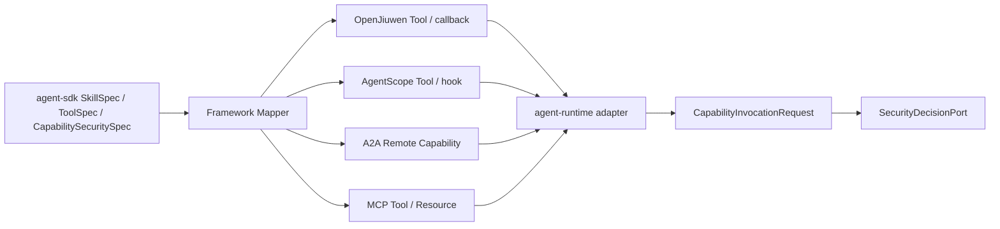

# Agent Capability Permission Policy L2 Proposal

> **Date:** 2026-06-13
> **Status:** Draft
> **Parent proposal:** `2026-06-13-agent-security-decision-chain-proposal.en.md`
> **Scope:** capability permission declarations, allowlist baseline, scope policy, profile presets, and runtime enforcement handoff.
> **Review order:** this L2 proposal should be reviewed after the L1 security decision chain direction is validated, as an implementation-boundary refinement under that L1 direction.

## 1. Background

The parent proposal defines the overall security chain: security redlines -> capability risk declarations -> permission policy -> `SecurityDecisionPort` -> runtime guard -> trajectory/security-event/audit. This L2 proposal focuses only on the permission policy layer.

Permission cannot cover tool calls only. High-risk runtime actions may come from tools, file reads/writes, HTTP/API calls, MCP, A2A remote agents, sandbox, memory, model calls, or business actions. They are all capability invocations with different resource types.

The current main branch already has:

- `SkillSpec` and `ToolSpec` in `agent-sdk`;
- OpenJiuwen, AgentScope, remote A2A adapters, and trajectory emission in `agent-runtime`;
- `agent-service` as the serviceization facade;
- no active `agent-middleware` reactor module.

Therefore, this design extends the current `agent-sdk` and `agent-runtime` seams. It does not depend on the retired `agent-middleware` hook chain.

## 2. Scope Statement

Primary scope:

- `affects_level: L2`
- `affects_view: development`

This proposal defines:

- deployer-readable `docs/governance/capability-permissions.yaml`;
- schema contract `docs/contracts/capability-permission-policy.v1.yaml`;
- default-deny plus allowlist baseline;
- scope permissions for tool, file, API, MCP, A2A, sandbox, memory, model, and business actions;
- `CapabilitySecuritySpec`, `SkillSecuritySpec`, and `ToolSecuritySpec`;
- `CapabilityInvocationRequest`;
- how OpenJiuwen, AgentScope, SDK tools, remote A2A, file/API/MCP, memory, and sandbox paths attach permission metadata.

This proposal does not define:

- the final `SecurityDecisionPort` schema, owned by the security decision contract L2;
- approval persistence and audit storage, owned by the approval/audit L2;
- sandbox provider APIs;
- a new runtime framework or `agent-middleware`.

## 3. Root Cause / Strongest Interpretation (Rule D-1)

1. **Observed failure / motivation:** high-risk capabilities can be invoked through tool, file, API, MCP, A2A, sandbox, memory, and business adapters, but there is no unified deployer-readable permission matrix.
2. **Execution path:** `agent-sdk` loads skill/tool/capability specs; framework adapters map them to OpenJiuwen or AgentScope; `agent-runtime` then executes, routes, or delegates capabilities.
3. **Root cause:** `SkillSpec`, `ToolSpec`, and remote capability descriptors do not carry risk semantics, so runtime must infer risk from names or implementation details.
4. **Evidence:** `SkillSpec.java` currently carries `name/path/skillFile`; `ToolSpec.java` currently carries `name/description/inputSchema/ref`; L0 states the active modules are `agent-runtime`, `agent-service`, `agent-bus`, and BoM.

## 4. Proposed Design

### 4.1 Design Principles

Permission is not a single allow flag. It is a layered decision:

```text
default deny
  -> allowlisted capability
  -> scoped permission
  -> runtime SecurityDecision
  -> obligations: redact / ask / approve / sandbox / audit / rate-limit
```

The allowlist answers whether the capability may be considered. Scope policy answers where, for whom, with what resource, endpoint, action, posture, and limits the capability can run. Runtime decision answers whether this specific invocation can run now.

### 4.2 CapabilityKind

| CapabilityKind | Examples | Typical risk |
|---|---|---|
| `TOOL` | Java tool, HTTP tool, framework-native tool | depends on side effect |
| `FILE` | file read/write/list/delete | local leakage or mutation |
| `API` | HTTP/gRPC external API | egress, SSRF, external side effect |
| `MCP` | MCP server tool/resource/prompt | indirect tool and data access |
| `A2A_NORTHBOUND` | Agent Card, SendMessage, SendStreamingMessage, GetTask, ListTasks, CancelTask, SubscribeToTask, push config | external access, task visibility, cancel/subscribe, push callback egress |
| `A2A_REMOTE_AGENT` | A2A remote agent capability | cross-agent trust and tenant propagation |
| `RUNTIME_CONTROL` | `start`, `stop`, `isHealthy`, `cancel(taskId)` on runtime/handler surfaces | availability manipulation, cross-task interruption, health visibility |
| `SANDBOX` | sandbox acquire/execute/file transfer | code execution and isolation |
| `MEMORY` | memory read/write/retrieval | data leakage or memory poisoning |
| `AGENT_STATE` | framework checkpointer, Redis/InMemory state, release | session-state leakage, tenant crossover, recovery pollution |
| `MODEL` | model invocation/fallback | data exposure and policy bypass |
| `BUSINESS_ACTION` | payment, approval, customer export, production change | regulated side effect |

### 4.3 Add `capability-permissions.yaml`

```yaml
schemaVersion: capability-permission-policy/v1
posture: research
activeProfile: review_unknown
defaultMode: deny

profiles:
  strict_allowlist:
    description: only explicitly allowlisted capabilities can run
    missingFromAllowlist: deny
    matchedAllowlist: allow
    unknownRisk: deny

  review_unknown:
    description: allow scoped whitelist, send unknown capability to HITL
    missingFromAllowlist: ask
    matchedAllowlist: evaluate_scope
    unknownRisk: ask
    approval:
      channel: hitl
      timeout: 15m
      timeoutAction: deny

  scoped_allowlist:
    description: whitelist is required but every invocation still checks scope
    missingFromAllowlist: deny
    matchedAllowlist: evaluate_scope
    scopeViolation: deny

  regulated_prod:
    description: regulated production posture
    missingFromAllowlist: deny
    matchedAllowlist: evaluate_scope
    r3Plus: approval
    r4Plus: sandbox_and_approval
    r5: regulated_approval
    auditRequired: true

allowlist:
  - capabilityKind: TOOL
    capability: web.search
  - capabilityKind: FILE
    capability: workspace.read
  - capabilityKind: MCP
    capability: mcp.docs.search
  - capabilityKind: A2A_REMOTE_AGENT
    capability: quote-agent.ask

tiers:
  R0_PURE_REASONING:
    defaultMode: allow
  R1_LOCAL_READ:
    defaultMode: allow
  R2_NETWORK_READ:
    defaultMode: ask
  R3_STATE_WRITE:
    defaultMode: ask
  R4_CODE_OR_SYSTEM_EXEC:
    defaultMode: sandbox
  R5_BUSINESS_CRITICAL:
    defaultMode: approval

capabilities:
  - selector:
      capabilityKind: API
      capability: web.search
      methods: ["GET"]
      hosts: ["example.com"]
    riskTier: R2_NETWORK_READ
    mode: ask
    scope:
      egress:
        allowHosts: ["example.com"]
        denyHosts: ["169.254.169.254", "localhost"]
      payload:
        maxBytes: 65536
        forbidDataClasses: ["credential"]
    audit:
      required: true

  - selector:
      capabilityKind: FILE
      capability: workspace.write
    riskTier: R3_STATE_WRITE
    mode: ask
    scope:
      filesystem:
        roots: ["workspace://project"]
        denyGlobs: ["**/.ssh/**", "**/.env", "**/secrets/**"]
        maxBytes: 1048576
      actions: ["read", "write"]
    audit:
      required: true

  - selector:
      capabilityKind: MCP
      capability: mcp.docs.search
      serverId: docs-mcp
      toolNames: ["search", "fetch"]
    riskTier: R2_NETWORK_READ
    mode: ask
    scope:
      mcp:
        allowDynamicToolDiscovery: false
        allowedResourceSchemes: ["docs://"]
        maxResultBytes: 262144

  - selector:
      capabilityKind: A2A_REMOTE_AGENT
      capability: quote-agent.ask
      remoteAgentId: quote-agent
    riskTier: R2_NETWORK_READ
    mode: ask
    scope:
      a2a:
        allowedSkills: ["quote"]
        requireTenantPropagation: true
        maxTimeoutMs: 30000

  - selector:
      capabilityKind: SANDBOX
      capability: code.execute
    riskTier: R4_CODE_OR_SYSTEM_EXEC
    mode: sandbox
    sandboxProfile: restricted-code
    approval:
      required: true
    audit:
      required: true

  - selector:
      capabilityKind: BUSINESS_ACTION
      capability: payment.transfer
    riskTier: R5_BUSINESS_CRITICAL
    mode: approval
    approval:
      required: true
      approverRole: regulated-operator
    audit:
      required: true
```

This file is desired state. It becomes runtime enforcement only after the policy engine loads it and connects to `SecurityDecisionPort`.

### 4.4 Permission Profiles / Policy Presets

Profiles are deployer-selected default behavior presets. They define how to handle a capability before a specific rule matches.

| Profile | Scenario | Missing allowlist | Matched allowlist | Unknown risk |
|---|---|---|---|---|
| `strict_allowlist` | production systems that prefer denial over drift | deny | allow or evaluate rule-specific scope | deny |
| `review_unknown` | research / evaluation | ask / HITL | evaluate scope | ask / HITL |
| `scoped_allowlist` | enterprise default | deny | always evaluate scope | deny or ask by posture |
| `least_agency_scoped` | agent applications with a known delegation boundary | deny or ask by posture | allow only after allowlist, scope, and delegation envelope all pass | deny or require policy change |
| `regulated_prod` | financial or regulated side effects | deny | evaluate scope + approval/audit obligations | deny |

Examples:

- "allowlist passes, not in allowlist denies" = `strict_allowlist`;
- "allowlist + scope passes, not in allowlist goes to HITL" = `review_unknown`;
- "allowlist is necessary but every file/API/MCP/A2A scope is checked" = `scoped_allowlist`;
- "developers/deployers define the reasonable agency boundary; actions outside it are denied or escalated" = `least_agency_scoped`;
- "R3+ approval, R4+ sandbox + approval, R5 regulated approval" = `regulated_prod`.

Profiles cannot override redlines. If a profile says allow but a redline or tenant deny matches, the decision is still deny.

#### DelegationEnvelope

Least agency adds `DelegationEnvelope` above the allowlist. It is not a tool list; it is the boundary of what this agent may autonomously do in a business scenario.

```yaml
delegationEnvelopes:
  claim_assistant_default:
    allowedTasks: ["claim_intake", "document_check", "status_query"]
    allowedCapabilityKinds: ["TOOL", "FILE", "API", "MCP", "A2A_NORTHBOUND", "A2A_REMOTE_AGENT", "AGENT_STATE"]
    dataClasses: ["PUBLIC", "INTERNAL", "CUSTOMER_METADATA"]
    fileRoots: ["workspace/claims/${tenantId}/${sessionId}"]
    apiHosts: ["claims.internal.example.com"]
    mcpServers: ["claims-readonly-mcp"]
    remoteAgents: ["ocr-agent", "policy-lookup-agent"]
    maxRiskTier: "R3_STATE_WRITE"
    budget:
      maxToolCallsPerTask: 30
      maxExternalCallsPerTask: 10
    timeWindow: "PT2H"
    unknownAction: "deny"
```

Execution rules:

- an allowlist match only means a capability can be considered; it does not grant agency;
- under `least_agency_scoped`, `requestedScope` must be a subset of the `DelegationEnvelope`;
- capabilities, files, APIs, MCP servers, A2A peers, sandbox profiles, or business thresholds outside the envelope cannot execute even when a native framework permission says allow;
- HITL approval can approve only one in-envelope action; expanding the envelope is a policy-change workflow with audit and versioning;
- framework "always allow" is imported only as a scoped, expiring, actor-bound candidate grant and never beyond the envelope.

### 4.5 PermissionMode

| Mode | Meaning | Runtime expectation |
|---|---|---|
| `allow` | can run without interactive approval | R2+ still records security event |
| `ask` | ask user/operator before first or every invocation | when no cached grant exists, enter approval flow |
| `deny` | block | return typed denial before execution |
| `sandbox` | must use sandbox | no local fallback except explicit dev override |
| `approval` | requires controlled approval | approval/audit refs must exist before side effect |
| `redact_and_allow` | redact before execution | record redaction summary, not raw sensitive content |

### 4.6 Permission Dimensions Beyond Allowlist

| Dimension | Example | Purpose |
|---|---|---|
| resource scope | file roots, API hosts, MCP server, A2A remote agent, sandbox profile | avoid over-broad grants |
| action scope | read/write/execute/delete/invoke/list/connect | distinguish observation from mutation |
| parameter constraints | max payload, deny globs, allowed methods, denied headers, redacted fields | block dangerous parameter shapes |
| risk axes | `riskTier`, `dataClass`, `sideEffect`, `egressScope`, `trustTier` | avoid one-dimensional risk scoring |
| identity scope | tenant/user/agent/session/task | avoid global durable grants |
| time scope | `expiresAt`, session-only, one-shot grant | avoid stale permission |
| budget scope | rate limit, max calls, timeout, concurrency, cost budget | prevent abuse and cost runaway |
| fallback scope | security-equivalent only | prevent fallback from weakening safety |

### 4.7 Risk Axes

| Axis | Example values | Role |
|---|---|---|
| `riskTier` | R0-R5 | coarse action risk |
| `dataClass` | public/internal/tenant/pii/credential/regulated | PII read can be high-risk even without mutation |
| `sideEffect` | none/local_write/network_write/financial/production | separates observation from mutation |
| `egressScope` | none/allowlist/internet/private_network | prevents SSRF and tenant leakage |
| `trustTier` | vetted/reviewed/untrusted | manages default treatment of third-party capabilities |
| `sandboxRequired` | true/false/profile | aligns with sandbox proposal |

### 4.8 Agent SDK Declarations

Current:

```java
public record SkillSpec(String name, Path path, Path skillFile) {}

public record ToolSpec(
        String name,
        String description,
        Map<String, Object> inputSchema,
        ToolRef ref) {}
```

Proposed:

```java
public record CapabilitySecuritySpec(
        String schemaVersion,
        CapabilityKind capabilityKind,
        String capability,
        RiskTier riskTier,
        TrustTier trustTier,
        Set<DataClass> dataClasses,
        SideEffect sideEffect,
        EgressScope egressScope,
        CapabilityScope scope,
        boolean auditRequired,
        boolean approvalRequired,
        String sandboxProfile) {
}

public record SkillSecuritySpec(
        String schemaVersion,
        RiskTier defaultRiskTier,
        TrustTier trustTier,
        Set<CapabilitySecuritySpec> declaredCapabilities,
        boolean auditRequired) {
}

public record ToolSecuritySpec(
        String schemaVersion,
        CapabilitySecuritySpec capability,
        Map<String, Object> parameterPolicy) {
}
```

Compatibility rules:

- keep old constructors or builders with defaults;
- missing security declaration is classified as `UNKNOWN`, not safe;
- dev may ask/warn for unknown low-risk capabilities;
- research/prod deny unknown R2+ and all unknown side-effecting capabilities.

### 4.9 CapabilityInvocationRequest

```java
public record CapabilityInvocationRequest(
        String schemaVersion,
        String tenantId,
        String userId,
        String sessionId,
        String taskId,
        String agentId,
        CapabilityKind capabilityKind,
        String capability,
        String resourceRef,
        String action,
        RiskTier riskTier,
        Set<DataClass> dataClasses,
        SideEffect sideEffect,
        EgressScope egressScope,
        CapabilityScope requestedScope,
        Object redactedArgsPreview,
        String argsHash,
        String traceId,
        String spanId,
        String idempotencyKey) {
}
```

This is not the final decision. It is a capability-specific input that later maps to a generic `SecurityEvaluationRequest`.

### 4.10 Capability Scope

| Scope | Required fields |
|---|---|
| `FileScope` | roots, allow/deny globs, max bytes, read/write/delete/list |
| `ApiScope` | allowed hosts, methods, paths, headers, timeout, payload limits |
| `McpScope` | server id, tool names, resource schemes, dynamic discovery flag, result limit |
| `A2aNorthboundScope` | methods, agent-card visibility, task read/list/cancel/subscribe, push callback hosts, includeArtifacts |
| `A2aScope` | remote agent id, allowed skills/capabilities, tenant propagation, timeout |
| `RuntimeControlScope` | lifecycle methods, own-task cancel scope, admin-only start/stop, health detail visibility |
| `SandboxScope` | sandbox profile, network profile, filesystem transfer limits |
| `MemoryScope` | memory kind, tenant/session bounds, read/write, retention, poisoning checks |
| `AgentStateScope` | checkpointer kind, tenant/session key pattern, read/write/release, retention, cleanup policy |
| `ModelScope` | model id/provider, prompt data class, fallback equivalence |
| `BusinessScope` | action name, regulated role, dual-control, amount/threshold |

### 4.11 Current Module Placement

| Module | Change | Boundary |
|---|---|---|
| `agent-sdk` | security spec, YAML parser, capability invocation request builder | no dependency on `agent-service` |
| `agent-runtime` | consumes capability metadata when adapters expose tool/file/API/MCP/A2A/memory/sandbox/model actions | no direct dependency on policy implementation |
| `agent-service` | loads policy, tenant posture, approval cache, budget state; provides policy evaluation | may depend on config/storage |
| `agent-bus` | no new dependency for base policy; approval callback belongs to approval L2 | remains neutral |
| BoM | pin parser dependencies if needed | no runtime behavior |

### 4.12 Framework Adapter Attachment Points



Rules:

- OpenJiuwen tools keep their native representation, but mapping must preserve `capabilityKind`, `capability`, `resourceRef`, `action`, and security spec.
- AgentScope wrappers follow the same rule; AgentScope does not need to understand this repository's policy language.
- A2A remote tools are treated as `A2A_REMOTE_AGENT` plus capability label. They do not bypass permission policy.
- MCP dynamic discovery is denied by default unless policy explicitly allows the server and discovered tool/resource class.
- If a tool's internal file/API access is runtime-observable, create a separate FILE/API request. If not observable, it must be pre-declared by the enclosing tool.

Framework relationship review:

| Integration type | OpenJiuwen / AgentScope role | Repository role | Result |
|---|---|---|---|
| Wrapped SDK capability | receives callable generated by repository SDK mapper | enforce before mapping/invocation | strongest and preferred |
| Native pre-action callback/hook | exposes callback before side effect | convert to `CapabilityInvocationRequest` and block if needed | acceptable |
| Native post-action callback only | emits event only after execution | telemetry/audit only | R3+ requires wrapper/proxy/pre-declaration |
| Opaque framework-internal side effect | performs file/API/MCP/sandbox/business action internally | cannot be trusted as governed | deny, sandbox, or require proxy/wrapper |

AgentScope / OpenJiuwen / JiuwenSwarm least-privilege mechanisms do not block this repository from implementing least agency, as long as adapters do not treat native allow as final authorization. The intended relationship is:

- framework permission engines are lower-layer secondary guards;
- repository `capability-permissions.yaml` and `DelegationEnvelope` are the primary policy;
- framework bypass, permission disabled, approval override, and post-action-only callbacks are insufficient proof of governance in research/prod;
- opaque internal framework actions must be moved behind a repository wrapper/proxy, or constrained to sandbox and pre-declared by the enclosing capability.

### 4.13 Default Behavior Matrix

| Posture | Missing declaration | Missing policy row | R4/R5 without sandbox/approval |
|---|---|---|---|
| dev | R0-R1 ask/warn; unknown side effect deny | ask | deny unless explicit dev override |
| research | unknown R2+ deny | deny or ask by profile | deny or suspend |
| prod | deny | deny | deny |

### 4.14 Contract Schema Ownership

`docs/contracts/capability-permission-policy.v1.yaml` owns:

- enums: `CapabilityKind`, `RiskTier`, `TrustTier`, `DataClass`, `SideEffect`, `EgressScope`, `PermissionMode`;
- profile schema: `strict_allowlist`, `review_unknown`, `scoped_allowlist`, `least_agency_scoped`, `regulated_prod`, and custom profiles;
- selector grammar: `capabilityKind`, `capability`, `serverId`, `remoteAgentId`, `host`, `path`, `filesystemRoot`, `sandboxProfile`, `agentId`, `tenantScope`;
- scope objects: `FileScope`, `ApiScope`, `McpScope`, `A2aNorthboundScope`, `A2aScope`, `RuntimeControlScope`, `SandboxScope`, `MemoryScope`, `AgentStateScope`, `ModelScope`, `BusinessScope`;
- merge order: redlines > tenant deny > explicit capability policy > risk-tier default > posture default;
- validation failures: unknown enum, illegal host/path pattern, and impossible combinations such as `mode=allow` + `R5_BUSINESS_CRITICAL`.

### 4.15 Failure Handling

| Failure | Required result |
|---|---|
| policy file parse fails | policy engine unavailable; high-risk capability denied |
| capability not in allowlist | deny unless explicit dev-only fixture |
| capability declaration missing | classify unknown; posture/profile decides |
| policy conflicts with redline | redline wins; emit validation error |
| sandbox requested but unavailable | deny or suspend; no automatic local fallback |
| API/MCP/A2A endpoint outside scope | deny before network call |
| file path escapes allowed root | deny before file operation |
| audit required but unavailable | block side-effect action in research/prod |

## 5. Alternatives

| Alternative | Why rejected |
|---|---|
| tool-only permission policy | misses file, API, MCP, A2A, sandbox, memory, model, and business-action risks |
| write allowlist into `AGENTS.md` | not machine-readable enough and cannot enforce by tenant/session |
| put permission logic only inside OpenJiuwen / AgentScope adapters | behavior diverges across frameworks |
| route every capability through sandbox | too expensive and still does not solve credentials, egress, memory, or business approval |
| infer risk only by capability name | brittle and not auditable |
| add a new `agent-middleware` module | conflicts with current mainline structure |

## 6. Verification Plan

- [ ] `CapabilityPermissionPolicyParserTest`: YAML loads and unknown mode/enum is rejected.
- [ ] `PermissionProfileParserTest`: validates built-in/custom profiles, timeout, and timeout action.
- [ ] `PermissionProfileBehaviorTest`: strict allowlist denies missing capability, review_unknown enters HITL, scoped_allowlist denies scope violation, least_agency_scoped validates envelope, regulated_prod adds approval/audit.
- [ ] `DelegationEnvelopeParserTest`: envelope task, scope, budget, timeWindow, and unknownAction parse correctly and unknown fields fail closed.
- [ ] `DelegationEnvelopeSubsetTest`: requested FILE/API/MCP/A2A/sandbox/state/business scope must be a subset of the envelope.
- [ ] `CapabilityAllowlistDefaultDenyTest`: non-allowlisted capability is denied before execution.
- [ ] `CapabilityPermissionMergeOrderTest`: redlines > tenant deny > capability policy > tier default.
- [ ] `CapabilityInvocationRequestBuilderTest`: produces stable `argsHash` and redacted preview.
- [ ] `FilePermissionScopeTest`: path traversal, deny globs, oversized writes are rejected.
- [ ] `ApiPermissionScopeTest`: denied host/method/private-network is blocked.
- [ ] `McpPermissionScopeTest`: unauthorized MCP server/tool/resource and dynamic discovery are rejected.
- [ ] `A2aNorthboundPermissionScopeTest`: unauthorized Agent Card, task read/list/cancel/subscribe, push config, and includeArtifacts are rejected.
- [ ] `A2aPermissionScopeTest`: unauthorized remote agent/capability is rejected and tenant propagation is required.
- [ ] `PushCallbackEgressPolicyTest`: push callback URL must match the egress allowlist; private-network or unknown hosts are rejected.
- [ ] `RuntimeControlPermissionScopeTest`: lifecycle start/stop requires an admin scope, health detail follows visibility policy, and task cancel is limited to authorized tenant/session/task scope.
- [ ] `AgentStatePermissionScopeTest`: InMemory/Redis/OpenJiuwen checkpointer access must match tenant/session key scope, and `release` cleans only authorized scope.
- [ ] `OpenJiuwenCapabilityMetadataTest`: mapped OpenJiuwen tools preserve capability metadata.
- [ ] `AgentScopeCapabilityMetadataTest`: AgentScope mapping preserves the same metadata.
- [ ] `FrameworkBypassCannotExpandAgencyTest`: AgentScope bypass, OpenJiuwen permission disabled, and JiuwenSwarm approval override cannot bypass the envelope.
- [ ] `ApprovalCannotExpandEnvelopeTest`: HITL can approve in-envelope actions only and cannot temporarily expand agency.
- [ ] ArchUnit: `agent-sdk` does not depend on `agent-service`.

## 7. Rollout

- **Wave 1:** add contract schema, built-in profiles, and sample `capability-permissions.yaml`.
- **Wave 2:** add `CapabilitySecuritySpec`, `SkillSecuritySpec`, and `ToolSecuritySpec` while preserving constructor compatibility.
- **Wave 3:** create requests in SDK and runtime adapters.
- **Wave 4:** enforce posture/profile defaults through `SecurityDecisionPort`.

Freeze impact:

- no L0 principle change;
- after acceptance, update contract catalog with `capability-permission-policy.v1.yaml`.

## 8. Self-Audit

| Finding | Severity | Status | Mitigation |
|---|---|---|---|
| policy scope may exceed v1 implementation | P1 | open | mark each kind as contract-defined, runtime-loaded, or runtime-enforced |
| extending `SkillSpec` / `ToolSpec` constructors has compatibility risk | P1 | open | add secondary constructors or builders |
| some native framework actions may not expose enough metadata | P1 | open | classify as unknown and deny high-risk |
| policy schema may become too large | P2 | open | keep core mandatory and advanced scope optional |

## Authority

- Parent proposal: `2026-06-13-agent-security-decision-chain-proposal.en.md`.
- L0 module facts: active modules are `agent-runtime`, `agent-service`, `agent-bus`, and BoM; historical `agent-middleware` is not the target module.
- Contract catalog: current `agent-runtime` SPI surface includes `AgentRuntimeHandler`, `StreamAdapter`, `AgentCardProvider`, and `MemoryProvider`.
