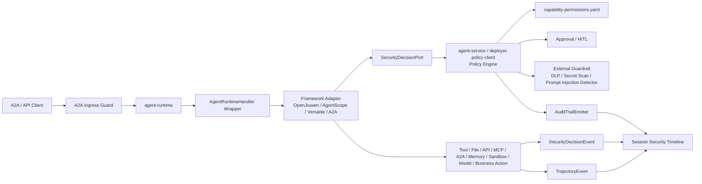
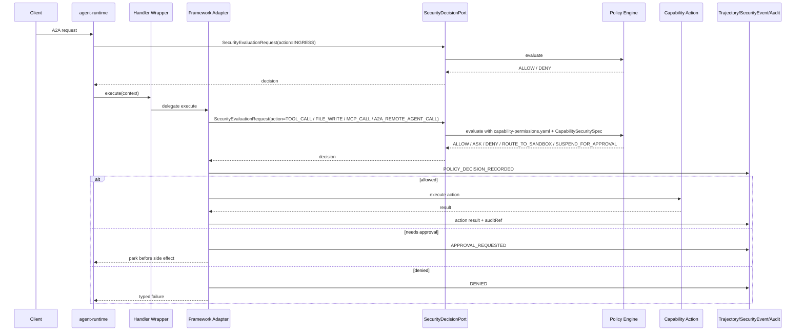

# Agent Security Decision Chain Proposal

> **Date:** 2026-06-13
> **Status:** Draft
> **Scope:** cross-module runtime security decisions, capability permission governance, approval, security events, trajectory, and audit.
> **Input analysis:** `docs/reports/2026-06-13-agent-security-design-recommendations.zh.md`
> **Boundary:** this proposal does not redesign `agent-runtime`, `AgentRuntimeHandler`, OpenJiuwen, AgentScope, or sandbox architecture. It defines how security decisions are embedded into the current repository architecture.
> **Review order:** this PR should be reviewed top-down: first validate the L1 security decision chain direction, then review the three L2 proposals as implementation-boundary refinements under that L1 direction.

## 1. Background

The repository already shows a strong security posture across L0/L1 governance, ADRs, contract catalog, DFX evidence, skill capacity, sandbox policy, AI risk control maps, trajectory events, masking, and audit-trail contracts. The missing part is not security awareness. The missing part is a unified, executable, and auditable runtime decision chain.

Target model:

```text
security redlines
  -> skill/tool/capability risk declarations
  -> capability permission policy
  -> SecurityDecisionPort
  -> adapter/tool/file/API/MCP/A2A/memory/sandbox/model guards
  -> trajectory + security event + audit
  -> replayable session-level security timeline
```

This proposal turns the report-level recommendations into module-level and interface-level design.

## 2. Scope Statement

Primary scope:

- `affects_level: L1`
- `affects_view: [logical, development, process, scenarios]`

This proposal defines:

- a repository-level agent security redline document;
- a deployer-readable capability permission policy file;
- contract vocabulary for capability permissions and security decisions;
- `agent-sdk` risk declaration models for skills, tools, and capabilities;
- a neutral `agent-runtime` security decision outbound port;
- guard placement for OpenJiuwen, AgentScope, A2A remote invocation, remote tool catalog, Versatile workflow, generic tools, files, APIs, MCP, memory, model, and sandbox actions;
- paired security decision events and audit receipts;
- fail-closed posture behavior;
- validation and red-team coverage.

This proposal does not define:

- a new runtime framework;
- a new sandbox provider API;
- a replacement for the sandbox proposal;
- reintroduction of the retired `HookDispatcher`;
- concrete vendor integration for DLP or content-safety checks;
- a session security timeline UI.

## 3. Root Cause / Strongest Interpretation (Rule D-1)

1. **Observed failure / motivation:** the repository contains multiple security requirements and signals, but high-risk tool/model/memory/sandbox/file/API/MCP/A2A/remote-tool-catalog/Versatile/business actions do not yet pass through one unified executable and auditable decision chain.
2. **Execution path:** `A2aJsonRpcController -> AgentRuntimeHandler.execute(context) -> framework adapter / tool executor / file/API/MCP adapter / memory adapter / sandbox gateway / remote A2A outbound port -> trajectory/audit`.
3. **Root cause:** redlines, permissions, risk tiers, approval, audit, and trajectory are distributed across documents and local implementations without one runtime decision contract and enforcement entry point.
4. **Evidence:** `SkillSpec.java` currently carries `name/path/skillFile`; `ToolSpec.java` carries `name/description/inputSchema/ref`; `TrajectoryEvent.java` is executable telemetry but not a security decision contract; `audit-trail.v1.yaml` is still design-level; L0 identifies active modules as `agent-runtime`, `agent-service`, `agent-bus`, and BoM, while historical `agent-middleware` is not in the reactor.

## 4. Proposed Design

### 4.1 Design Thesis

This repository should own cross-framework security policy, permission decisions, approval, audit, and fallback semantics. AgentScope, OpenJiuwen, and JiuwenSwarm-like frameworks should keep their native execution model.

```text
spring-ai-ascend owns:
  policy, redlines, risk tier, permission decision, approval, audit, trace, fail-closed behavior

AgentScope / OpenJiuwen / JiuwenSwarm-like frameworks provide:
  native tool/model/memory hooks, event streams, callbacks, workspace/sandbox adapters, execution semantics
```

Short version:

> Frameworks execute. The platform decides whether execution is allowed.

Framework relationship review:

| Integration type | Current repository / framework relationship | Reasonable boundary |
|---|---|---|
| Declared and wrapped capability | `agent-sdk` parses Java/HTTP tools and maps them to OpenJiuwen/AgentScope. Runtime can wrap before handing a callable to the framework. | Strongest control point. Build `CapabilityInvocationRequest` before the framework receives the callable. |
| Observable native framework callback | OpenJiuwen trajectory rail can observe model/tool callbacks. AgentScope-like hooks or wrappers may expose similar points. | Good for telemetry and policy checks. Enforcement is valid only when the callback is pre-action and blocking. |
| Opaque framework-internal capability | Framework internally performs file/API/MCP/sandbox/business actions without a repository wrapper or pre-action hook. | Not acceptable for high-risk paths. Require wrapper, proxy, pre-declaration, sandbox, HITL, or denial. |

OpenJiuwen and AgentScope do not own the repository-level unified security policy. They provide execution and signals. This repository owns allowlist profiles, scoped permissions, approval, audit, fallback equivalence, and fail-closed behavior.

#### Least Agency vs Least Privilege

The target is least agency, not only least privilege. Least privilege answers whether a tool, file, API, MCP server, A2A peer, remote tool catalog entry, Versatile workflow, or sandbox can be accessed. Least agency also answers how far the agent may autonomously act within the current role, task, session, tenant, data boundary, budget, and time window. Therefore AgentScope / OpenJiuwen / JiuwenSwarm-like allow / ask / deny modes, permission modes, approval overrides, or sandbox isolation are lower-layer permission and execution signals. They do not replace the repository-owned agency boundary.

| Framework capability shape | Impact on least agency | Repository preset requirement |
|---|---|---|
| AgentScope `PermissionMode` / `PermissionBehavior` | useful tool-level least-privilege signal, but `BYPASS`, `DONT_ASK`, and persistent allow cannot expand agency | research/prod must still pass repository `SecurityDecisionPort` and `DelegationEnvelope` |
| OpenJiuwen / JiuwenSwarm allow / ask / deny and permission scene hooks | useful interaction carrier, secondary guard, or evidence | repository policy remains the primary decision; when framework permission is disabled, repository still fails closed |
| framework-level "always allow" / approval override | can turn confirmation fatigue into over-delegation | import only as a scoped, expiring, actor-bound candidate grant, never beyond the agency envelope |
| framework sandbox / jiuwenbox / remote runtime | provides isolation and execution environment | sandbox is not authorization; capability, scope, approval, audit, and fallback-equivalence still apply |
| opaque framework-internal side effect | repository cannot prove whether the agency boundary was respected | deny R3+ in research/prod unless wrapper/proxy/pre-declaration/sandbox control point is added |

### 4.1.1 Current Runtime Alignment

The current mainline runtime already treats external agent and workflow systems as lower-layer capabilities:

- A2A remote agents are discovered from configured remote Agent Cards and exposed as callable tool specs.
- OpenJiuwen can receive those remote tool specs through the runtime-owned installer and interrupt rail.
- Versatile Adapter converts A2A message text and metadata into REST/SSE workflow calls.
- `INPUT_REQUIRED` may mean remote workflow continuation, remote agent continuation, or a future security approval pause.

These capabilities strengthen the need for a repository-owned security chain. Remote Agent Card skills, Versatile workflow calls, A2A metadata/header forwarding, and remote continuation state are not trusted policy by themselves. They are capability descriptions and transport signals that must be admitted, scoped, audited, and, when needed, parked by this repository before side effects occur.

### 4.2 Logical Architecture



### 4.3 Modules / Artefacts To Develop

| Module / artefact | Responsibility | Target state |
|---|---|---|
| `docs/trustworthy/agent-safety-redlines.md` | tenant, credential, external side effect, local side effect, prompt/tool injection, fallback, memory, and self-evolution redlines | governance authority |
| `docs/governance/capability-permissions.yaml` | allowlist, scope, ask, deny, sandbox, approval, budget, and audit policy for tools, files, APIs, MCP, A2A, sandbox, memory, model, and business actions | schema-defined, then runtime-loaded |
| `docs/contracts/capability-permission-policy.v1.yaml` | contract vocabulary for `CapabilityInvocationRequest`, `CapabilityKind`, `PermissionMode`, `RiskTier`, and scope objects | contract-defined |
| `docs/contracts/security-decision.v1.yaml` | contract vocabulary for `SecurityEvaluationRequest`, `SecurityDecision`, decision profiles, obligations, and policy hash | contract-defined |
| `agent-sdk` security spec | `CapabilitySecuritySpec`, `SkillSecuritySpec`, `ToolSecuritySpec` | runtime-loaded + tests |
| `agent-sdk` capability invocation request builder | builds `CapabilityInvocationRequest`, then maps to `SecurityEvaluationRequest` | runtime-loaded + tests |
| `agent-runtime` `SecurityDecisionPort` | neutral outbound port, without dependency on `agent-service` implementation classes | runtime-enforced + ArchUnit purity test |
| `agent-runtime` handler wrapper | lifecycle and run-level guard around `AgentRuntimeHandler.start/stop/isHealthy/cancel/execute` | runtime-enforced + adapter tests |
| A2A northbound guard | admission and capability decisions for Agent Card, `SendMessage`, `SendStreamingMessage`, `GetTask`, `ListTasks`, `CancelTask`, `SubscribeToTask`, and push config entry points | runtime-enforced + A2A protocol tests |
| OpenJiuwen security rail | maps OpenJiuwen native model/tool callbacks to security evaluation request and evidence | enforce only when pre-action blocking is possible; otherwise telemetry/audit only |
| AgentScope security wrapper | maps AgentScope event/harness/client calls to the unified decision model | implemented when the path is governed |
| A2A remote outbound guard | decorates remote invocation outbound port with endpoint, capability, tenant, and audit policy | runtime-enforced + negative tests |
| memory guard | protects memory read/write data scope and poisoning/write policy | runtime-enforced + memory tests |
| agent-state guard | protects OpenJiuwen/InMemory/Redis checkpointer read/write/release and tenant/session key scope | runtime-enforced + state adapter/provider tests |
| `agent-service` policy engine | loads redlines, capability permissions, tenant posture, approval state, and returns decisions | serviceized policy + policy tests |
| audit emitter | writes high-risk decision receipts and action outcomes | dev sink, then durable append-only sink |
| session security timeline | reconstructs the security decision chain by tenant/session/task/trace | initial JSONL/query endpoint, UI optional |

### 4.4 Security Redline Authority

Add:

```text
docs/trustworthy/agent-safety-redlines.md
```

Minimum redline families:

| Redline | Meaning |
|---|---|
| Tenant and identity cannot be self-asserted by client/model/tool | tenant, user, and role must come from trusted ingress or verified context. |
| Credentials cannot leave the process in plaintext | tokens, keys, passwords, env values, and credentials must not enter model prompts, tool outputs, or plaintext trajectory. |
| External side effects require authorization | email, payment, order, approval, production writes, and similar mutations must pass policy decision. |
| Local high-risk side effects are tiered | shell, file write, process, network, browser, container, and system config require risk-tier governance. |
| Untrusted context cannot modify policy | prompts, webpages, file contents, and tool outputs cannot alter system prompts, permissions, release decisions, or audit verdicts. |
| Fallback cannot weaken safety | model, tool, sandbox, provider, and framework fallbacks must preserve equivalent policy and audit obligations. |
| Memory writes are governed | long-term memory requires source, tenant, classification, retention, poisoning check, and audit. |
| Self-evolution is constrained | skill creation or evolution defaults to deny/ask and cannot expand its own permissions. |

`AGENTS.md` should reference this authority rather than carrying the full redline body.

### 4.5 Capability Permission Governance

Add:

```text
docs/governance/capability-permissions.yaml
```

This file is the deployer-facing desired-state policy for default deny, allowlist, scoped permission, ask, sandbox, approval, budget, and audit behavior.

Capabilities include:

| Capability kind | Example |
|---|---|
| `TOOL` | Java tool, HTTP tool, OpenJiuwen / AgentScope native tool |
| `FILE` | file read/write/list/delete |
| `API` | HTTP/gRPC external API |
| `MCP` | MCP server tool/resource/prompt |
| `A2A_REMOTE_AGENT` | remote agent capability exposed through A2A |
| `SANDBOX` | sandbox acquire/execute/file transfer |
| `MEMORY` | memory read/write/retrieval |
| `MODEL` | model invocation / model fallback |
| `BUSINESS_ACTION` | payment, approval, customer export, production mutation |

The allowlist is the minimum safety baseline, not the full decision. After an allowlist match, the runtime still checks scope, risk, profile, approval, audit, budget, and fallback equivalence.

```yaml
schemaVersion: capability-permission-policy/v1
activeProfile: review_unknown
defaultMode: deny

profiles:
  strict_allowlist:
    missingFromAllowlist: deny
    matchedAllowlist: allow
    unknownRisk: deny

  review_unknown:
    missingFromAllowlist: ask
    matchedAllowlist: evaluate_scope
    unknownRisk: ask
    approval:
      channel: hitl
      timeout: 15m
      timeoutAction: deny

  scoped_allowlist:
    missingFromAllowlist: deny
    matchedAllowlist: evaluate_scope
    scopeViolation: deny

  regulated_prod:
    missingFromAllowlist: deny
    matchedAllowlist: evaluate_scope
    r3Plus: approval
    r4Plus: sandbox_and_approval
    r5: regulated_approval

postures:
  dev:
    activeProfile: review_unknown
    defaultMode: ask
  research:
    activeProfile: review_unknown
    defaultMode: ask
  prod:
    activeProfile: strict_allowlist
    defaultMode: deny
```

Typical profiles:

| Profile | Meaning |
|---|---|
| `strict_allowlist` | allowlisted capabilities pass; capabilities outside the allowlist are denied. |
| `review_unknown` | allowlist + scope pass; capabilities outside the allowlist go to HITL. |
| `scoped_allowlist` | allowlist is necessary, but each invocation still evaluates scope. |
| `least_agency_scoped` | deployment defines a `DelegationEnvelope`; after allowlist and scope pass, the action must still fit task, data, budget, time-window, and remote-agent bounds. |
| `regulated_prod` | R3+ requires approval; R4+ requires sandbox + approval; R5 requires regulated approval. |

### 4.6 Skill / Tool / Capability Risk Declarations

Add security declarations at the SDK layer without overloading the existing `SkillSpec`:

```java
public record CapabilitySecuritySpec(
        CapabilityKind capabilityKind,
        String capability,
        RiskTier riskTier,
        Set<DataClass> dataClasses,
        SideEffect sideEffect,
        EgressScope egressScope,
        CapabilityScope scope,
        boolean requiresApproval,
        boolean sandboxRequired,
        boolean auditRequired,
        String schemaVersion) {
}

public record SkillSecuritySpec(
        String skillId,
        Set<CapabilitySecuritySpec> declaredCapabilities,
        String provenanceRef,
        String schemaVersion) {
}
```

Risk tiers:

| Tier | Meaning | Default prod behavior |
|---|---|---|
| `R0_READ_ONLY_LOCAL` | local read-only, no egress, no write | allow |
| `R1_CONTEXT_READ` | session/memory/context read | allow + audit when needed |
| `R2_NETWORK_READ` | network read, web fetch, read-only MCP | allowlist or ask |
| `R3_STATE_WRITE` | memory/file/state write | approval required |
| `R4_CODE_OR_SYSTEM_EXEC` | shell/code/process/browser/container | sandbox + approval |
| `R5_BUSINESS_CRITICAL` | payment, approval, production mutation, customer export | regulated approval only |

### 4.7 SecurityDecisionPort

Define a neutral runtime outbound port:

```java
public interface SecurityDecisionPort {
    SecurityDecision evaluate(SecurityEvaluationRequest request);
}
```

Boundary rules:

- `agent-runtime` may define and call the port;
- `agent-service` or a deployer-provided policy client may implement the port;
- `agent-runtime` must not depend on `agent-service` implementation classes;
- when policy is unavailable, high-risk decisions fail closed.

Minimum `SecurityEvaluationRequest`:

```java
public record SecurityEvaluationRequest(
        String securityEvaluationRequestId,
        String tenantId,
        String userId,
        String sessionId,
        String taskId,
        String agentId,
        ActionType actionType,
        String target,
        RiskTier riskTier,
        Set<String> requestedCapabilities,
        Object redactedPreview,
        String inputHash,
        String traceId,
        String parentSpanId,
        String schemaVersion) {
}
```

`securityEvaluationRequestId` identifies only the input object submitted to the security decision chain. It must not be interpreted as an NLU category, agent task, call-chain trace, or idempotency key.

`ActionType`:

```text
INGRESS
A2A_AGENT_CARD_READ
A2A_TASK_SEND
A2A_TASK_STREAM
A2A_TASK_READ
A2A_TASK_LIST
A2A_TASK_CANCEL
A2A_TASK_SUBSCRIBE
A2A_PUSH_CONFIG
RUNTIME_START
RUNTIME_STOP
RUNTIME_HEALTH_READ
RUNTIME_TASK_CANCEL
MODEL_CALL
TOOL_CALL
API_CALL
MCP_CALL
MEMORY_READ
MEMORY_WRITE
STATE_READ
STATE_WRITE
STATE_RELEASE
SANDBOX_ACQUIRE
SANDBOX_EXEC
A2A_REMOTE_AGENT_CALL
EXTERNAL_EGRESS
FILE_READ
FILE_WRITE
FILE_LIST
FILE_DELETE
CODE_EXEC
BUSINESS_ACTION
FALLBACK
```

### 4.8 Guard Placement

| Guard point | Module | Decision scope |
|---|---|---|
| A2A northbound guard | `agent-runtime.boot` / `runtime.engine.a2a` | Agent Card, task send/stream/get/list/cancel/subscribe, push config, tenant header trust mode, posture |
| Handler lifecycle guard | adjacent to `agent-runtime.engine.spi` | `RUNTIME_START` / `RUNTIME_STOP` / `RUNTIME_HEALTH_READ` / `RUNTIME_TASK_CANCEL`, plus run-level guard around `execute` |
| OpenJiuwen rail | `runtime.engine.openjiuwen` | model/tool callback security and trajectory mapping |
| AgentScope wrapper | `runtime.engine.agentscope` | permission, harness, runtime-client security mapping |
| Tool executor guard | `agent-sdk` | SDK tool invocation, egress, file, process, HTTP |
| File/API/MCP guard | SDK/runtime adapter | scoped capability policy |
| Memory guard | `MemoryProvider` / memory adapter | memory read/write policy, retention, poisoning checks |
| Agent-state guard | framework checkpointer adapter | checkpoint read/write/release and tenant/session key scope |
| Sandbox guard | sandbox gateway/provider path | sandbox acquire/execute/release decision and fail-closed behavior |
| Remote tool catalog guard | `runtime.engine.a2a.RemoteAgentCardCache` / framework tool installer | remote Agent Card endpoint, skill-derived tool description, generated tool name, open input schema, card refresh drift |
| Remote A2A guard | `runtime.engine.a2a` outbound decorator | endpoint policy, capability label, tenant, audit |
| Versatile workflow guard | `runtime.engine.versatile` | URL template variables, structured query/header forwarding, `inputs` body fields, result extraction, continuation semantics |
| Trajectory/security event sink guard | runtime sink/exporter | masking and decision event emission |

### 4.9 Runtime Decision Sequence



### 4.10 Security Event And Audit

Do not directly expand `TrajectoryEvent.Kind` into the source of truth for security decisions. Use a paired `SecurityDecisionEvent` stream:

```text
POLICY_DECISION_RECORDED
APPROVAL_REQUESTED
APPROVAL_GRANTED
APPROVAL_DENIED
REDACTION_APPLIED
SANDBOX_ROUTE_DECIDED
EGRESS_DECISION_RECORDED
MEMORY_ACCESS_DECISION_RECORDED
FALLBACK_DECISION_RECORDED
```

Telemetry and audit must remain separate:

- trajectory / OTel: debugging and session timeline;
- security event: security decision chain;
- audit trail: compliance-grade evidence and high-risk decision receipt.

### 4.11 Fail-Closed Policy

| Failure | dev | research | prod |
|---|---|---|---|
| policy engine unavailable | warn + deny high-risk | deny high-risk | deny high-risk |
| skill/capability has no security declaration | ask | deny unknown R2+ | deny |
| capability not in allowlist / policy | ask | deny or ask by profile | deny |
| sandbox unavailable for R4/R5 | explicit dev fallback only | deny or suspend | deny |
| approval timeout | ask again / deny | suspend or deny | deny or suspend per regulated workflow |
| audit unavailable | low-risk warn | deny high-risk side effect | deny if audit required |
| remote Agent Card / skill catalog cannot be validated | keep pending or disable dev-only tool | deny tool registration or require manual admission | deny tool registration |
| Versatile metadata/body exceeds scope | ask or block by profile | deny before REST call | deny before REST call |
| `INPUT_REQUIRED` lacks a trusted waiting-target namespace | reject continuation | reject continuation | reject continuation |
| fallback is not safety-equivalent | deny | deny | deny |

### 4.12 Relationship To Sandbox Proposal

This proposal is above the sandbox proposal:

- sandbox is an execution strategy for R4/R5 high-risk actions;
- the security decision chain decides allow, deny, ask, route to sandbox, or suspend for approval;
- the sandbox proposal defines lease/provider/pool/execution details;
- this proposal defines why sandbox is selected, who approves it, and how it is audited.

## 5. Alternatives

| Alternative | Why rejected |
|---|---|
| Put all security rules into `AGENTS.md` | `AGENTS.md` should stay a thin wrapper and is not a machine-enforceable policy surface. |
| Let every framework manage its own security | OpenJiuwen, AgentScope, remote A2A, Versatile, and SDK tools would produce inconsistent policy, audit, and fallback behavior. |
| Reintroduce the global `HookDispatcher` | The current mainline moved away from this design. The proposal should not rebuild retired architecture. |
| Treat sandbox as the only security mechanism | Sandbox does not solve credentials, tenant spoofing, memory poisoning, approval, or audit. |
| Rely only on code allowlists | Deployers and reviewers need readable, diffable governance configuration. |
| Automatically fallback to local execution when sandbox fails | Unsafe in prod, untrusted, and high-risk scenarios. |
| Use logs only for security decisions | Logs are insufficient for replay, compliance, and session-level security timelines. |

## 6. Verification Plan

### 6.1 Unit Tests

| Test | Expected proof |
|---|---|
| `SkillSecuritySpecValidationTest` | fails when risk tier, schema version, audit requirement, or legal egress declaration is missing. |
| `CapabilityPermissionPolicyParserTest` | loads `capability-permissions.yaml` deterministically and rejects unknown mode/kind/scope. |
| `PermissionProfileBehaviorTest` | `strict_allowlist`, `review_unknown`, `scoped_allowlist`, `least_agency_scoped`, and `regulated_prod` handle missing/matched allowlist differently. |
| `LeastAgencyEnvelopeTest` | allowlisted framework tools are denied when they exceed the task/session/data/API/MCP/A2A/budget envelope. |
| `FrameworkLeastPrivilegeCannotBypassEnvelopeTest` | AgentScope/OpenJiuwen/JiuwenSwarm native allow or bypass modes cannot override repository-level least-agency policy. |
| `RiskTierPolicyMatrixTest` | dev/research/prod behavior follows R0-R5 matrix. |
| `SecurityDecisionPortContractTest` | decisions are serializable and carry policy/audit refs. |
| `TenantHeaderTrustModeTest` | research/prod fail closed when tenant source is not trusted. |
| `RuntimeHandlerLifecycleGuardTest` | `start`, `stop`, `isHealthy`, and `cancel` map to runtime control actions and do not bypass security state or audit events. |
| `RemoteAgentToolCatalogAdmissionTest` | remote Agent Card skills are not exposed as tools until endpoint, card, schema openness, and capability policy are admitted. |
| `VersatileWorkflowScopeDecisionTest` | structured headers/query/body inputs/result extraction rules are denied when outside policy scope. |
| `InputRequiredNamespaceTest` | remote continuation and security approval pauses use distinct metadata namespaces and cannot resume each other. |

### 6.2 Integration Tests

| Test | Scenario | Expected result |
|---|---|---|
| `HighRiskCapabilityWithoutSpecIT` | R4/R5 capability lacks `CapabilitySecuritySpec` | denied before execution in prod |
| `A2aNorthboundSecurityGuardIT` | external Agent Card, send/stream/get/list/cancel/subscribe/push config calls | decisions enforce tenant, capability, scope, and push callback egress |
| `ApiAllowlistEgressIT` | API call targets a non-allowlisted host | denied with `EGRESS_DECISION` |
| `FileScopePolicyIT` | file write escapes workspace root | denied before file operation |
| `McpScopePolicyIT` | MCP server exposes unauthorized dynamic tool | denied before MCP invocation |
| `BashSandboxDecisionIT` | shell execution requested | routed to sandbox or suspended for approval |
| `SandboxUnavailableNoLocalFallbackIT` | R4/R5 sandbox unavailable | prod fails closed |
| `RemoteAgentPolicyIT` | remote A2A endpoint lacks allowed capability label | remote invocation denied |
| `SessionSecurityTimelineIT` | full run includes model/tool/security events | taskId reconstructs policy decisions and action refs |

### 6.3 Red-Team Corpus

Turn scenarios from `docs/trustworthy/ai-risk-control-map.md` into executable fixtures:

- prompt asks runtime to ignore tenant or policy;
- web/tool content asks for credential exfiltration;
- tool result impersonates system prompt;
- model suggests destructive shell or production config write;
- sandbox outage asks for local fallback;
- repeated high-risk calls try to exhaust capacity;
- malicious tool output tries to poison long-term memory.

### 6.4 Gate And Architecture Verification

- `bash gate/check_architecture_sync.sh` passes after architecture docs are updated.
- Contract schemas validate.
- ArchUnit proves `agent-runtime` does not import `agent-service` implementation classes.
- New tests prove all high-risk capability paths call `SecurityDecisionPort`.
- Generated architecture facts are refreshed only by deterministic extractors.

## 7. Rollout

### S0: Safety Authority And Vocabulary

- Add `docs/trustworthy/agent-safety-redlines.md`.
- Add `docs/governance/capability-permissions.yaml`.
- Add `docs/contracts/capability-permission-policy.v1.yaml`.
- Add `docs/contracts/security-decision.v1.yaml`.
- Add profiles: `strict_allowlist`, `review_unknown`, `scoped_allowlist`, `least_agency_scoped`, `regulated_prod`.
- Reference safety authority from `AGENTS.md`, without copying redline body.

### S1: Minimal Runtime Decision Chain

- Add `CapabilitySecuritySpec` and `SkillSecuritySpec`.
- Add `SecurityDecisionPort`.
- Add handler wrapper and capability guard.
- Emit `POLICY_DECISION_RECORDED` security event.
- Fail closed in prod for unknown high-risk capabilities.

### S2: Framework Adapter Integration

- OpenJiuwen rail maps model/tool callbacks to security evaluation requests where pre-action blocking is possible.
- AgentScope adapter maps harness/runtime-client events to security evaluation requests.
- Remote A2A outbound decorator applies endpoint-level policy.
- Memory guard protects memory read/write.
- File/API/MCP guards apply scoped capability policy.

### S3: Approval And Audit

- Add approval state model and `SUSPEND_FOR_APPROVAL`.
- Add minimal `AuditTrailEmitter` for high-risk decision receipts.
- Add session security timeline reconstruction.

### S4: External Guards And Red-Team Gates

- Add optional external guard ports for DLP / prompt injection / secret scan.
- Promote red-team fixtures to CI/security regression suite.
- Add fallback-equivalence and sandbox-unavailable negative tests.

## 8. Self-Audit

| Finding | Severity | Status | Mitigation |
|---|---|---|---|
| Exact package placement for `SecurityDecisionPort` needs package-level review | P1 | open | keep port neutral and add ArchUnit dependency purity test |
| capability-permissions schema needs gate validation | P2 | open | add parser unit test and schema validation gate after acceptance |
| opaque external framework side effects cannot be fully governed | P1 | open | require wrapper/proxy/pre-declaration/sandbox/deny in research/prod |
| approval state persistence exceeds minimal runtime capability | P2 | open | use in-memory for dev/research and serviceized durable state for prod |

## Authority

- `docs/reports/2026-06-13-agent-security-design-recommendations.zh.md`: input analysis and framework comparison.
- `architecture/docs/L0/ARCHITECTURE.md`: current module structure and security constraints.
- `docs/contracts/contract-catalog.md`: current contract authority.
- `agent-runtime/src/main/java/com/huawei/ascend/runtime/engine/spi/AgentRuntimeHandler.java`: current framework-neutral runtime SPI.
- `agent-runtime/src/main/java/com/huawei/ascend/runtime/engine/spi/TrajectoryEvent.java`: current trajectory event contract.
