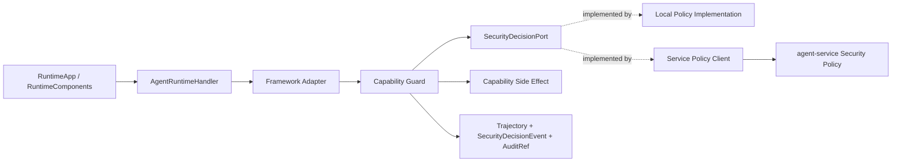

# Agent Security Decision Contract L2 Proposal

> **Date:** 2026-06-13
> **Status:** Draft
> **Parent proposal:** `2026-06-13-agent-security-decision-chain-proposal.en.md`
> **Scope:** neutral security decision contract and the runtime-to-policy-engine boundary.

## 1. Background

The parent proposal needs one unified executable decision point across tool, file, API, MCP, A2A remote agent, memory, sandbox, model, egress, and business actions. This L2 proposal defines that decision contract.

The current architecture requires `agent-runtime` to stay neutral. It may define and call a port, but it must not depend on `agent-service` implementation classes. Therefore, the core design is:

```text
agent-runtime owns the port interface and emits SecurityEvaluationRequest
agent-service or deployer policy client implements the port
SecurityDecision returns allow/deny/ask/sandbox/approval/audit obligations
```

## 2. Scope Statement

Primary scope:

- `affects_level: L2`
- `affects_view: development`

This proposal defines:

- `docs/contracts/security-decision.v1.yaml`;
- Java-level port shape for `SecurityDecisionPort`;
- `SecurityEvaluationRequest`, `CapabilityTarget`, `SecurityDecision`, `DecisionType`, and `ActionType`;
- how framework adapters map native actions to the neutral decision contract;
- runtime failure handling and fail-closed defaults.

This proposal does not define:

- capability permission YAML details, owned by the capability permission L2;
- approval state machine and audit event stream, owned by the approval/audit L2;
- sandbox provider execution details;
- external DLP/prompt-injection vendor integration.

## 3. Root Cause / Strongest Interpretation (Rule D-1)

1. **Observed failure / motivation:** without a neutral decision contract, each adapter could make local safety decisions, producing inconsistent behavior across OpenJiuwen, AgentScope, A2A, SDK tools, memory, sandbox, and file/API/MCP paths.
2. **Execution path:** runtime receives an agent request, framework adapter is about to call a capability, adapter builds `SecurityEvaluationRequest`, runtime calls `SecurityDecisionPort`, policy returns `SecurityDecision`, adapter enforces before side effect.
3. **Root cause:** current runtime SPI focuses on execution, while policy, permission, approval, and audit semantics are not expressed as one reusable runtime contract.
4. **Evidence:** current `AgentRuntimeHandler` is framework-neutral execution SPI; `TrajectoryEvent` is telemetry; active architecture places runtime, service, and bus in separate modules.

## 4. Proposed Design

### 4.1 Boundary Principles

- `agent-runtime` defines and calls `SecurityDecisionPort`.
- `agent-service` or a deployer-provided policy client implements `SecurityDecisionPort`.
- `agent-runtime` must not import `agent-service` implementation classes.
- The contract is synchronous at the logical boundary, but implementation may use async adapters internally.
- High-risk actions fail closed when policy is unavailable.
- Adapters must enforce the decision before the side effect is delegated.

### 4.2 Port Implementation Shape

Deployment options:

| Option | Runtime dependency | Policy location | Suitable use |
|---|---|---|---|
| in-process no-op/dev policy | runtime-local implementation | test/dev only | unit and local development |
| in-process configured policy | runtime config module | lightweight deployments | research/single process |
| HTTP/gRPC policy client | runtime client only | `agent-service` | serviceized deployments |
| custom deployer plugin | runtime port implementation | deployer module | enterprise integration |

The port boundary remains the same for all options.

### 4.3 Runtime Assembly



Assembly rules:

- `RuntimeComponents` wires a `SecurityDecisionPort` instance.
- A default dev implementation may be provided, but it must be explicit in prod.
- Framework adapters should not know which implementation is behind the port.
- If the port is missing in research/prod, high-risk capability execution is denied.

### 4.4 Port Interface

```java
public interface SecurityDecisionPort {
    CompletionStage<SecurityDecision> evaluate(SecurityEvaluationRequest request);
}
```

The method returns `CompletionStage` to avoid blocking the runtime spine. Synchronous policy engines can complete immediately.

### 4.5 SecurityEvaluationRequest

```java
public record SecurityEvaluationRequest(
        String schemaVersion,
        String securityEvaluationRequestId,
        String tenantId,
        String userId,
        String sessionId,
        String taskId,
        String agentId,
        String traceId,
        String spanId,
        ActionType actionType,
        CapabilityTarget target,
        RiskTier riskTier,
        TrustTier trustTier,
        Set<DataClass> dataClasses,
        SideEffect sideEffect,
        EgressScope egressScope,
        PermissionScope requestedScope,
        Object redactedPreview,
        String inputHash,
        String idempotencyKey,
        String posture,
        String policyProfile,
        String delegationEnvelopeRef,
        Instant requestedAt) {
}
```

Rules:

- `securityEvaluationRequestId` uniquely identifies one security evaluation request; it is not an NLU classification object, not the agent task id, and not an idempotency key;
- raw sensitive data must not be placed in `redactedPreview`;
- `inputHash` identifies the sensitive input without exposing it;
- `traceId` / `spanId` correlate the call chain, `decisionId` identifies the policy result, and `securityEvaluationRequestId` identifies the input object submitted to the security decision chain;
- `tenantId` and `userId` must come from trusted ingress, not from model/tool self-assertion;
- `policyProfile` carries the deployer-selected preset such as `strict_allowlist`, `review_unknown`, `scoped_allowlist`, `least_agency_scoped`, or `regulated_prod`;
- `delegationEnvelopeRef` points to the least-agency boundary used for this decision; it is not an NLU classification id;
- `policyProfile` is also the deployer-selected autonomous-delegation preset; R2+ research/prod requests without a valid envelope fail closed.

### 4.6 CapabilityTarget

```java
public sealed interface CapabilityTarget permits
        ToolTarget,
        FileTarget,
        ApiTarget,
        McpTarget,
        A2aRemoteAgentTarget,
        SandboxTarget,
        MemoryTarget,
        ModelTarget,
        BusinessActionTarget {
}
```

Examples:

```java
public record ApiTarget(
        String capability,
        URI endpoint,
        String method,
        String host,
        String path) implements CapabilityTarget {
}

public record FileTarget(
        String capability,
        String workspaceRef,
        Path relativePath,
        String operation) implements CapabilityTarget {
}

public record A2aRemoteAgentTarget(
        String remoteAgentId,
        String capability,
        URI endpoint,
        Set<String> declaredSkills) implements CapabilityTarget {
}
```

The target object must describe the resource that policy needs, without leaking full payloads.

### 4.7 SecurityDecision

```java
public record SecurityDecision(
        String schemaVersion,
        String decisionId,
        String securityEvaluationRequestId,
        DecisionType decisionType,
        String policyId,
        String policyVersion,
        String policyHash,
        String policyProfile,
        String delegationEnvelopeRef,
        String profileRule,
        List<DecisionObligation> obligations,
        String reasonCode,
        String humanMessage,
        String approvalRef,
        String auditRef,
        Instant expiresAt,
        Map<String, String> attributes) {
}
```

Decision obligations:

```text
REDACT_BEFORE_MODEL
ROUTE_TO_SANDBOX
REQUIRE_APPROVAL
REQUIRE_AUDIT_RECEIPT
LIMIT_EGRESS
LIMIT_FILE_SCOPE
LIMIT_MCP_SCOPE
LIMIT_A2A_SCOPE
RECORD_SECURITY_EVENT
DENY_LOCAL_FALLBACK
RECHECK_BEFORE_RESUME
```

### 4.8 DecisionType

```text
ALLOW
ALLOW_WITH_OBLIGATIONS
DENY
ASK_USER
SUSPEND_FOR_APPROVAL
ROUTE_TO_SANDBOX
REDACT_AND_RETRY
DEGRADE_TO_READ_ONLY
```

Semantics:

| DecisionType | Meaning |
|---|---|
| `ALLOW` | execute immediately |
| `ALLOW_WITH_OBLIGATIONS` | execute after applying obligations |
| `DENY` | return typed denial before side effect |
| `ASK_USER` | lightweight user confirmation, usually dev/research |
| `SUSPEND_FOR_APPROVAL` | park action until approval result |
| `ROUTE_TO_SANDBOX` | execute through sandbox strategy |
| `REDACT_AND_RETRY` | redact and re-evaluate/retry |
| `DEGRADE_TO_READ_ONLY` | allow safe read-only fallback only |

### 4.9 ActionType

```text
INGRESS
MODEL_CALL
TOOL_CALL
API_CALL
MCP_CALL
MEMORY_READ
MEMORY_WRITE
SANDBOX_ACQUIRE
SANDBOX_EXEC
A2A_REMOTE_AGENT_CALL
EXTERNAL_EGRESS
FILE_READ
FILE_WRITE
FILE_LIST
FILE_DELETE
CODE_EXEC
BUSINESS_ACTION
FALLBACK
```

### 4.10 Current Runtime Enforcement Points

| Enforcement point | Action type | Required behavior |
|---|---|---|
| A2A ingress | `INGRESS` | validate tenant/header trust and posture |
| handler wrapper | run-level | ensure run context has policy identity |
| OpenJiuwen adapter | model/tool callbacks | enforce only when pre-action blocking is possible |
| AgentScope adapter | tool/runtime/harness calls | create `SecurityEvaluationRequest` before delegated side effect |
| SDK tool executor | `TOOL_CALL`, `API_CALL`, `FILE_*` | enforce before tool call |
| MCP adapter | `MCP_CALL` | enforce server/tool/resource scope |
| remote A2A outbound | `A2A_REMOTE_AGENT_CALL` | enforce remote endpoint and capability label |
| memory adapter | `MEMORY_READ`, `MEMORY_WRITE` | enforce tenant/session/data scope |
| sandbox gateway | `SANDBOX_ACQUIRE`, `SANDBOX_EXEC` | enforce sandbox profile, fallback, audit |
| model caller | `MODEL_CALL`, `FALLBACK` | enforce model policy and fallback equivalence |

### 4.11 Framework Adapter Contract Boundary

AgentScope, OpenJiuwen, and similar frameworks should not be required to implement this repository's policy language. Their adapters are responsible for translating native framework events into `SecurityEvaluationRequest`.

| Framework path | Adapter responsibility | Decision owner |
|---|---|---|
| OpenJiuwen declared tool | attach capability metadata and call `SecurityDecisionPort` before execution | repository |
| OpenJiuwen native callback | if pre-action and blocking, map to request; otherwise telemetry only | repository when enforceable |
| AgentScope local wrapper | map call to request before side effect | repository |
| AgentScope remote runtime client | guard remote call before delegating | repository |
| A2A remote invocation | classify as `A2A_REMOTE_AGENT_CALL` and enforce endpoint/capability policy | repository |
| opaque framework-internal side effect | deny or require wrapper/proxy/sandbox in research/prod | repository |

The repository should not trust framework-level "safe" labels without mapping them to its own contract.

Additional framework-permission rules:

- AgentScope / OpenJiuwen / JiuwenSwarm native allow / ask / deny may enter `attributes.frameworkPermission` as evidence, but cannot replace `SecurityDecision`.
- Framework bypass, permission disabled, approval override, or always-allow state must be represented in `attributes.frameworkPermissionMode`; in research/prod it triggers envelope validation or fail-closed behavior.
- `requestedScope` must be checked as a subset of the `DelegationEnvelope` referenced by `delegationEnvelopeRef`; HITL approval cannot convert an out-of-envelope request into allow.

### 4.12 Relationship To Capability Permission L2

Capability permission policy determines whether a capability selector matches allowlist, scope, risk tier, posture, and profile. This proposal defines the runtime contract used to ask for the decision.

```text
capability-permissions.yaml
  -> policy engine
  -> SecurityDecisionPort.evaluate(SecurityEvaluationRequest)
  -> SecurityDecision
```

### 4.13 Relationship To Approval/Audit L2

When `SecurityDecision.decisionType == SUSPEND_FOR_APPROVAL`, the decision must include `approvalRef` and usually `auditRef`. Approval/audit L2 owns the lifecycle of those references.

When `DecisionObligation.REQUIRE_AUDIT_RECEIPT` appears, the action must not perform a high-risk side effect until audit reserve succeeds.

### 4.14 Versioning

Rules:

- all contract objects carry `schemaVersion`;
- additive fields are allowed only when old consumers can ignore them safely;
- enum additions require contract catalog update and adapter compatibility review;
- runtime should reject unknown `DecisionType` in prod;
- policy hash should be recorded for replay and audit.

### 4.15 Failure Handling

| Failure | Required behavior |
|---|---|
| port implementation missing | deny high-risk in research/prod |
| policy engine timeout | deny high-risk; dev may warn for low-risk |
| invalid decision payload | deny and emit security event |
| unknown decision type | deny in prod |
| missing audit ref when required | deny before side effect |
| sandbox route required but sandbox unavailable | deny or suspend; no local fallback unless explicit dev override |
| approval required but approval service unavailable | deny in research/prod |

## 5. Alternatives

| Alternative | Why rejected |
|---|---|
| put policy logic directly inside each adapter | produces divergent semantics across OpenJiuwen, AgentScope, A2A, and SDK tools |
| make `agent-runtime` depend on `agent-service` directly | violates runtime neutrality and module direction |
| use `TrajectoryEvent` as the decision object | trajectory is telemetry, not policy contract |
| return boolean allow/deny only | cannot represent approval, sandbox routing, redaction, audit, or fallback obligations |
| treat sandbox failure as local fallback | unsafe for high-risk actions |

## 6. Verification Plan

- [ ] `SecurityDecisionSchemaTest`: validates required fields, enum values, and schema version.
- [ ] `SecurityEvaluationRequestRedactionTest`: raw credentials and PII do not enter `redactedPreview`.
- [ ] `SecurityDecisionPortPurityArchTest`: `agent-runtime` does not import `agent-service` implementation classes.
- [ ] `RuntimeComponentsPolicyWiringTest`: runtime fails closed when policy port is missing in research/prod.
- [ ] `DelegationEnvelopeRefRequiredTest`: R2+ research/prod requests fail closed when `delegationEnvelopeRef` is missing or invalid.
- [ ] `DelegationEnvelopeSubsetDecisionTest`: `requestedScope` outside the envelope is denied even when native framework permission says allow.
- [ ] `FrameworkAdapterSecurityEvaluationRequestMappingTest`: OpenJiuwen, AgentScope, and A2A adapters create expected requests.
- [ ] `FrameworkPermissionEvidenceMappingTest`: AgentScope/OpenJiuwen/JiuwenSwarm allow/ask/deny/bypass/disabled/override is mapped as evidence, not final decision.
- [ ] `OpaqueFrameworkSideEffectDenyTest`: opaque high-risk framework side effects are denied in research/prod.
- [ ] `PolicyTimeoutFailClosedTest`: high-risk actions fail closed when policy times out.
- [ ] `AuditRefRequiredTest`: R4/R5 side effects are blocked when required audit refs are missing.

## 7. Rollout

- **Wave 1:** add `security-decision.v1.yaml` to contracts as design-only.
- **Wave 2:** add Java records/interfaces behind experimental package.
- **Wave 3:** wire a dev local implementation and policy timeout behavior.
- **Wave 4:** connect `agent-service` or deployer policy client implementation.
- **Wave 5:** enforce adapter-level coverage for OpenJiuwen, AgentScope, A2A, SDK tools, MCP, files, memory, and sandbox.

Freeze impact:

- update contract catalog after schema acceptance;
- add ArchUnit dependency rule for runtime/service boundary;
- update architecture docs only after implementation package names are accepted.

## 8. Self-Audit

| Finding | Severity | Status | Mitigation |
|---|---|---|---|
| `CompletionStage` may require adapter changes | P1 | open | allow immediate completed futures for sync implementations |
| exact package name needs review | P1 | open | keep contract under neutral runtime SPI or adjacent security package |
| external policy latency may affect runtime | P2 | open | require timeout and fail-closed behavior |
| enum growth may break old adapters | P2 | open | version contract and reject unknown prod decisions |

## Authority

- Parent proposal: `2026-06-13-agent-security-decision-chain-proposal.en.md`.
- Capability policy L2: `2026-06-13-agent-capability-permission-policy-l2-proposal.en.md`.
- Current runtime SPI: `AgentRuntimeHandler`.
- Current architecture boundary: runtime owns execution/adapters; service owns serviceized policy and durable state.
